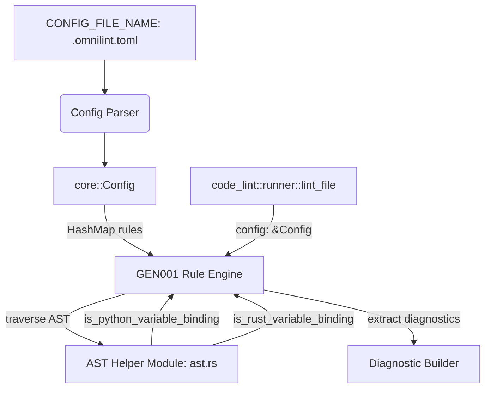

# Design Document: Banned Single-Letter Variables Rule (GEN001)

This design document outlines the corrected, robust architecture, AST traversal helper module, and configuration design for the `GEN001` (`single-letter-variable-name`) cross-language linter rule, targeting Python and Rust.

---

## 1. Overview & Goal

The goal is to discourage the use of single-letter variable names across multiple languages in the codebase, while supporting custom user-configured exceptions (with default allowed names: `i`, `j`, `x`, `f`) and ignoring the wildcard discard symbol `_`.

### Target Languages
- **Python** (`.py`) using `tree-sitter-python` via `ast-grep`
- **Rust** (`.rs`) using `tree-sitter-rust` via `ast-grep`

---

## 2. Architectural Design



### 2.1. Decoupled Configuration
To keep the core `Config` struct clean and extensible without hardcoding rule-specific options, rule-specific parameters are stored in a generic map:

```rust
#[derive(Deserialize, Debug, Default, Clone)]
pub struct Config {
    pub select: Option<HashSet<Selector>>,
    pub ignore: Option<HashSet<Selector>>,
    /// Generic map of rule-specific configurations.
    #[serde(default)]
    pub rules: HashMap<String, serde_json::Value>,
}
```

The configuration in `.omnilint.toml` will be mapped as:
```toml
[rules.single-letter-variable-name]
allowed_names = ["i", "j", "x", "f", "y"]
```

The rule reads its configuration using standard `serde` deserialization:
```rust
#[derive(Deserialize, Debug, Clone)]
pub struct SingleLetterVariableNameConfig {
    #[serde(default = "default_allowed_names")]
    pub allowed_names: HashSet<String>,
}

impl Default for SingleLetterVariableNameConfig {
    fn default() -> Self {
        Self {
            allowed_names: default_allowed_names(),
        }
    }
}

fn default_allowed_names() -> HashSet<String> {
    ["i", "j", "x", "f"].iter().map(|s| s.to_string()).collect()
}
```

### 2.2. Language Support Tagging & Registry Modifications
To prevent cross-language rule leakage (e.g. running Python-specific analysis on Rust code), we perform the following registry updates:

1. **Expose `Tag::Rust`**: Add `Rust` to `define_tags!` in `src/rules.rs`:
   ```rust
   /// Checks targeting Rust source code ASTs.
   Rust => "Checks targeting Rust source code ASTs",
   ```
2. **Update `detect_language`**: Add Rust mapping in `src/code_lint.rs`:
   ```rust
   pub fn detect_language(path: &Path) -> Option<SupportLang> {
       path.extension()
           .and_then(std::ffi::OsStr::to_str)
           .and_then(|ext| match ext {
               "py" => Some(SupportLang::Python),
               "rs" => Some(SupportLang::Rust),
               _ => None,
           })
   }
   ```
3. **Filter by Tag**: Check if the rule's tags match the file language:
   ```rust
   pub fn lint_file(path: &Path, content: &str, config: &Config) -> Vec<Diagnostic> {
       let Some(lang) = detect_language(path) else {
           return Vec::new();
       };

       let grep = AstGrep::new(content, lang);
       let mut diagnostics = Vec::new();

       for rule in crate::rules::CODE_RULES {
           if config.is_rule_enabled(*rule) && rule_supports_language(*rule, lang) {
               diagnostics.extend(rule.check_file(path, &grep, config));
           }
       }
       diagnostics
   }

   fn lang_to_tag(lang: SupportLang) -> Option<crate::rules::Tag> {
       match lang {
           SupportLang::Python => Some(crate::rules::Tag::Python),
           SupportLang::Rust => Some(crate::rules::Tag::Rust),
           _ => None,
       }
   }

   fn rule_supports_language(rule: &dyn crate::code_lint::rule::CodeRule, lang: SupportLang) -> bool {
       lang_to_tag(lang)
           .map(|tag| rule.tags().contains(&tag))
           .unwrap_or(false)
   }
   ```

---

## 3. AST Traversal Helper Module (`src/code_lint/ast.rs`)

We isolate AST traversal logic to a new helper module `src/code_lint/ast.rs`, which will be used by `GEN001` and future variable-name related rules.

### 3.1. Rust AST Variable Bindings
In Rust, variable declarations are represented by pattern binding nodes in tree-sitter. We identify bindings using the following rules:

1. **Target Node Kinds**:
   - `shorthand_field_identifier`: Always a variable binding (e.g., `x` in `let Point { x } = p;`).
   - `identifier`: A variable binding if it is located inside a pattern context, is not the name of a type/variant or constructor, and is not a value being assigned.
2. **Context Verification (Boundary-Restricted Walk-Up)**:
   To verify if an `identifier` node is in a pattern context, walk up its ancestors. Check if the parent node exposes a `"pattern"` field, and if our node is part of that pattern. Stop walking up immediately when hitting key boundary nodes to prevent false positives from outer-scope patterns:

   ```rust
   pub fn is_rust_variable_binding(node: &ast_grep_core::Node<'_, ast_grep_language::SupportLang>) -> bool {
       let kind = node.kind();
       
       if kind == "shorthand_field_identifier" {
           return true;
       }
       
       if kind == "identifier" {
           // Exclude uppercase names (variants/constants like None, Ok, MAX)
           if let Some(first_char) = node.text().chars().next() {
               if first_char.is_ascii_uppercase() {
                   return false;
               }
           }

           let mut current = node.clone();
           while let Some(parent) = current.parent() {
               let p_kind = parent.kind();
               
               // Closure parameter names are always bindings
               if p_kind == "closure_parameters" {
                   return true;
               }
               
               // Intercept match pattern guards (condition is not a pattern context)
               if p_kind == "match_pattern" {
                   if let Some(cond) = parent.field("condition") {
                       if cond.range() == current.range() {
                           return false;
                       }
                   }
               }
               
               // If the parent exposes a "pattern" field, check if we are in it
               if let Some(pattern) = parent.field("pattern") {
                   if pattern.range() == current.range() {
                       return true;
                   }
               }
               
               // Special handling for tuple struct patterns: exclude type constructor name
               if p_kind == "tuple_struct_pattern" {
                   if let Some(type_node) = parent.field("type") {
                       if type_node.range() == current.range() {
                           return false;
                       }
                   }
                   return true;
               }
               
               // Stop traversal if we hit a boundary node, but weren't in its pattern field
               if p_kind == "let_declaration"
                   || p_kind == "let_condition"
                   || p_kind == "for_expression"
                   || p_kind == "match_arm"
                   || p_kind == "parameter"
                   || p_kind == "field_pattern"
                   || p_kind == "struct_pattern"
                   || p_kind == "generic_pattern"
                   || p_kind == "range_pattern"
                   || p_kind == "const_item"
                   || p_kind == "static_item"
               {
                   return false;
               }
               
               current = parent;
           }
       }
       false
   }
   ```

### 3.2. Python AST Variable Bindings
In Python, we walk up ancestors to verify if the identifier is being declared or bound:

1. **Parameters & Expressions**:
   Identifies bindings under parameters, lambda parameters, walrus operators (`named_expression`), left-hand side of assignments, loops, comprehensions, and alias targets (for `with` and `except` blocks).
2. **Context Verification (Boundary-Restricted Walk-Up)**:
   ```rust
   pub fn is_python_variable_binding(node: &ast_grep_core::Node<'_, ast_grep_language::SupportLang>) -> bool {
       let kind = node.kind();
       if kind != "identifier" {
           return false;
       }
       
       let mut current = node.clone();
       while let Some(parent) = current.parent() {
           let p_kind = parent.kind();
           
           // Simple parameters & lambda parameters
           if p_kind == "parameters" || p_kind == "lambda_parameters" {
               return true;
           }
           
           // Complex parameters: def foo(b: int = 1):
           if p_kind == "typed_parameter" || p_kind == "default_parameter" || p_kind == "typed_default_parameter" {
               if let Some(name_node) = parent.field("name") {
                   return name_node.range() == current.range();
               }
               return false;
           }
           
           // Walrus operator variables: (x := 1)
           if p_kind == "named_expression" {
               if let Some(name_node) = parent.field("name") {
                   return name_node.range() == current.range();
               }
               return false;
           }
           
           // Left-hand side of assignments, loops, and comprehensions
           if let Some(left) = parent.field("left") {
               if left.range() == current.range() {
                   return true;
               }
           }
           
           // Aliases in with statements and except clauses
           if let Some(alias) = parent.field("alias") {
               if alias.range() == current.range() {
                   return true;
               }
           }
           
           // Pattern Matching: case clauses
           if p_kind == "case_clause" {
               return true;
           }
           if p_kind == "dotted_name" {
               if parent.text().contains('.') {
                   return false; // Multi-part constant lookup, not a binding
               }
           }
           if p_kind == "keyword_pattern" {
               if let Some(first_child) = parent.child(0) {
                   if first_child.range() == current.range() {
                       return false; // Keyword parameter name, not a binding
                   }
               }
           }
           if p_kind == "class_pattern" {
               if let Some(first_child) = parent.child(0) {
                   if first_child.range() == current.range() {
                       return false; // Match class type name, not a binding
                   }
               }
           }
           
           // Stop walking up if we hit a boundary node but weren't in its binding fields
           if p_kind == "assignment"
               || p_kind == "for_statement"
               || p_kind == "list_comprehension"
               || p_kind == "dictionary_comprehension"
               || p_kind == "set_comprehension"
               || p_kind == "generator_expression"
               || p_kind == "with_item"
               || p_kind == "except_clause"
               || p_kind == "function_definition"
               || p_kind == "class_definition"
               || p_kind == "lambda"
               || p_kind == "match_statement"
           {
               return false;
           }
           
           current = parent;
       }
       false
   }
   ```

---

## 4. Generic Rules & Test Utility Modifications

### 4.1. The New Rule Implementation (`src/code_lint/rules/generic.rs`)
Implement the linter rule logic inside `src/code_lint/rules/generic.rs`.
- The rule loops over the AST using DFS.
- When it encounters an `identifier` or `shorthand_field_identifier`:
  - It runs `is_rust_variable_binding` (for Rust) or `is_python_variable_binding` (for Python).
  - If verified as a variable binding, checks if the length is `1`, is not `_`, and is not in the config's `allowed_names` list.
- Deserialization logic:
  ```rust
  let rule_config: SingleLetterVariableNameConfig = config
      .rules
      .get(self.name().0)
      .and_then(|val| serde_json::from_value(val.clone()).ok())
      .unwrap_or_default();
  ```

### 4.2. Existing Python Rules & Registry Modifications
We will integrate the rule and align existing rules to the new config-enabled signature:
1. **`src/rules.rs`**: Add `&crate::code_lint::rules::generic::SingleLetterVariableName` to `CODE_RULES`.
2. **`src/code_lint/rules/python.rs`**: Update `NoLoggingInExcept` and `FlatScopeEnforced` to accept the `_config: &Config` parameter:
   ```rust
   fn check_file(
       &self,
       path: &Path,
       file: &crate::code_lint::ast::ParsedFile,
       _config: &crate::core::Config,
   ) -> Vec<Diagnostic>
   ```

### 4.3. Test Utility Backward Compatibility
To avoid unnecessary test churn and align with surgical changes, the existing snapshot test helper signature is preserved, and a new config-aware helper is introduced inside `src/test_utils.rs`:

```rust
pub fn assert_code_rule_snapshot(
    rule: &impl CodeRule,
    source: &str,
    filename: &str,
) -> String {
    assert_code_rule_snapshot_with_config(rule, source, filename, &Config::default())
}

pub fn assert_code_rule_snapshot_with_config(
    rule: &impl CodeRule,
    source: &str,
    filename: &str,
    config: &Config,
) -> String {
    let path = Path::new(filename);
    let lang = match path.extension().and_then(|ext| ext.to_str()) {
        Some("py") => SupportLang::Python,
        Some("rs") => SupportLang::Rust,
        _ => panic!("Unsupported extension in test file: {}", filename),
    };
    let grep = AstGrep::new(source, lang);
    let diags = rule.check_file(path, &grep, config);
    format_diagnostics_for_test(&diags, source)
}
```

---

## 5. Verification Plan

### 5.1. AST Helper Module Unit Tests
We will add isolated unit tests inside `src/code_lint/ast.rs` to verify that `is_rust_variable_binding` and `is_python_variable_binding` correctly classify bindings:
- **Rust bindings tests**: verify let assignments, loop variables, parameter names, matches, `if let` blocks, while `let` blocks, and shorthand struct fields are recognized as `true`. Verify function names, struct type names, uppercase variants, and RHS values are recognized as `false`.
- **Python bindings tests**: verify assignments, parameters, lambda arguments, comprehensions, and walrus expressions are recognized as `true`. Verify class names, function names, and dotted attribute calls are recognized as `false`.

### 5.2. Rule Snapshot Tests
We will add inline snapshot validations inside `src/code_lint/rules/generic.rs`:

#### Rust Snapshot Test Cases
- Standard `let` binding: `let a = 1;` (violation)
- Let binding reference assignment: `let a = b;` (violation for `a`, `b` ignored)
- Mutable binding: `let mut b = 2;` (violation)
- Tuple destructuring: `let (c, d) = (1, 2);` (violations)
- Struct destructuring (explicit): `let Point { x: e, y: _ } = p;` (violation for `e`, `_` ignored, `x` ignored)
- Struct destructuring (shorthand): `let Point { f, g } = p;` (violation for `g`, `f` ignored because it is allowed by default)
- Loop target: `for h in 0..10 {}` (violation)
- Closure parameter: `let f = |x: i32| x + 1;` (ignored because `x` is a default exception)
- Function parameters: `fn test(i: i32, j: i32)` (ignored because `i` and `j` are defaults)
- Match pattern variants: `Some(k) => {}` (violation for `k`, `Some` ignored)
- Match arm variants: `None => {}` (ignored)
- If-let bindings: `if let Some(x) = y` (ignored because `x` is a default)
- While-let bindings: `while let Some(z) = y` (violation for `z`)
- Match pattern guards: `Some(z) if z > 0 => {}` (violation for binding `z`, ignored for reference `z` inside guard)
- Wildcards: `let _ = 1;` (ignored)

#### Python Snapshot Test Cases
- Parameter annotations (allowed name): `def foo(i: int = 1)` (ignored)
- Parameter annotations (banned name): `def foo(b: int = 1)` (violation for `b`)
- Assignments: `c = 2` (violation)
- Multi-assignments: `d, e = 3, 4` (violations)
- Comprehensions: `[y for y in range(10)]` (violation if `y` is not allowed)
- Exception aliases: `except Exception as g:` (violation for `g`, `Exception` ignored)
- Walrus expressions: `(v := 1)` (violation for `v`)

#### Configuration Override Test
Verify that providing a custom config `allowed_names = ["y"]` via `assert_code_rule_snapshot_with_config` accepts `y` but flags `i`.

### 5.3. Manual CLI Verification
1. Create a dummy Python file `test.py` containing `y = 10`.
2. Run `cargo run --bin omni-code-lint test.py` and verify it exits with code `1` and shows the `GEN001` diagnostic.
3. Add `.omnilint.toml` in the current directory:
   ```toml
   [rules.single-letter-variable-name]
   allowed_names = ["y"]
   ```
4. Re-run `cargo run --bin omni-code-lint test.py` and verify it passes successfully.
