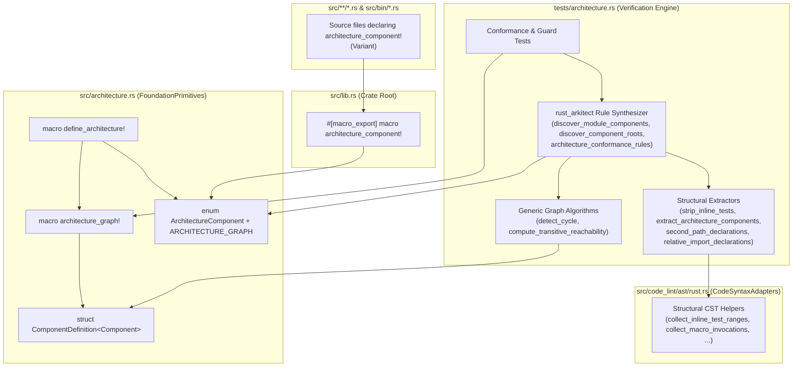

# Phase 3: Design & Execution Plan — Architectural DAG & Conformance

This document records **Phase 3 (Design/Plan)** for `omni`'s architectural specification, compile-time component colocation, and structural AST conformance engine.

**Status**: Validated by user (Track 3.1A + Track 3.2A) — proceeding to **Phase 4 (Execute)**.

---

## 1. Critical User Journeys (CUJs) & Acceptance Criteria

### CUJs

| ID | Persona & Scenario | Expected Experience |
| :--- | :--- | :--- |
| **`CUJ1`** | **Developer adds a new source file** (e.g., `src/code_lint/rules/new_rule.rs`) and declares `architecture_component!(CodeLintRules);`. | Zero edits needed in `tests/architecture.rs`. If the variant name has a typo, `cargo check --lib` fails immediately with a compiler error (`E0599`). If duplicated in the same file, `rustc` fails with `E0428`. If omitted, `test_all_source_files_declare_architecture_component` fails naming the file. |
| **`CUJ2`** | **Developer adds a binary in `src/bin/`** and declares `omni::architecture_component!(ApplicationBinaries);`. | Works directly via `omni::architecture_component!` without copy-pasting dummy `macro_rules! architecture_component` stubs in `src/bin/*.rs`. |
| **`CUJ3`** | **Developer introduces an illegal dependency** (e.g., cross-domain `command_lint` $\to$ `code_lint`, upward `rules` $\to$ `runner`, sibling rule $\to$ sibling rule, or placing a forbidden import below a mid-file `#[cfg(test)]` item). | `cargo test --test architecture` catches both `use` imports and inline path expressions (`crate::...`), even when placed after a `#[cfg(test)]` helper item. |
| **`CUJ4`** | **Architect inspects or evolves the high-level DAG** (`define_architecture!`). | The entire 14-component DAG fits on one screen in `src/architecture.rs` with `///` doc comments, direct dependency frontier `[...]`, and optional `(no_internal_dependencies)` leaf isolation modifier. |
| **`CUJ5`** | **Test author writes unit tests for graph algorithms** (`detect_cycle`, `compute_transitive_reachability`). | Uses `architecture_graph!` directly with lightweight test node types (e.g., `&'static str`) without coupling to `ArchitectureComponent` or touching disk files. |

### Acceptance Criteria (`AC1`–`AC8`)

- **`AC1` (Compile-Time Variant & Duplicate Validation)**: `architecture_component!(Variant)` expands to `const _ARCHITECTURE_COMPONENT: $crate::architecture::ArchitectureComponent = $crate::architecture::ArchitectureComponent::$component;` so `rustc` validates both variant existence (`E0599`) and single declaration per module (`E0428`) during `cargo check --lib`.
- **`AC2` (Zero Duplicated Macro Stubs in `src/bin/`)**: All 3 binary entrypoints (`src/bin/omni-code-lint.rs`, `src/bin/omni-command-lint.rs`, `src/bin/ast_dumper.rs`) use `omni::architecture_component!(ApplicationBinaries);` directly; the 3 copy-pasted no-op `macro_rules!` stubs are deleted.
- **`AC3` (Two-Level Macro Separation)**: `architecture_graph!` builds generic `&[ComponentDefinition<Component>]` slices for any node type `Component`, and `define_architecture!` generates `pub enum ArchitectureComponent` + `pub const ARCHITECTURE_GRAPH` by delegating to `architecture_graph!`.
- **`AC4` (Doc-Comment Descriptions via `strum`)**: Every `ArchitectureComponent` variant has a non-empty `///` doc comment exposed via `.description()`, verified by `test_all_architecture_components_have_descriptions`.
- **`AC5` (Dynamic Root & Leaf Discovery)**: Zero hardcoded module tables (`root_modules()` is gone); component roots and isolated leaf modules are derived from `src/` declarations.
- **`AC6` (Mid-File `#[cfg(test)]` Safety)**: `strip_inline_tests` uses structural AST byte ranges (`collect_inline_test_ranges`) rather than truncating at the first `#[cfg(test)]` line. Production code located below a `#[cfg(test)]` item (such as in `src/lib.rs` below line 5) remains fully verified.
- **`AC7` (Structural AST Extraction for Conformance Rules)**: `extract_architecture_components`, `second_path_declarations`, and `relative_import_declarations` use `ParsedFile` (`omni::code_lint::ast`) so comments, docstrings, and raw string literals never cause false positives or false negatives.
- **`AC8` (Zero Linter / Clippy Warnings)**: `cargo test`, `cargo clippy --all-targets -- -D warnings`, `cargo fmt --check`, and `cargo run --bin omni-code-lint` all pass with zero warnings or errors.

---

## 2. Abstraction DAG

---

## 3. Competing Design Tracks & Trade-Offs

### Decision 3.1: Placement of `ArchitectureComponent` and `define_architecture!` in `src/`

| Track | Description | Pros | Cons | Verdict |
| :--- | :--- | :--- | :--- | :--- |
| **Track 3.1A (Recommended)** | **Dedicated `src/architecture.rs` (`FoundationPrimitives`) + `#[macro_export] architecture_component!` in `src/lib.rs`** | - Keeps `src/lib.rs` minimal (~25 lines). - Keeps `ArchitectureComponent` and `ARCHITECTURE_GRAPH` unified in one `define_architecture!` block. - `src/architecture.rs` has zero internal dependencies (`FoundationPrimitives => []`). - Zero runtime overhead (only `Copy` enum + `const` slice). | - Adds one small module file `src/architecture.rs` (~120 lines). | **Selected** |
| **Track 3.1B** | **Inline `define_architecture!` directly into `src/lib.rs`** | - No new file in `src/`. | - Bloats `src/lib.rs` from 21 lines to ~150 lines, mixing crate module declarations with the full architecture catalog. | Rejected |
| **Track 3.1C** | **`enum ArchitectureComponent` in `src/`, `ARCHITECTURE_GRAPH` in `tests/architecture.rs`** | - Keeps `ARCHITECTURE_GRAPH` in `tests/`. | - Forces listing all 14 variants twice (once in `src/` for the enum, once in `tests/` for the graph), defeating `define_architecture!`. | Rejected |

#### Why `#[macro_export]` in `src/lib.rs` Complies with Single Canonical Path (`test_items_have_a_single_path`)
- In Rust, `#[macro_export]` places a `macro_rules!` macro at the crate root (`omni::<macro>`).
- When `#[macro_export]` is used inside a *submodule* (e.g. `src/foo/bar.rs`), it silently moves the macro from `omni::foo::bar` to `omni`, hiding `foo::bar` from dependency checks.
- When `#[macro_export]` is used in `src/lib.rs` (which **is** the crate root), the definition module and the exported path are identical (`omni::architecture_component` / `omni::architecture_graph`), and the crate root is not a forbidden layer.
- Therefore, `second_path_declarations` should forbid `#[macro_export]` in all submodules (`path != src/lib.rs`) while permitting crate-root macro exports in `src/lib.rs`.

---

### Decision 3.2: Structural AST Extraction vs. Line-Based Heuristics in `tests/architecture.rs`

During our Phase 2 audit, we discovered that `src/lib.rs` has `#[cfg(test)]` at **line 5** (`#[cfg(test)] #[macro_use] extern crate pretty_assertions;`). Because the old `strip_inline_tests` ran `if line.starts_with("#[cfg(test)]") { break; }`, it was **truncating `src/lib.rs` at line 5 and skipping lines 6–21**!

| Track | Description | Pros | Cons | Verdict |
| :--- | :--- | :--- | :--- | :--- |
| **Track 3.2A (Recommended)** | **Dogfood `omni::code_lint::ast` (`ParsedFile` + `code_lint::ast::rust`)** | - Zero new dependencies in `Cargo.toml`. - Reuses `collect_inline_test_ranges` and `collect_macro_invocations` already in `src/code_lint/ast/rust.rs`. - Preserves exact line numbers when blanking `#[cfg(test)]` items. - Never fooled by comments or raw multiline strings. | - Requires adding small CST query helpers in `src/code_lint/ast/rust.rs` for visible `use` items, `#[macro_export]`, and `use super::` imports. | **Selected** |
| **Track 3.2B** | **Add `syn` to `[dev-dependencies]` in `Cargo.toml`** | - Uses `syn::Item` directly in `tests/architecture.rs`. | - Adds a new direct dependency to `Cargo.toml` when `omni` already has a first-class Rust CST parser (`ParsedFile`). | Rejected |

#### Structural AST Designs for the 4 Checks:
1. **`strip_inline_tests(source: &str) -> String`**:
   - Update `collect_inline_test_ranges` in [src/code_lint/ast/rust.rs](../../../src/code_lint/ast/rust.rs) so each returned `Range<usize>` spans from the start of the item's first preceding `attribute_item` (`#[cfg(test)]`, `#[test]`, etc.) to `node.range().end`.
   - In `strip_inline_tests`, replace all non-newline bytes in those ranges with `' '`.
   - Result: Any production code *after* a `#[cfg(test)]` item (like in `src/lib.rs`) remains intact at its exact original line numbers!
2. **`extract_architecture_components(source: &str) -> Vec<String>`**:
   - Parse `source` (after stripping inline tests) with `ParsedFile::new(source, SupportLang::Rust)`.
   - Use `rust::collect_macro_invocations(&parsed)` filtered by `rust::macro_terminal_name(&node) == "architecture_component"`, extracting the identifier text via `rust::extract_macro_arguments(&node)`.
   - Returns all declarations in the file so `test_all_source_files_declare_architecture_component` can assert `declarations.len() == 1` (catching both missing and duplicate declarations, while ignoring comments and strings).
3. **`second_path_declarations(source: &str, is_crate_root: bool) -> Vec<String>`**:
   - Using CST helper on `ParsedFile` (after stripping inline tests):
     - Collects all `use_declaration` nodes that have a `visibility_modifier` (`pub`, `pub(crate)`, `pub(super)`, `pub(in ...)`), excluding `pub(crate) use <name>;` when `macro_definition` `<name>` exists in the same file.
     - Collects all `#[macro_export]` `attribute_item` nodes when `!is_crate_root`.
4. **`relative_import_declarations(source: &str) -> Vec<(usize, String)>`**:
   - Using CST helper on `ParsedFile` (after stripping inline tests):
     - Collects all `use_declaration` nodes that contain a `super` path segment, returning `(start_line, node_text)`.

---

## 4. Ordered Implementation Tasks (`Audit -> RED -> GREEN -> Verify`)

### Task 1: Move Architecture Specification to `src/architecture.rs` & Enable Compile-Time `architecture_component!`
1. **Audit**: Review [src/lib.rs](../../../src/lib.rs), [src/bin/omni-code-lint.rs](../../../src/bin/omni-code-lint.rs), [src/bin/omni-command-lint.rs](../../../src/bin/omni-command-lint.rs), [src/bin/ast_dumper.rs](../../../src/bin/ast_dumper.rs), and [tests/architecture.rs](../../../tests/architecture.rs).
2. **RED**: Write a test in `tests/architecture.rs` importing `omni::architecture::{ARCHITECTURE_GRAPH, ArchitectureComponent, ComponentDefinition}` and `omni::architecture_graph`.
3. **GREEN**:
   - Create `src/architecture.rs` (`architecture_component!(FoundationPrimitives);`) containing `ComponentDefinition`, `define_architecture!`, `ArchitectureComponent`, and `ARCHITECTURE_GRAPH`.
   - Define `#[macro_export] macro_rules! architecture_component` and `#[macro_export] macro_rules! architecture_graph` in `src/lib.rs` (the crate root).
   - Remove the 3 duplicate `macro_rules! architecture_component` stubs from `src/bin/*.rs` and use `omni::architecture_component!(ApplicationBinaries);`.
4. **Verify**: Run `cargo test --test architecture` and `cargo clippy --all-targets -- -D warnings`.

### Task 2: Fix Mid-File `#[cfg(test)]` Truncation in `strip_inline_tests`
1. **Audit**: Inspect `collect_inline_test_ranges` in [src/code_lint/ast/rust.rs](../../../src/code_lint/ast/rust.rs) and `strip_inline_tests` in [tests/architecture.rs](../../../tests/architecture.rs).
2. **RED**: Add `test_strip_inline_tests_preserves_production_code_after_cfg_test_item` in `tests/architecture.rs`, proving that a forbidden dependency placed *after* an inline `#[cfg(test)]` item (or after a raw string containing `#[cfg(test)]`) is currently missed.
3. **GREEN**:
   - Update `collect_inline_test_ranges` in `src/code_lint/ast/rust.rs` to include the item's preceding `attribute_item`s in the byte range.
   - Rewrite `strip_inline_tests` in `tests/architecture.rs` to blank out `collect_inline_test_ranges` spans while preserving newlines.
4. **Verify**: Run `cargo test` across all unit and integration tests.

### Task 3: Structural AST Extractors for Component Declarations, Single Path, and Relative Imports
1. **Audit**: Inspect `extract_architecture_component`, `second_path_declarations`, and `test_no_relative_imports_in_production_code` in [tests/architecture.rs](../../../tests/architecture.rs).
2. **RED**: Add guard tests in `tests/architecture.rs` verifying that:
   - Duplicate `architecture_component!(...)` calls in a single file are detected, while `architecture_component!(...)` inside comments/strings is ignored.
   - `pub use ...` and `use super::...` inside raw strings or comments are ignored, while real AST nodes (including multiline `pub use` or `use self::super::...` and items placed after `#[cfg(test)]`) are caught.
3. **GREEN**: Add small CST helpers in `src/code_lint/ast/rust.rs` and update `extract_architecture_components`, `second_path_declarations`, and `test_no_relative_imports_in_production_code` in `tests/architecture.rs`.
4. **Verify**: Run `cargo test`, `cargo clippy --all-targets -- -D warnings`, `cargo fmt --check`, and `cargo run --bin omni-code-lint`.

### Task 4: Sync ADR `decisions/006_architectural_dag_and_conformance.md`
1. **Verify**: Ensure `decisions/006_architectural_dag_and_conformance.md` accurately documents the final `src/architecture.rs` + `tests/architecture.rs` architecture.
