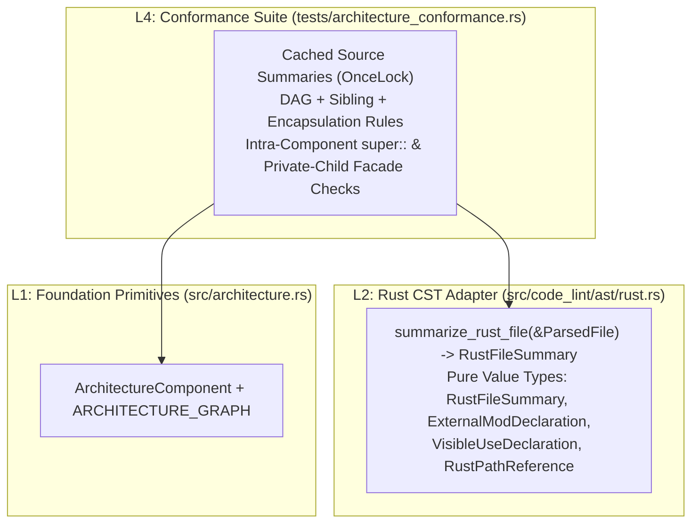

# Phase 3: Design & Plan — Native CST Conformance Engine & Idiomatic Rust Policies

This document records **Phase 3 (Design/Plan)** for replacing `rust_arkitect` with a native Tree-sitter CST conformance engine and enforcing idiomatic Rust module/import policies.

**Status**: Validated — proceeding to **Phase 4 (Execute)**.

---

## 1. Definition of "Done" — Critical User Journeys (CUJs) & Metrics

| CUJ | Scenario | Acceptance Criteria | Target Metric |
| :--- | :--- | :--- | :--- |
| **CUJ 1: Fast, Cached Architecture Conformance** | Developer or CI runs `cargo test --test architecture_conformance`. | All source files in `src/` are parsed once into a `Send + Sync` `RustFileSummary` map stored in a `OnceLock`. Zero `rust_arkitect` or `syn` dependencies remain in `Cargo.toml`. | `architecture_conformance` binary runtime drops from **~3.9s to < 0.15s** (>25x speedup). |
| **CUJ 2: Complete Dependency & Sibling Isolation Detection** | A module introduces a forbidden upward, cross-domain, sibling-child, multi-root-sibling, or `ast_grep_core` dependency via `use`, inline expression/type, turbofish path, or macro argument (`crate::`, `omni::`, `self::`, or `super::`). | Normalized to a canonical module path and rejected with `file:line: statement` context. | **100% detection** across `use` trees, inline paths, turbofish generics, and macro `token_tree` arguments. |
| **CUJ 3: Idiomatic Intra-Component `super::` / `self::` Imports** | A child module (`code_lint::ast::rust`) imports from its parent component root (`use super::{AstNode, ParsedFile};`), or a parent references `self::child`. | Allowed when the resolved target belongs to the **same `ArchitectureComponent`** (and respects sibling isolation); rejected with a clear message when `super::` crosses into a different component or router. | Intra-component `super::`/`self::` passes; cross-component `super::` fails with actionable `crate::` guidance. |
| **CUJ 4: Idiomatic Private-Child `pub use` Facades** | A parent module declares a private submodule (`mod detail;`) and re-exports its public API (`pub use self::detail::Item;` or `pub use detail::Item;`). | Allowed because `detail` is private (`mod detail;`), preserving a single visible path (`parent::Item`) and intra-component ownership. Re-exporting from a `pub mod` or another component is rejected. | Private-child facades pass; duplicate-path (`pub mod` + `pub use`) and cross-component `pub use` fail. |

---

## 2. Architecture & Abstraction Layers (Dependency DAG)

Dependencies point strictly downward:



### 2.1. Layer 1: Pure CST Summary Types (`src/code_lint/ast/rust.rs`)
To keep `ast_grep_core` strictly encapsulated inside `src/code_lint/ast` (`AST_GREP_OWNERS`) while enabling `OnceLock` caching in `tests/architecture_conformance.rs`, `src/code_lint/ast/rust.rs` exposes plain owned value types (`Clone + Debug + PartialEq + Eq + Send + Sync`):

```rust
/// Visibility and name of a top-level external `mod <name>;` declaration in a Rust file.
#[derive(Debug, Clone, PartialEq, Eq)]
pub struct ExternalModDeclaration {
    /// Module identifier (e.g. `"rust"` in `pub mod rust;`).
    pub name: String,
    /// Full trimmed source text of the declaration (e.g. `"pub mod rust;"`).
    pub declaration_text: String,
    /// True when the declaration has no `visibility_modifier` (`mod child;`).
    pub is_private: bool,
}

/// A referenced path in production Rust code (from a `use` tree or inline qualified path).
#[derive(Debug, Clone, PartialEq, Eq)]
pub struct RustPathReference {
    /// 1-indexed starting line number of the reference or enclosing `use` declaration.
    pub line: usize,
    /// Raw syntactic path segments joined by `::` (e.g. `"crate::code_lint::ast::ParsedFile"`,
    /// `"super::AstNode"`, `"self::rust::collect_bindings"`, `"ast_grep_core::Node"`).
    pub raw_path: String,
    /// Trimmed source text of the enclosing `use` declaration or inline path node for diagnostics.
    pub statement_text: String,
}

/// A visible `use` declaration (`pub use ...`, `pub(crate) use ...`) in production Rust code.
#[derive(Debug, Clone, PartialEq, Eq)]
pub struct VisibleUseDeclaration {
    /// 1-indexed starting line number.
    pub line: usize,
    /// Full trimmed source text (e.g. `"pub use self::child::Item;"`).
    pub declaration_text: String,
    /// Expanded target paths imported by this `use` tree (e.g. `["self::child::Item"]`).
    pub target_paths: Vec<String>,
}

/// Structural and dependency summary of the production code in a Rust source file,
/// extracted in a single CST pass while skipping `#[cfg(test)]` and `#[test]` subtrees.
#[derive(Debug, Clone, Default, PartialEq, Eq)]
pub struct RustFileSummary {
    /// Arguments of all `architecture_component!(...)` macro invocations in production code.
    pub architecture_components: Vec<String>,
    /// Top-level external `mod <name>;` declarations (`mod foo;`, `pub mod foo;`).
    pub external_mods: Vec<ExternalModDeclaration>,
    /// `(line, item_text)` of top-level production items that are neither external `mod` declarations
    /// nor `macro_rules!` definitions.
    pub non_namespace_items: Vec<(usize, String)>,
    /// `(line, item_text)` of top-level production `macro_rules!` definitions (`macro_definition`).
    pub macro_definitions: Vec<(usize, String)>,
    /// All `#[macro_export]` attribute texts in production code.
    pub macro_exports: Vec<String>,
    /// Visible `use` declarations (`pub use`, `pub(crate) use`, etc.) excluding `pub(crate) use <local_macro>;`.
    pub visible_uses: Vec<VisibleUseDeclaration>,
    /// All module/item paths referenced in production code (`use` trees, inline qualified paths,
    /// and `::`-qualified paths inside macro `token_tree` arguments).
    pub referenced_paths: Vec<RustPathReference>,
}

#[must_use]
pub fn summarize_rust_file(file: &ParsedFile) -> RustFileSummary;
```

**Consolidation Cleanup in `src/code_lint/ast/rust.rs`**:
- `summarize_rust_file` replaces the four single-purpose test helpers (`collect_second_path_declarations`, `collect_relative_use_declarations`, `collect_external_mod_declarations`, `collect_non_namespace_items`), which are deleted.
- `collect_inline_test_ranges` (used by `src/code_lint/runner.rs`) and `collect_macro_invocations` / `macro_terminal_name` / `extract_macro_arguments` (used by `src/code_lint/rules/no_assertion_packing.rs`) remain untouched.

### 2.2. Single-Pass CST Extraction Algorithm (`summarize_rust_file`)
1. **Test Range Filtering**:
   - Compute `test_ranges = collect_inline_test_ranges(file)` (which includes preceding `#[cfg(test)]` / `#[test]` attribute spans).
   - During recursive CST traversal, any node whose `range().start` falls inside `test_ranges` is skipped immediately (neither inspected nor descended into).
2. **Top-Level (`source_file`) Item Classification**:
   - External `mod_item` (`field("body").is_none()`): pushed to `external_mods` with `name`, `declaration_text`, and `is_private = children().all(|c| c.kind() != "visibility_modifier")`.
   - `macro_definition`: name recorded in `defined_macros: HashSet<String>` and pushed to `macro_definitions`.
   - Any other non-trivia, non-attribute top-level child: pushed to `non_namespace_items`.
3. **Production Node Inspection**:
   - `macro_invocation`: if `macro_terminal_name_raw(node) == "architecture_component"`, extract macro argument text into `architecture_components`. Also scan its `token_tree` argument for contiguous `<seg> (:: <seg>)+` token runs and push to `referenced_paths`.
   - `attribute_item`: if `attribute_terminal_name(node) == Some("macro_export")`, push `"#[macro_export]"` to `macro_exports`.
   - `use_declaration`:
     - Expand the `use` tree recursively (`identifier`, `crate`, `self`, `super`, `scoped_identifier`, `use_as_clause`, `use_wildcard`, `scoped_use_list`, `use_list`) into `target_paths: Vec<String>`.
     - Every expanded target path is added to `referenced_paths` (with the `use_declaration`'s line and text).
     - If the `use_declaration` has a `visibility_modifier` and is not `pub(crate) use <local_macro>;`, push `VisibleUseDeclaration` to `visible_uses`.
     - Do not recurse into `use_declaration` children for inline `scoped_identifier` extraction (avoiding duplicate path entries).
   - Maximal pure `scoped_identifier` / `scoped_type_identifier` (outside `use_declaration`):
     - Define `is_pure_scoped_path(node)` as a `scoped_identifier` or `scoped_type_identifier` whose `field("path")` is an `identifier`, `type_identifier`, `crate`, `self`, `super`, `metavariable`, or another `is_pure_scoped_path`.
     - When `is_pure_scoped_path(node)` holds and its parent is not a pure scoped path, push `RustPathReference` to `referenced_paths`. (For turbofish/generics like `a::b::Foo::<c::d::Bar>::baz()`, both `a::b::Foo` and `c::d::Bar` are maximal pure scoped paths and both are extracted cleanly.)

### 2.3. Layer 2: Path Canonicalization & Conformance Rules (`tests/architecture_conformance.rs`)

1. **Path Canonicalization (`resolve_reference_path`)**:
   Given `enclosing_module: &str` (e.g. `"code_lint::ast::rust"`, or `""` for `src/lib.rs`), `external_mods: &[ExternalModDeclaration]`, and `raw_path: &str`:
   - `crate::<rest>` or `omni::<rest>` $\to$ `canonical_path = <rest>`, `kind = CrateAbsolute`.
   - `self::<rest>` or `self` $\to$ prepend `enclosing_module`, `kind = RelativeSelf`.
   - `super::<rest>` or `super` $\to$ pop one segment from `enclosing_module` per leading `super::` segment and append `<rest>`, `kind = RelativeSuper { depth }`.
   - `<first>::<rest>` where `<first>` matches an `ExternalModDeclaration` in `external_mods` $\to$ prepend `enclosing_module`, `kind = LocalChildMod`.
   - Otherwise $\to$ `canonical_path = raw_path`, `kind = ExternalOrLocal`.

2. **Native `ForbiddenDependencyRule` (Replacing `rust_arkitect`)**:
   ```rust
   struct ForbiddenDependencyRule {
       description: String,
       subject_prefix: String,
       forbidden_prefixes: Vec<String>,
       exempt_prefixes: Vec<String>,
   }
   ```
   - `is_applicable(module_path)`: matches `subject_prefix` (empty string matches all modules in crate; otherwise `module_path == subject_prefix || module_path.starts_with(&format!("{subject_prefix}::"))`) and does not match any `exempt_prefixes`.
   - `check(file)`: for each `reference` in `file.summary.referenced_paths`, resolves `canonical_path`. If `canonical_path == forbidden || canonical_path.starts_with(&format!("{forbidden}::"))`, emits:
     `"{description}: {path}:{line} references `{raw_path}` (resolved to `{canonical_path}` via `{statement_text}`)"`.

3. **Idiomatic Relative Import Check (`test_relative_paths_stay_within_component`)**:
   - For each `reference` with `RelativeSelf` or `RelativeSuper { depth }`:
     - If `depth > 1` (`super::super::...`), emit violation (deep relative chains are forbidden; use `crate::` or single `super::` within component).
     - Resolve the target module's `ArchitectureComponent` via `resolve_target_component(&canonical_path, declared_components)`.
     - If `target_component != enclosing_component` (or `enclosing_component.is_none()`), emit violation instructing the author to use `crate::...` for cross-component imports.

4. **Idiomatic Single-Path & Private-Child Facade Check (`test_items_have_a_single_path`)**:
   - `#[macro_export]` is allowed only in `src/lib.rs`.
   - A `VisibleUseDeclaration` in module `M` is allowed if and only if **every** path in `target_paths` starts with `self::<child>::` or `<child>::` where `<child>` is declared in `M`'s `external_mods` with `is_private == true`. Otherwise, it is flagged as a second-path violation.

5. **Router Topological + CST Verification (`test_all_source_files_declare_architecture_component`)**:
   - In addition to verifying that unannotated files (`lib.rs`, `code_lint.rs`, `command_lint.rs`) have `non_namespace_items.is_empty()` (and `macro_definitions.is_empty()` outside `lib.rs`), verify that every unannotated router file is a module-path ancestor of at least one declared `ArchitectureComponent` root.

---

## 3. Ordered Execution Tasks (Audit → RED → GREEN → Verify)

### Task 1: Add `RustFileSummary` & `summarize_rust_file` to `src/code_lint/ast/rust.rs`
- **Audit**: Inspect `src/code_lint/ast/rust.rs` lines 725–917.
- **RED**: Add unit tests in `src/code_lint/ast/rust.rs` (`mod tests`) testing `summarize_rust_file` on:
  - Nested `use` lists (`use a::b::{self, c as d, e::*}`), `pub use`, `pub(crate) use local_macro;`, private `mod child;` vs `pub mod pub_child;`.
  - Inline `scoped_identifier`, `scoped_type_identifier`, turbofish `a::b::Foo::<c::d::Bar>::baz()`, and macro `token_tree` paths `assert!(crate::a::b::check())`.
  - Ignoring items and attributes inside `#[cfg(test)]` / `#[test]` while capturing production items that follow them.
- **GREEN**: Implement `ExternalModDeclaration`, `RustPathReference`, `VisibleUseDeclaration`, `RustFileSummary`, and `summarize_rust_file` in `src/code_lint/ast/rust.rs`.
- **Verify**: `cargo test --lib code_lint::ast::rust`.

### Task 2: Replace `rust_arkitect` in `tests/architecture_conformance.rs` & Remove Old CST Helpers
- **Audit**: Inspect `tests/architecture_conformance.rs` and `Cargo.toml`.
- **RED**: Write unit tests in `tests/architecture_conformance.rs` for:
  - Upward, cross-domain, sibling-child, multi-root-sibling, inline `super::`, turbofish, and macro-argument forbidden dependencies.
  - Intra-component `super::` / `self::` allowed vs. cross-component `super::` and `super::super::` rejected (`test_relative_paths_stay_within_component`).
  - Private-child `mod detail; pub use self::detail::Item;` allowed vs. `pub mod detail; pub use self::detail::Item;` and cross-component `pub use crate::core::Tag;` rejected (`test_items_have_a_single_path`).
- **GREEN**:
  - Switch `tests/architecture_conformance.rs` to `OnceLock`-cached `RustFileSummary` and native `ForbiddenDependencyRule`.
  - Remove `rust_arkitect` from `Cargo.toml`.
  - Delete the 4 obsolete single-purpose helpers (`collect_second_path_declarations`, `collect_relative_use_declarations`, `collect_external_mod_declarations`, `collect_non_namespace_items`) from `src/code_lint/ast/rust.rs`.
- **Verify**: `cargo fmt --check`, `cargo clippy --all-targets -- -D warnings`, `cargo test`.

### Task 3: Update Documentation (`decisions/006_architectural_dag_and_conformance.md` & `ROADMAP.md`)
- **Audit**: Check `decisions/006_architectural_dag_and_conformance.md` and `ROADMAP.md` lines 16–35.
- **GREEN**:
  - Update `decisions/006_architectural_dag_and_conformance.md` to document native CST dependency extraction, intra-component `super::`/`self::` resolution, and private-child `pub use` facades.
  - Remove the 3 completed items from `ROADMAP.md` (*Domain Router Classification vs. CST Content Verification*, *Architecture Test Parse Caching*, and *Architecture Conformance Watch List: Inline `super::` paths*).
- **Verify**: `cargo fmt --check`, `cargo clippy --all-targets -- -D warnings`, `cargo test`.
