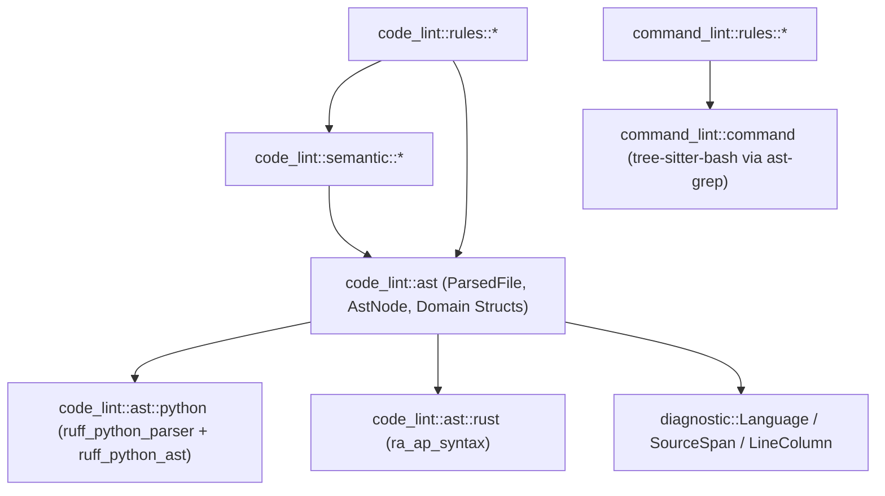

# Phase 3 — Architecture & Execution Design Plan (P3 Dedicated AST Migration)

> **Status**: READY FOR EXECUTION (`rustc 1.99.0` installed; D1–D8 incorporated)

---

## 1. Architectural Vision & Layering Boundaries

### 1.1 Component Ownership (`tests/architecture_conformance.rs`)



- **`crate::diagnostic::Language`**:
  - First-class Omni enum (`Language::Python`, `Language::Rust`) replacing `ast_grep_language::SupportLang` everywhere in `src/` and `tests/` outside `command_lint::command`.
- **`crate::code_lint::ast` (`ModuleArea::CodeLintAst`)**:
  - Sole owner of `ruff_python_parser`, `ruff_python_ast`, `ruff_text_size`, and `ra_ap_syntax`.
  - Enforced by a new architecture conformance test (`test_dedicated_ast_imports_are_confined_to_code_lint_ast`) in `tests/architecture_conformance.rs`.
  - All 10 `// omni:disable-file [repeated-literal]` directives across `src/code_lint/ast*` are removed.
- **`crate::command_lint::command` (`ModuleArea::CommandLintCommand`)**:
  - Sole remaining owner of `ast_grep_core` / `ast_grep_language` (with `ast-grep-language` trimmed in `Cargo.toml` to `default-features = false, features = ["tree-sitter-bash"]`, eliminating 27 of 28 compiled C/C++ grammars).
  - Enforced by updating `AST_GREP_OWNERS` in `tests/architecture_conformance.rs` from `&[ModuleArea::CodeLintAst, ModuleArea::CommandLintCommand]` to `&[ModuleArea::CommandLintCommand]`.

---

## 2. Core Data Structures & Abstractions

### 2.1 `crate::diagnostic::Language` (`src/diagnostic.rs`)

```rust
/// Programming language analyzed by Omni's code linter.
#[derive(Debug, Clone, Copy, PartialEq, Eq, Hash, PartialOrd, Ord)]
pub enum Language {
    /// Python (`.py`).
    Python,
    /// Rust (`.rs`).
    Rust,
}

impl Language {
    /// Lowercase canonical identifier (`"python"`, `"rust"`).
    #[must_use]
    pub const fn as_str(self) -> &'static str {
        match self {
            Self::Python => "python",
            Self::Rust => "rust",
        }
    }

    /// Detects the language of `path` from its file extension (`.py`, `.rs`).
    #[must_use]
    pub fn from_path(path: &std::path::Path) -> Option<Self> {
        match path.extension()?.to_str()? {
            "py" => Some(Self::Python),
            "rs" => Some(Self::Rust),
            _ => None,
        }
    }
}
```

### 2.2 `LineIndex` (`src/code_lint/ast.rs`)

Replaces `ast-grep`'s line/column tracking with an $O(\log L)$ binary-searched line-start table built once when `ParsedFile` is constructed:

```rust
/// Precomputed byte offsets of line starts in a source file for O(log L) line/column lookup.
pub(in crate::code_lint::ast) struct LineIndex {
    /// Byte offset of the start of each 0-indexed line. Always starts with `0`.
    line_starts: Vec<u32>,
}

impl LineIndex {
    #[must_use]
    pub(in crate::code_lint::ast) fn new(source: &str) -> Self {
        let mut line_starts = vec![0_u32];
        for (idx, byte) in source.bytes().enumerate() {
            if byte == b'\n' {
                if let Ok(next) = u32::try_from(idx + 1) {
                    line_starts.push(next);
                }
            }
        }
        Self { line_starts }
    }

    /// Returns the 1-indexed line number containing `byte_offset`.
    #[must_use]
    pub(in crate::code_lint::ast) fn line(&self, byte_offset: usize) -> usize {
        let offset_u32 = u32::try_from(byte_offset).unwrap_or(u32::MAX);
        self.line_starts.partition_point(|&start| start <= offset_u32)
    }

    /// Returns the 1-indexed `(line, column)` (where `column` counts Unicode scalar values)
    /// for `byte_offset` in `source`.
    #[must_use]
    pub(in crate::code_lint::ast) fn line_column(
        &self,
        source: &str,
        byte_offset: usize,
    ) -> LineColumn {
        let line = self.line(byte_offset);
        let line_start = self.line_starts[line - 1] as usize;
        let clamped_end = byte_offset.min(source.len()).max(line_start);
        let column = source[line_start..clamped_end].chars().count() + 1;
        LineColumn { line, column }
    }
}
```

> **Note on `end_line` parity with `ast-grep`**:
> Verify whether `ast_grep_core::Node::end_pos().line()` on a node ending with a trailing `\n` (such as a Python `comment` or `block` or statement) reports the line of the last byte or after `\n`. Neither Python `TokenKind::Comment` nor Rust `SyntaxKind::COMMENT` includes the trailing `\n`, so `line(span.end)` and `ast-grep`'s `end_pos().line() + 1` agree on all single-line and multi-line nodes that do not end with a newline character. If a node's text ends with `\n` (`span.end > span.start && source.as_bytes()[span.end - 1] == b'\n'`), we will verify exact parity with existing tests in Slice 2.

### 2.3 `ParsedFile` and `CodeLintAst` (`src/code_lint/ast.rs`)

```rust
pub(in crate::code_lint::ast) enum CodeLintAst {
    Python(ruff_python_parser::Parsed<ruff_python_ast::ModModule>),
    Rust(ra_ap_syntax::Parse<ra_ap_syntax::ast::SourceFile>),
}

pub struct ParsedFile {
    source: String,
    lang: Language,
    line_index: LineIndex,
    pub(in crate::code_lint::ast) ast: CodeLintAst,
    /// Memoized inline test byte ranges (Rust `#[cfg(test)]` / `#[test]`; empty for Python).
    inline_test_ranges: std::sync::OnceLock<Vec<std::ops::Range<usize>>>,
}
```

- **Zero `Option` / `Result` unwrapping**:
  - Both `ruff_python_parser::parse_module(source)` (in `ruff_python_parser 0.0.16`, verify whether it returns `Parsed<ModModule>` or `Result<Parsed<ModModule>, ParseError>`; note that even on syntax error `parse_module` or `parse_unchecked_source` recovers a syntax tree, and if `Result`, store `Result<Parsed<ModModule>, ParseError>`) and `ra_ap_syntax::SourceFile::parse(source, Edition::CURRENT)` are encapsulated inside `CodeLintAst`.
  - `ParsedFile::source_text(&self) -> Cow<'_, str>` returns `Cow::Borrowed(&self.source)`.
  - `ParsedFile::lang(&self) -> Language` returns `self.lang`.
  - `ParsedFile::has_syntax_error(&self) -> bool` checks `!parsed.errors().is_empty()` for both Python and Rust.
  - `ParsedFile::inline_test_ranges(&self) -> &[Range<usize>]` memoizes `rust::collect_inline_test_ranges(self)` via `OnceLock` so multiple rules inspecting the same Rust file compute inline test ranges at most once.

### 2.4 `AstNode<'a>` (`src/code_lint/ast.rs`)

```rust
#[derive(Clone)]
pub(in crate::code_lint::ast) enum AstNodeInner<'a> {
    Python(ruff_python_ast::AnyNodeRef<'a>),
    Rust(ra_ap_syntax::SyntaxNode),
    SpanOnly,
}

#[derive(Clone)]
pub struct AstNode<'a> {
    pub(in crate::code_lint::ast) file: &'a ParsedFile,
    pub(in crate::code_lint::ast) span: SourceSpan,
    pub(in crate::code_lint::ast) inner: AstNodeInner<'a>,
}
```

- **Why this representation is strictly superior to the prototype's 4-`Option` struct**:
  1. `file: &'a ParsedFile` and `span: SourceSpan` are **always present** on every `AstNode<'a>`.
  2. All 7 public methods (`text`, `lang`, `span`, `start_line`, `end_line`, `start_coordinate`, `to_source_location`) are **100% infallible** with zero `.unwrap()`, zero `.expect()`, and zero `#[allow(clippy::unwrap_used)]`.
  3. Inside `crate::code_lint::ast`:
     - `node.py_node() -> Option<AnyNodeRef<'a>>` extracts the typed Python node reference in $O(1)$ time.
     - `node.rs_node() -> Option<&SyntaxNode>` extracts the Rowan `SyntaxNode` in $O(1)$ time.
     - Any helper taking `node: &AstNode<'a>` automatically has access to `node.file` for $O(\text{depth})$ Python ancestor queries (`python::ancestors_containing(node.file, node.span)`) without changing public function signatures.

---

## 3. Native `CallPattern` Matcher (`src/code_lint/semantic/calls.rs`) — Decision D4

### 3.1 Deleting `ast::find_pattern_calls` and Legacy `ast-grep` Pattern Syntax

Currently, 4 rules pass `ast-grep` metavariable strings (`$OBJ.wait($$$ARGS)`, `$LOOP($$$LOOP_ARGS).create_task($$$ARGS)`) through `CallMatcher::Pattern` -> `ast::find_pattern_calls`.
Per Decision D4, we **delete `ast::find_pattern_calls` completely** and replace `CallMatcher::Pattern` with structured, native matching over `collect_call_candidates(file)`!

### 3.2 `AstCallCandidate<'a>` Enrichment

Extend `AstCallCandidate<'a>` in `src/code_lint/ast.rs` with one optional field for chained receiver calls (`receiver_call().method()`):

```rust
pub struct AstCallCandidate<'a> {
    /// The call expression AST node.
    pub node: AstNode<'a>,
    /// Full source text of the invoked function/callee expression.
    pub callee: String,
    /// Terminal method identifier text if the callee is a method access (e.g. `obj.method`).
    pub method_name: Option<String>,
    /// If the receiver of a method call is itself a call expression (e.g. `get_loop().create_task(coro)`),
    /// the callee text of that receiver call (e.g. `"get_loop"` or `"asyncio.get_running_loop"`).
    pub receiver_call_callee: Option<String>,
    /// Semantic argument nodes passed to the call.
    pub arguments: Vec<AstNode<'a>>,
}
```

- **In Python (`Expr::Call`)**:
  - If `call.func` is `Expr::Attribute(attr)`:
    - `method_name = Some(attr.attr.to_string())`
    - If `attr.value` is `Expr::Call(inner_call)`, `receiver_call_callee = Some(source[inner_call.func.range()].to_string())`.
- **In Rust (`ast::CallExpr` and `ast::MethodCallExpr`)**:
  - `ast::CallExpr`: `callee = func.syntax().text()`, `method_name = None`, `receiver_call_callee = None`.
  - `ast::MethodCallExpr`:
    - `method_name = method_call.name_ref().map(|n| n.text().to_string())`
    - `callee` = full `<receiver>.<method>` slice (`receiver.syntax().text_range().start()..name_ref.syntax().text_range().end()`).
    - If `method_call.receiver()` is `ast::Expr::CallExpr(inner_call)` (or `ast::Expr::MethodCallExpr(inner_mc)`), `receiver_call_callee` is populated accordingly.

> **Bonus Improvement Unlocked by `ra_ap_syntax`**:
> In Tree-sitter Rust, `x.foo(a, b)` and `foo(a, b)` were both `call_expression` with a `field_expression` child, except when turbofish `x.foo::<T>(a)` was involved (`generic_function`). In `ra_ap_syntax`, `ast::MethodCallExpr` and `ast::CallExpr` are distinct, first-class AST nodes with `.arg_list()`. Extracting both in `collect_call_candidates` handles method calls (including turbofish `x.foo::<T>(a)`) cleanly!

### 3.3 `CallMatcher` API in `src/code_lint/semantic/calls.rs`

Replace `CallMatcher::Pattern { pattern, fallback_callee }` with:
- **`CallMatcher::ChainedMethod { receiver_callee: Option<&'static str>, method: &'static str }`** (or declarative pattern syntax in `CallMatcher::from_pattern(spec: &'static str)`):
  - `"*().create_task"` -> matches any method call where `method_name == Some("create_task")` and `receiver_call_callee.is_some()`.
  - `"asyncio.get_running_loop().create_task"` -> matches where `method_name == Some("create_task")` and `receiver_call_callee == Some("asyncio.get_running_loop")` (or resolved via imports).
  - `"*.wait"` -> `CallMatcher::Method("wait")`.
  - `"time.sleep"` -> `CallMatcher::QualifiedPath(&["time", "sleep"])`.
  - `"sleep"` -> `CallMatcher::Function("sleep")`.
- All 4 rules (`SleepInTest`, `SubprocessCommunicate`, `UntrackedAsyncTask`, `ForbiddenSyncCall`) now execute in a **single pass** over `collect_call_candidates(file)` with zero `ast-grep` pattern compilation!

---

## 4. Tightening `code_lint::ast` Encapsulation & Visibility (Decision D7)

### 4.1 Internal Items Tightened from `pub` to `pub(in crate::code_lint::ast)` / Private

| File | Item(s) | Current Visibility | Target Visibility |
| :--- | :--- | :--- | :--- |
| `src/code_lint/ast/python.rs` | `is_comment_kind`, `is_call_kind`, `extract_method_call_target`, `is_import_binding_parent`, `is_structural_definition_parent`, `function_name_and_is_top_level` | `pub fn` | Deleted or `pub(super) fn` (internal to `ast.rs` dispatch) |
| `src/code_lint/ast/rust.rs` | `is_comment_kind`, `is_call_kind`, `extract_method_call_target`, `is_import_binding_parent`, `is_structural_definition_parent`, `function_name_and_is_top_level`, `attribute_terminal_name`, `is_test_attribute`, `is_conditional_test_attribute` | `pub fn` | `pub(super) fn` / private |
| `src/code_lint/ast/rust.rs` | `collect_bindings`, `collect_test_function_assertion_counts`, `find_unwrapped_multiline_strings`, `collect_positional_reads`, `collect_literal_occurrences`, `is_trait_impl_member` | `pub fn` | `pub(super) fn` (callers outside `ast` use `ast::collect_*` language-dispatched entry points) |
| `src/code_lint/ast/python.rs` | `collect_bindings`, `collect_test_function_assertion_counts`, `find_unwrapped_multiline_strings`, `collect_positional_reads`, `collect_literal_occurrences`, `is_trait_impl_member` | `pub fn` | `pub(super) fn` (callers outside `ast` use `ast::collect_*` language-dispatched entry points) |
| `src/code_lint/ast/python.rs` | `normalize_string_content`, `delimited_string_parts` | `pub(in crate::code_lint::ast)` / private | **Deleted** (Decision D6: native decoded literal values) |
| `src/code_lint/ast/rust.rs` | `rust_string_body` | private | **Deleted** (Decision D6: native decoded literal values) |

---

## 5. Step-by-Step Execution Plan (Slices 0–6)

Each slice is designed to compile cleanly and pass `cargo fmt --check && cargo clippy --all-targets -- -D warnings && cargo test && cargo doc --no-deps --document-private-items` before moving to the next slice.

```
0. [Slice 0: Toolchain Update]           → verify: rustc 1.99.0 installed (DONE)
1. [Slice 1: Omni Language Enum]         → verify: cargo clippy & test green; 0 SupportLang outside ast.rs / command.rs (DONE)
2. [Slice 2: AST Core + CallPattern]     → verify: Cargo.toml updated; ast.rs + statements.rs + semantic/calls.rs migrated; find_pattern_calls deleted (DONE)
3. [Slice 3: Rust AST (ra_ap_syntax)]    → verify: ast/rust.rs 100% migrated; 0 RawNode in rust.rs (DONE)
4. [Slice 4: Python AST Submodules]      → verify: ast/python/{strings,format_strings,logging,annotations,classes,functions,scopes}.rs migrated
5. [Slice 5: Python Root + Drop AstGrep] → verify: ast/python.rs migrated; 0 AstGrep in code_lint; ast-grep-language trimmed to bash
6. [Slice 6: Boundaries + Memoization + Zero-Legacy Audit] → verify: OnceLock caches + visibility tightening + Phase 5/6 audit 100% green
```

### Slice 0 — Toolchain Update (`rustc 1.99.0`) — DONE
- Updated local toolchain from `rustc 1.90.0` to `rustc 1.99.0` (`cargo 1.99.0`) via `rustup update stable`.
- Verified `ruff_python_parser = "=0.0.16"`, `ruff_python_ast = "=0.0.16"`, `ruff_text_size = "=0.0.2"`, and `ra_ap_syntax = "=0.0.357"` on crates.io.

### Slice 1 — First-Class `crate::diagnostic::Language` Enum (Decision D3) — DONE (deviations in `04_execution_log.md`)
- **Files**:
  - `src/diagnostic.rs`: Define `Language { Python, Rust }` with `as_str()`, `from_path(&Path)`, `Display`.
  - `src/code_lint/ast.rs`: `detect_language(path) -> Option<Language>`, `ParsedFile::new(source, lang: Language)`, `ParsedFile::lang(&self) -> Language`, `AstNode::lang(&self) -> Language`. (Temporarily convert `Language <-> SupportLang` in `ParsedFile::new` until Slice 5 drops `AstGrep` from `ParsedFile`.)
  - Mechanical replacement of `SupportLang` -> `Language` across `src/rule_trait.rs`, `src/engine.rs`, `src/ignore.rs`, `src/context.rs`, `src/code_lint/semantic/*.rs`, `src/code_lint/rules/*.rs`, `src/test_utils.rs`, and `tests/registry.rs`.
- **Verification**: `cargo fmt --check && cargo clippy --all-targets -- -D warnings && cargo test`.

### Slice 2 — `Cargo.toml` Crates, `ParsedFile` / `LineIndex` / `AstNode` Core, and `CallPattern` (Decisions D2, D4)
- **Files**:
  - `Cargo.toml`: Add `ruff_python_parser = "=0.0.16"`, `ruff_python_ast = "=0.0.16"`, `ruff_text_size = "=0.0.2"`, `ra_ap_syntax = "=0.0.357"`.
  - `src/code_lint/ast.rs`:
    - Add `LineIndex` and `AstNodeInner<'a>`.
    - Migrate `ParsedFile::has_syntax_error`, `collect_comment_nodes`, `collect_call_candidates` (with `receiver_call_callee`), and `enclosing_non_exempt_function_name` to `ruff_python_ast` and `ra_ap_syntax`.
    - Delete `ast::find_pattern_calls`.
  - `src/code_lint/semantic/calls.rs` & rule callers (`mock_call_assertion.rs`, `unstructured_task.rs`, etc.):
    - Replace `ast-grep` `$OBJ` / `$LOOP($$$LOOP_ARGS)` pattern matching with native `CallPattern` matching (`"*.method"`, `"*().method"`, `"pkg.func().method"`) over `collect_call_candidates`.
- **Verification**: `cargo fmt --check && cargo clippy --all-targets -- -D warnings && cargo test`.

### Slice 3 — Migrate `src/code_lint/ast/rust.rs` and Rust `statements.rs` to `ra_ap_syntax` (Decisions D1, D6, D7)
- **Files**:
  - `src/code_lint/ast/rust.rs` & `src/code_lint/ast/statements.rs`:
    - Migrate all Rust extractors from `RawNode` to `ra_ap_syntax` (`SourceFile`, `SyntaxNode`, `SyntaxToken`, `SyntaxKind`, `ast::*`, `HasAttrs`, `HasName`, `HasVisibility`, `HasArgList`, `HasGenericParams`, `HasTypeBounds`):
      1. Inline test ranges & attributes (`collect_inline_test_ranges`, `has_preceding_doc_comment`, `is_trait_impl_member`) — using `HasAttrs::attrs()` and `ast::Comment::kind().doc`.
      2. Imports, bindings, and calls (`collect_bindings`, `collect_suppress_calls`, etc.).
      3. Assertions & test functions (`collect_test_function_assertion_counts`, `macro_terminal_name`, `has_top_level_logical_and`, `extract_macro_arguments`, `is_boolean_literal_collection`) — using `ast::Fn`, `ast::MacroCall`, `ast::TokenTree`.
      4. Multiline strings (`find_unwrapped_multiline_strings`) — using `ast::Literal` (`LiteralKind::String` / `ByteString`).
      5. Function/type signatures (`collect_function_signatures`, `unwrap_return_envelope`, `extract_option_payload`, `unwrap_pointer_wrappers`, `extract_generic_type`, `resolve_type_path`, `extract_slice_type`).
      6. Structural summary (`summarize_rust_file`) — using `ast::Module`, `ast::Fn`, `ast::Struct`, `ast::Enum`, `ast::Trait`, `ast::Impl`, `ast::TypeAlias`, `ast::Const`, `ast::Static`.
      7. Positional reads (`collect_positional_reads`) — using `ast::FieldExpr` (tuple index) and mutation/borrow detection.
      8. Literals (`collect_literal_occurrences`) — using `ast::Literal` with native `.value()` decoding (Decision D6) + macro `TokenTree` traversal.
      9. Statement metrics (`ast/statements.rs` Rust paths).
    - Lift `// omni:disable-file [repeated-literal]` from `src/code_lint/ast/rust.rs`.
- **Verification**: Zero `RawNode` or `ast_grep` references in `src/code_lint/ast/rust.rs`; all Rust AST & rule tests pass.

### Slice 4 — Migrate `src/code_lint/ast/python/*` Submodules to `ruff_python_ast` (Decisions D1, D7)
- **Files**:
  - `src/code_lint/ast/python/strings.rs`: Multiline strings, docstrings, dedent wrappers using `Expr::StringLiteral`, `Expr::BytesLiteral`, `Expr::FString`.
  - `src/code_lint/ast/python/format_strings.rs`: F-string / `.format()` / `%` formatting inspection using `Expr::FString`, `InterpolatedStringElement`, `Expr::Call`, `Expr::BinOp`.
  - `src/code_lint/ast/python/logging.rs`: Logging calls and exception handlers using `Expr::Call`, `ExceptHandler`.
  - `src/code_lint/ast/python/annotations.rs`: Type annotations, generic types (`Expr::Subscript` for both `Final[int]` and `typing.Final[int]`), union types (`Expr::BinOp` with `Operator::BitOr`), return envelopes, collection displays. Delete `unwrap_type_and_parens`.
  - `src/code_lint/ast/python/classes.rs`: `Stmt::ClassDef`, `Stmt::AnnAssign`, Protocol/ABC inheritance, dataclass/NamedTuple/TypedDict inspection.
  - `src/code_lint/ast/python/functions.rs`: `Stmt::FunctionDef`, `Parameters`, `ParameterWithDefault`, `@override` / exempt decorators, stub bodies. Delete `parse_param_parts`.
  - `src/code_lint/ast/python/scopes.rs`: Scope & import bindings (`Stmt::Import`, `Stmt::ImportFrom`, `Alias`, `BindingKind`).
  - Lift `// omni:disable-file [repeated-literal]` on each migrated submodule.
- **Verification**: `cargo fmt --check && cargo clippy --all-targets -- -D warnings && cargo test`.

### Slice 5 — Migrate `src/code_lint/ast/python.rs` Root Extractors, Drop `AstGrep` from `code_lint`, and Trim `ast-grep-language` (Decisions D1, D5, D6, D8)
- **Files**:
  - `src/code_lint/ast/python.rs` & `src/code_lint/ast/statements.rs`:
    - Migrate remaining `python.rs` extractors: escape-decoded `collect_literal_occurrences` (Decision D6), `collect_positional_reads`, `collect_test_function_assertion_counts`, parameter mutation/capability analysis (`is_parameter_mutated_or_escaping`), `collect_mutable_module_assignments`, `summarize_python_file`, and Python paths in `statements.rs`.
    - Delete `normalize_string_content`, `delimited_string_parts`, `strip_named_unicode_escapes`.
  - `src/code_lint/rules/repeated_literal.rs`:
    - Promote `known_gap_negative_numbers_in_mapping_and_keyword_patterns` (`repeated_literal.rs:283`) to a `fail` test (Decision D5).
  - `src/code_lint/ast.rs`:
    - Remove `grep: AstGrep<SourceDoc>`, `SourceDoc`, and `RawNode` completely.
    - Lift remaining `// omni:disable-file [repeated-literal]` directives in `ast.rs`, `python.rs`, and `statements.rs`.
  - `Cargo.toml` & `tests/architecture_conformance.rs`:
    - Trim `ast-grep-language` to `default-features = false, features = ["tree-sitter-bash"]`.
    - Restrict `AST_GREP_OWNERS` to `&[ModuleArea::CommandLintCommand]`.
    - Add `DEDICATED_AST_OWNERS` (`ruff_python_parser`, `ruff_python_ast`, `ruff_text_size`, `ra_ap_syntax`) restricted to `&[ModuleArea::CodeLintAst]`.
- **Verification**: `cargo fmt --check && cargo clippy --all-targets -- -D warnings && cargo test`.

### Slice 6 — Architecture & Boundary Refinement, `ParsedFile` Memoization, and Zero-Legacy Audit (Decisions D6, D7)
- **Files**:
  - `src/code_lint/ast.rs` + `src/code_lint/ast/{python,rust}.rs`:
    - Tighten ~20 internal `pub` helpers to `pub(super)` / `pub(in crate::code_lint::ast)` and remove duplicate exports.
    - Memoize shared file-level queries (`inline_test_ranges`, `comment_nodes`, `call_candidates`, etc.) via `OnceLock` on `ParsedFile`.
    - Add declarative rule helpers on `CodeRule` / `code_lint::policy`.
  - Execute the mandatory Phase 5 (`05_cleanup.md`) and Phase 6 (`06_review_and_audit.md`) **Zero-Legacy & Zero-Compat Bloat Audit**, then record learnings in `07_learn.md`.

---

## 6. Mandatory Zero-Legacy & Zero-Compat Bloat Audit Checklist (Phase 5 & 6)

Every item below must be verified with `rg` / `cargo` before completion:

1. **Zero `ast-grep` or `tree-sitter` in `src/code_lint/`**:
   - `rg 'ast_grep|tree_sitter|SupportLang|RawNode|SourceDoc|find_pattern_calls' src/code_lint/` -> **0 matches**.
2. **Zero `SupportLang` outside `src/command_lint/command.rs`**:
   - `rg 'SupportLang' src/ tests/` -> matches **only** in `src/command_lint/command.rs` and `tests/architecture_conformance.rs`.
3. **Zero legacy string/delimiter stripping shims**:
   - `rg 'normalize_string_content|rust_string_body|delimited_string_parts' src/` -> **0 matches**.
4. **Zero `generic_type` vs `subscript` workarounds in Python AST**:
   - `rg 'generic_type' src/code_lint/ast/python*` -> **0 matches**.
5. **Zero `// omni:disable-file [repeated-literal]` in `src/code_lint/ast*`**:
   - `rg 'omni:disable-file \[repeated-literal\]' src/code_lint/ast*` -> **0 matches**.
6. **Zero transitional `Option` fields or `#[allow(clippy::unwrap_used)]` on `ParsedFile` / `AstNode`**:
   - Inspect `src/code_lint/ast.rs` to verify `ParsedFile` and `AstNode` have no transitional `Option` wrappers or blanket `#[allow]` attributes.
7. **Visibility audit of `src/code_lint/ast/`**:
   - Verify no internal dispatch helpers in `ast/python.rs` or `ast/rust.rs` are `pub` when only called from `src/code_lint/ast.rs`.
8. **Full quality gate**:
   - `cargo fmt --check && cargo clippy --all-targets -- -D warnings && cargo test && cargo doc --no-deps --document-private-items` -> **100% green**.
