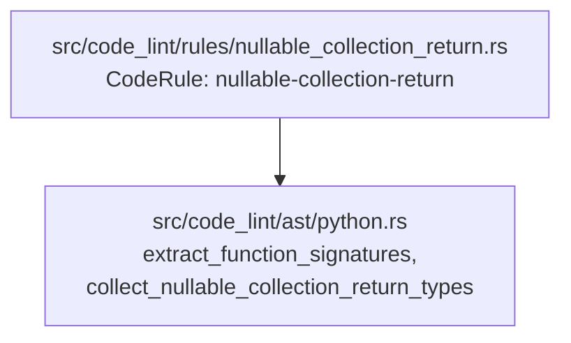

# Phase 3: Design & Plan — `nullable-collection-return`

Builds on validated [01_understand.md](01_understand.md) (`D1`–`D5`, `Q1`–`Q4`) and [02_references.md](02_references.md) (`R1`–`R8`).

> **Status**: **VALIDATED** (2026-10-03).
> - Rescoped from Polybot's `AvoidOptionalOrNoneRule` to **`nullable-collection-return`** (`Q1` Option B).
> - Classification set to `Precision::Heuristic`, `Consensus::Opinionated`, `ImpactedQuality::Maintainability`, `topics: &[Topic::STATIC_TYPING]` (`D3`).

---

## 1. Definition of Done

### 1.1 Critical User Journeys
1. **Unexplained nullable collection return**: A Python function `def get_tags() -> list[str] | None:` or `def fetch_items() -> Optional[Sequence[int]]:` is flagged with:
   - `summary`: ``Return annotation `list[str] | None` of `get_tags` makes collection type `list` nullable.``
   - `rationale`: ``Wrapping a collection return type in `| None` or `Optional` creates two representations for an empty result and forces callers to check for `None` before iterating or querying length.``
   - `suggestion`: ``Remove `None` from the return annotation of `get_tags` and return an empty collection such as `()`, `[]`, `{}`, or `frozenset()` when no elements are present.``
2. **Explained tri-state return (`EnforcementMode::RequireExplanation`)**: A function preceded by a substantive explanation comment (e.g., `# Returns None on cache miss; an empty sequence means the user has no tags.`) passes without diagnostics in the default `require-explanation` mode.
3. **Non-collection optionals and inner nullable elements**: `def find_user() -> User | None:`, `def parse_pair() -> tuple[str, int] | None:`, and `def get_scores() -> Sequence[int | None]:` pass without diagnostics.
4. **Imposed signatures**: Functions decorated with `@override`, `@overload`, `@abstractmethod`, `@fixture`, `@<fn>.register`, methods on `Protocol` or `ABC` classes, and fixed data-model dunders pass without diagnostics.

### 1.2 Verification Metrics
- `cargo fmt --check && cargo clippy --all-targets -- -D warnings && cargo test` passes 100%.
- `tests/registry.rs` conformance tests pass (`test_rule_names_follow_the_naming_grammar`, `test_rule_files_and_consts_are_named_after_their_rule`, `test_template_fields_share_the_common_form`, `test_summaries_state_only_the_fact`, `test_rationales_explain_without_commanding`, `test_suggestions_open_with_a_listed_verb`, `test_placeholders_use_the_shared_vocabulary`, `test_rules_with_a_mode_leave_comment_explanations_to_the_framework`, `test_doc_summaries_open_with_flags_or_requires`, `assert_documented_examples`).
- Every exemption in `check_file` and `collect_nullable_collection_return_types` is verified by temporarily mutating/disabling the exemption and confirming its dedicated `pass` test case fails.

---

## 2. Architecture & Component Boundaries



- **`src/code_lint/ast/python.rs` (`CodeLintAst`)**: Owns all Tree-sitter node-kind inspection (`"type"`, `"binary_operator"`, `"generic_type"`, `"subscript"`, `"none"`, `"ellipsis"`), return-envelope unwrapping (`Annotated`, `Awaitable`, `Coroutine`), top-level union flattening (`|`, `Optional`, `Union`), and collection constructor matching.
- **`src/code_lint/rules/nullable_collection_return.rs` (`CodeLintRules`)**: Iterates `extract_function_signatures(file)`, skips `signature.is_exempt_from_signature_rules()`, calls `collect_nullable_collection_return_types(return_type_node)`, and emits diagnostics on `return_type_node`.

---

## 3. Detailed Design

### 3.1 AST Helpers (`src/code_lint/ast/python.rs`)

Add the public extractor and supporting private helpers to `src/code_lint/ast/python.rs`:

```rust
/// Abstract and immutable collection constructors in `collections.abc`, `typing`, and `builtins`
/// that have a natural empty value (`()`, `{}`, `frozenset()`).
const ABSTRACT_AND_IMMUTABLE_COLLECTION_CONSTRUCTORS: &[&str] = &[
    "Sequence",
    "MutableSequence",
    "Mapping",
    "MutableMapping",
    "Set",
    "AbstractSet",
    "MutableSet",
    "Collection",
    "Iterable",
    "Reversible",
    "frozenset",
    "FrozenSet",
];

/// Returns true if `(path, terminal)` is a concrete or abstract collection type constructor
/// (excluding `tuple` / `Tuple`, which requires variadic-vs-fixed arity inspection when subscripted).
fn is_non_tuple_collection_constructor(path: &str, terminal: &str) -> bool {
    is_concrete_collection_constructor(path, terminal)
        || is_std_type_constructor(
            path,
            terminal,
            ABSTRACT_AND_IMMUTABLE_COLLECTION_CONSTRUCTORS,
        )
}

/// Returns true if `node` (unwrapping `type` and `parenthesized_expression`) is an `ellipsis` (`...`).
fn is_ellipsis_type_arg(node: &RawNode<'_>) -> bool {
    let mut current = node.clone();
    while matches!(current.kind().as_ref(), "type" | "parenthesized_expression") {
        let Some(inner) = current
            .children()
            .find(|child| child.is_named() && !child.is_extra())
        else {
            return false;
        };
        current = inner;
    }
    current.kind() == "ellipsis"
}

/// Unwraps outer return-annotation envelopes (`type`, `parenthesized_expression`,
/// `Annotated[T, ...]`, `Awaitable[T]`, and `Coroutine[YieldT, SendT, ReturnT]`).
fn unwrap_return_envelope<'a>(node: &RawNode<'a>) -> RawNode<'a> {
    let mut current = node.clone();
    loop {
        if matches!(current.kind().as_ref(), "type" | "parenthesized_expression") {
            let Some(inner) = current
                .children()
                .find(|child| child.is_named() && !child.is_extra())
            else {
                return current;
            };
            current = inner;
            continue;
        }
        if matches!(current.kind().as_ref(), "generic_type" | "subscript")
            && let Some((base_node, type_args)) = extract_generic_base_and_args(&current)
        {
            let (base_path, base_terminal) = resolve_path_and_terminal_raw(&base_node);
            if is_std_type_constructor(&base_path, &base_terminal, &["Annotated", "Awaitable"])
                && let Some(first_arg) = type_args.into_iter().next()
            {
                current = first_arg;
                continue;
            }
            if is_std_type_constructor(&base_path, &base_terminal, &["Coroutine"])
                && let Some(return_arg) = type_args.into_iter().nth(2)
            {
                current = return_arg;
                continue;
            }
        }
        return current;
    }
}

/// Flattens top-level union constructs (`|`, `Optional[...]`, `Union[...]`, and `Annotated[T, ...]`)
/// into `branches` and sets `*has_none = true` if `None` (`none`) or `Optional[...]` is part of the union.
fn collect_union_branches<'a>(
    node: &RawNode<'a>,
    has_none: &mut bool,
    branches: &mut Vec<RawNode<'a>>,
) {
    match node.kind().as_ref() {
        "type" | "parenthesized_expression" | "union_type" => {
            for child in node.children() {
                if child.is_named() && !child.is_extra() {
                    collect_union_branches(&child, has_none, branches);
                }
            }
        }
        "binary_operator" if node.field("operator").is_some_and(|op| op.text() == "|") => {
            if let Some(left) = node.field("left") {
                collect_union_branches(&left, has_none, branches);
            }
            if let Some(right) = node.field("right") {
                collect_union_branches(&right, has_none, branches);
            }
        }
        "none" => {
            *has_none = true;
        }
        "generic_type" | "subscript" => {
            let Some((base_node, type_args)) = extract_generic_base_and_args(node) else {
                branches.push(node.clone());
                return;
            };
            let (base_path, base_terminal) = resolve_path_and_terminal_raw(&base_node);
            if is_std_type_constructor(&base_path, &base_terminal, &["Optional"]) {
                *has_none = true;
                for arg in &type_args {
                    collect_union_branches(arg, has_none, branches);
                }
            } else if is_std_type_constructor(&base_path, &base_terminal, &["Union"]) {
                for arg in &type_args {
                    collect_union_branches(arg, has_none, branches);
                }
            } else if is_std_type_constructor(&base_path, &base_terminal, &["Annotated"]) {
                if let Some(first_arg) = type_args.first() {
                    collect_union_branches(first_arg, has_none, branches);
                }
            } else {
                branches.push(node.clone());
            }
        }
        _ => {
            branches.push(node.clone());
        }
    }
}

/// Returns the collection type constructor path (e.g. `"Sequence"`, `"list"`, `"tuple"`) if
/// `branch` is a collection type, or `None` otherwise.
///
/// Bare `tuple`/`Tuple` and variadic `tuple[T, ...]`/`Tuple[T, ...]` are treated as collections;
/// fixed-length record tuples (`tuple[int, str]`) return `None`.
fn collection_branch_type_path(branch: &RawNode<'_>) -> Option<String> {
    match branch.kind().as_ref() {
        "identifier" | "attribute" => {
            let (path, terminal) = resolve_path_and_terminal_raw(branch);
            if is_non_tuple_collection_constructor(&path, &terminal)
                || is_std_type_constructor(&path, &terminal, &["tuple", "Tuple"])
            {
                Some(path)
            } else {
                None
            }
        }
        "generic_type" | "subscript" => {
            let (base_node, type_args) = extract_generic_base_and_args(branch)?;
            let (base_path, base_terminal) = resolve_path_and_terminal_raw(&base_node);
            if is_non_tuple_collection_constructor(&base_path, &base_terminal) {
                Some(base_path)
            } else if is_std_type_constructor(&base_path, &base_terminal, &["tuple", "Tuple"])
                && type_args.len() == 2
                && is_ellipsis_type_arg(&type_args[1])
            {
                Some(base_path)
            } else {
                None
            }
        }
        _ => None,
    }
}

/// Collects collection type constructors (in source order, deduplicated) when `type_node`
/// (after unwrapping `Annotated`, `Awaitable`, and `Coroutine` return envelopes) is a union
/// containing `None` (`| None`, `Optional[...]`, or `Union[..., None]`) in which **all**
/// non-`None` branches are collection types.
#[must_use]
pub fn collect_nullable_collection_return_types(type_node: &AstNode<'_>) -> Vec<String> {
    let root = unwrap_return_envelope(&type_node.raw);
    let mut has_none = false;
    let mut branches = Vec::new();
    collect_union_branches(&root, &mut has_none, &mut branches);

    if !has_none || branches.is_empty() {
        return Vec::new();
    }

    let mut matched = Vec::new();
    for branch in &branches {
        let Some(type_path) = collection_branch_type_path(branch) else {
            return Vec::new();
        };
        if !matched.contains(&type_path) {
            matched.push(type_path);
        }
    }
    matched
}
```

---

### 3.2 Rule Declaration (`src/code_lint/rules/nullable_collection_return.rs`)

```rust
//! Flags Python function return annotations that wrap a collection type in `| None` or `Optional` (`nullable-collection-return`).

use crate::code_lint::ast::ParsedFile;
use crate::code_lint::ast::python::{
    collect_nullable_collection_return_types, extract_function_signatures,
};
use crate::code_lint::contract::{CodeRule, RuleTarget};
use crate::diagnostic::{Diagnostic, RuleName, ViolationTemplate, violation_template};
use crate::rule_declaration::{
    Classification, Consensus, Declaration, EnforcementMode, Example, ImpactedQuality,
    LanguageDefaults, Precision, Reference, RuleDoc, RuleOptions, Topic,
};
use ast_grep_language::SupportLang;
use std::path::Path;

const TEMPLATE: ViolationTemplate = violation_template! {
    summary: "Return annotation `{expression}` of `{function}` makes collection type `{token}` nullable.",
    rationale: "Wrapping a collection return type in `| None` or `Optional` creates two representations for an empty result and forces callers to check for `None` before iterating or querying length.",
    suggestion: "Remove `None` from the return annotation of `{function}` and return an empty collection such as `()`, `[]`, `{}`, or `frozenset()` when no elements are present.",
};

/// The rule's declaration.
pub const RULE: CodeRule = CodeRule {
    declaration: Declaration {
        name: RuleName("nullable-collection-return"),
        template: &TEMPLATE,
        languages: &[SupportLang::Python],
        options: RuleOptions {
            enforcement_mode: Some(LanguageDefaults::new(
                EnforcementMode::RequireExplanation,
                &[],
            )),
            options: (),
        },
        classification: Classification {
            topics: &[Topic::STATIC_TYPING],
            precision: Precision::Heuristic,
            consensus: Consensus::Opinionated,
            impacted_quality: ImpactedQuality::Maintainability,
        },
        doc: RuleDoc {
            summary: "Flags Python function return annotations that wrap a collection type in `| None` or `Optional`.",
            what_it_does: "Flags functions and methods in Python source files (test files are \
                           not checked) whose return annotation (or awaited return type inside \
                           `Awaitable[...]` or `Coroutine[Any, Any, ...]`, or underlying type \
                           inside `Annotated[..., ...]`) is a union containing `None` (`| None`, \
                           `Optional[...]`, or `Union[..., None]`) in which every non-`None` \
                           branch is a collection type (`Sequence`, `MutableSequence`, `Mapping`, \
                           `MutableMapping`, `Set`, `AbstractSet`, `MutableSet`, `Collection`, \
                           `Iterable`, `Reversible`, `list`, `List`, `dict`, `Dict`, `set`, \
                           `frozenset`, `FrozenSet`, `deque`, `Deque`, `defaultdict`, \
                           `DefaultDict`, `Counter`, `OrderedDict`, bare `tuple` / `Tuple`, or \
                           variadic `tuple[T, ...]` / `Tuple[T, ...]`). Fixed-length record \
                           tuples (`tuple[int, str] | None`), unions that mix a collection with \
                           a non-collection type (`str | Sequence[str] | None`), and \
                           non-nullable collections of nullable elements (`Sequence[int | None]`) \
                           are not flagged. Dunder methods other than `__init__`, `__new__`, and \
                           `__call__`, methods on `Protocol` or `ABC` classes, and functions \
                           decorated with `@override`, `@overload`, `@abstractmethod`, \
                           `@fixture`, or `@<function>.register` are exempt.",
            why_is_this_bad: "A collection type (`Sequence`, `Mapping`, `Set`, `Iterable`, \
                              `list`, `dict`, `set`, `tuple[T, ...]`) already has an empty value \
                              (`()`, `[]`, `{}`, `frozenset()`) that represents zero elements. \
                              Returning `Sequence[T] | None` or `Optional[list[T]]` splits the \
                              empty case across `None` and `()`, forcing every caller to branch \
                              on `None` (`for item in get_items() or ():`) before iterating, \
                              indexing, or calling `len()`.\n\n\
                              Return an empty collection when no items are found so callers can \
                              iterate and query length unconditionally. A nullable collection \
                              return is only needed for a three-state contract where `None` \
                              means something distinct from zero elements, such as a cache miss, \
                              an unparsed field, or an omitted filter.",
            references: &[
                Reference {
                    title: "SonarSource RSPEC-1168: Empty arrays and collections should be returned instead of null",
                    url: "https://rules.sonarsource.com/java/RSPEC-1168/",
                },
                Reference {
                    title: "PMD: ReturnEmptyCollectionRatherThanNull",
                    url: "https://pmd.github.io/pmd/pmd_rules_java_design.html#returnemptycollectionratherthannull",
                },
            ],
            examples: &[Example {
                language: SupportLang::Python,
                flagged: indoc::indoc! {r"
                    from collections.abc import Sequence

                    def active_tags(self) -> Sequence[str] | None:
                        return self._tags
                "},
                flagged_span: "Sequence[str] | None",
                fixed: indoc::indoc! {r"
                    from collections.abc import Sequence

                    def active_tags(self) -> Sequence[str]:
                        return self._tags or ()
                "},
            }],
        },
    },
    target: RuleTarget::SourceOnly,
    check: check_file,
};

fn check_file(rule: &CodeRule, path: &Path, file: &ParsedFile, (): ()) -> Vec<Diagnostic> {
    let mut diagnostics = Vec::new();

    for signature in extract_function_signatures(file) {
        if signature.is_exempt_from_signature_rules() {
            continue;
        }
        let Some(ref return_type_node) = signature.return_type_node else {
            continue;
        };
        let matched = collect_nullable_collection_return_types(return_type_node);
        if matched.is_empty() {
            continue;
        }
        let token = matched.join(", ");
        let expression = return_type_node.text();
        diagnostics.push(rule.diagnostic_at_node(
            path,
            return_type_node,
            &[
                ("function", &signature.name),
                ("expression", expression.as_ref()),
                ("token", &token),
            ],
        ));
    }

    diagnostics
}
```

### 3.3 Registry Guardrail Verification Checklist
- **Rule name**: `"nullable-collection-return"` — 3 words (`<= 4`), kebab-case, no polarity prefix/suffix (`no-`, `prefer-`, `enforce-`, `banned-`, `max-`, `min-`, `-enforced`).
- **File & const**: `src/code_lint/rules/nullable_collection_return.rs` with `pub const RULE: CodeRule`.
- **`TEMPLATE.summary`**:
  - Starts with uppercase `'R'`, ends with `'.'`, single sentence.
  - Prose outside backticks: `"Return annotation  of  makes collection type  nullable."` — no quotes, no judgement words, no fix verbs (`use`, `replace`, `add`, `rename`, `remove`), no abbreviations (`e.g.`, `i.e.`).
- **`TEMPLATE.rationale`**:
  - Starts with `"Wrapping"` (not a fix verb), ends with `'.'`, no `"should"` or `"must"`, no quotes outside backticks, no abbreviations.
- **`TEMPLATE.suggestion`**:
  - Starts with `"Remove"` (in `SUGGESTION_VERBS`), ends with `'.'`, no quotes outside backticks, no judgement words, no abbreviations.
- **Placeholders**: `{expression}`, `{function}`, `{token}` — all in `PLACEHOLDERS` (`{}` has empty key so `placeholders()` ignores it and `LanguageText::interpolate` leaves it literal).
- **Mode guardrail (`test_rules_with_a_mode_leave_comment_explanations_to_the_framework`)**:
  - Neither `"require-explanation"` nor any word containing `"comment"` appears anywhere in `TEMPLATE` or `RuleDoc`.
- **`RuleDoc::summary`**:
  - `"Flags Python function return annotations that wrap a collection type in `| None` or `Optional`."` — starts with `"Flags "`, single sentence ending with `'.'`.

---

## 4. Comprehensive Test Plan

### 4.1 `rule_test!` Cases in `src/code_lint/rules/nullable_collection_return.rs`

#### `pass` Cases (17 cases — 1 behaviour per case)
1. `non_nullable_collection_returns`:
   - `-> Sequence[str]`, `-> Mapping[str, int]`, `-> AbstractSet[str]`, `-> list[int]`, `-> tuple[int, ...]`, `-> frozenset[str]` (no `None` in return union).
2. `non_collection_nullable_returns`:
   - `-> str | None`, `-> int | None`, `-> Optional[User]`, `-> Union[int, str, None]` (scalar and domain object optionals).
3. `collection_of_nullable_elements`:
   - `-> Sequence[int | None]`, `-> Mapping[str, list[int] | None]`, `-> tuple[Price | None, ...]` (inner element is nullable, outer collection is not).
4. `fixed_length_record_tuple_nullable`:
   - `-> tuple[str, int] | None`, `-> Tuple[bool, str] | None`, `-> Optional[tuple[int]]` (fixed-length record tuples, not variadic `tuple[T, ...]`).
5. `mixed_collection_and_scalar_union_with_none`:
   - `-> str | Sequence[str] | None`, `-> Optional[int | list[int]]` (discriminated union mixing a non-collection type and a collection type).
6. `nullable_parameters_and_attributes_not_flagged`:
   - Function parameters `items: Sequence[str] | None = None`, `mapping: Mapping[str, int] | None = None` and class/instance attributes `tags: Sequence[str] | None = None` with `-> None` return.
7. `callable_with_nullable_collection_parameter_or_return_not_flagged`:
   - `-> Callable[[int], Sequence[str] | None]` and `-> Callable[[Sequence[str]], None] | None` (returning a callable or an optional callable).
8. `explained_by_preceding_header_comment`:
   - `# Returns None on cache miss; an empty sequence means the user has no tags.` above `def cached_tags() -> Sequence[str] | None:`.
9. `explained_on_decorated_function_header`:
   - Header comment above `@staticmethod def cached_batch() -> list[int] | None:`.
10. `protocol_class_exempt`:
    - `class Cache(Protocol): def get_items(self) -> Sequence[str] | None: ...`.
11. `abc_class_exempt`:
    - `class BaseCache(abc.ABC): def get_items(self) -> Sequence[str] | None: pass`.
12. `abstractmethod_exempt`:
    - `@abc.abstractmethod def get_items(self) -> Sequence[str] | None:`.
13. `override_exempt`:
    - `@override def get_items(self) -> Sequence[str] | None:`.
14. `overload_exempt`:
    - `@overload def fetch(x: int) -> Sequence[int] | None: ...`.
15. `pytest_fixture_exempt`:
    - `@pytest.fixture def sample_items() -> Sequence[int] | None:`.
16. `singledispatch_register_exempt`:
    - `@process.register def _(value: int) -> Sequence[str] | None:`.
17. `data_model_dunder_exempt`:
    - `def __getattr__(self, name: str) -> Sequence[str] | None:`.

#### `fail` Cases (14 cases — each producing 1 diagnostic)
1. `pep604_sequence_or_none`:
   - `def get_users() -> Sequence[str] | None:` => `"Sequence[str] | None"`
2. `none_on_left_of_pep604_union`:
   - `def get_users() -> None | Sequence[str]:` => `"None | Sequence[str]"`
3. `typing_optional_list`:
   - `def get_users() -> Optional[list[str]]:` => `"Optional[list[str]]"`
4. `qualified_typing_union_mapping_none`:
   - `def get_counts() -> typing.Union[Mapping[str, int], None]:` => `"typing.Union[Mapping[str, int], None]"`
5. `abstract_and_concrete_sets`:
   - `def get_tags() -> AbstractSet[str] | None:` => `"AbstractSet[str] | None"`
6. `collections_abc_set_or_none`:
   - `from collections.abc import Set` + `def get_tags() -> Set[str] | None:` => `"Set[str] | None"`
7. `frozenset_and_mutable_abcs`:
   - `def get_flags() -> frozenset[str] | None:` => `"frozzenset[str] | None"` (spelled `frozenset[str] | None`)
8. `iterable_and_collection_abcs`:
   - `def stream_ids() -> Iterable[int] | None:` => `"Iterable[int] | None"`
9. `collections_containers_deque_defaultdict_counter_ordereddict`:
   - `def get_queue() -> deque[int] | None:` => `"deque[int] | None"`
10. `variadic_homogeneous_tuple_or_none`:
    - `def get_coords() -> tuple[int, ...] | None:` => `"tuple[int, ...] | None"`
11. `bare_unparameterized_collection_or_none`:
    - `def get_items() -> tuple | None:` => `"tuple | None"`
12. `multi_collection_union_with_none`:
    - `def get_items() -> list[str] | tuple[str, ...] | None:` => `"list[str] | tuple[str, ...] | None"`
13. `async_awaitable_and_annotated_wrappers`:
    - `def fetch_items() -> Annotated[Awaitable[Sequence[str] | None], "meta"]:` => `"Annotated[Awaitable[Sequence[str] | None], \"meta\"]"`
14. `coroutine_return_type_wrapper`:
    - `def fetch_items() -> Coroutine[object, object, dict[str, int] | None]:` => `"Coroutine[object, object, dict[str, int] | None]"`
15. `body_comment_does_not_count_as_header_explanation`:
    - `@staticmethod def get_items() -> Sequence[str] | None:` with `# Internal comment` inside body => `"Sequence[str] | None"`.

### 4.2 Unit Tests in `src/code_lint/ast/python.rs` (`#[cfg(test)] mod tests`)
Add unit tests for `collect_nullable_collection_return_types` covering:
- `token` extraction and deduplication on `list[int] | list[str] | None` (`vec!["list"]`) vs `list[int] | set[str] | None` (`vec!["list", "set"]`).
- Variadic `tuple[int, ...] | None` (`vec!["tuple"]`) vs fixed-length `tuple[int, str] | None` (`empty`) vs `tuple[int] | None` (`empty`) vs bare `tuple | None` (`vec!["tuple"]`).
- `Annotated[Sequence[int], "meta"] | None` (`vec!["Sequence"]`) and `Awaitable[Coroutine[Any, Any, MutableMapping[str, int] | None]]` (`vec!["MutableMapping"]`).

### 4.3 Per-Exemption Mutation Verification Plan (Phase 4)
During Phase 4 execution, temporarily comment out each exemption branch and verify its corresponding `pass` test fails:
1. `signature.is_exempt_from_signature_rules()` $\to$ fails `protocol_class_exempt`, `abc_class_exempt`, `abstractmethod_exempt`, `override_exempt`, `overload_exempt`, `pytest_fixture_exempt`, `singledispatch_register_exempt`, `data_model_dunder_exempt`.
2. Fixed-length tuple check (`type_args.len() == 2 && is_ellipsis_type_arg(&type_args[1])`) $\to$ fails `fixed_length_record_tuple_nullable`.
3. Mixed non-collection union bailout (`let Some(type_path) = collection_branch_type_path(branch) else { return Vec::new(); }`) $\to$ fails `mixed_collection_and_scalar_union_with_none`.
4. Top-level-only union check (not recursing into collection type args) $\to$ fails `collection_of_nullable_elements`.

---

## 5. Task Plan (Phase 4 Execution)

| # | Task | Verification |
| :--- | :--- | :--- |
| **T1** | Add `collect_nullable_collection_return_types` (and private helpers) + unit tests to `src/code_lint/ast/python.rs`. | `cargo test --lib code_lint::ast::python` |
| **T2** | Create `src/code_lint/rules/nullable_collection_return.rs` with `RULE` and `rule_test!` suite, and register `&nullable_collection_return::RULE` in `src/code_lint/rules.rs`. | `cargo test --test registry` and `cargo test nullable_collection_return` |
| **T3** | Update CLI snapshot (`tests/snapshots/cli__list_rules.snap`) if `--list-rules` snapshot tests check the registered rule list. | `cargo test --test cli` |
| **T4** | Run per-exemption mutation checks and full workspace gates (`cargo fmt --check`, `cargo clippy --all-targets -- -D warnings`, `cargo test`). | All tests green; `04_execution_log.md` written. |
