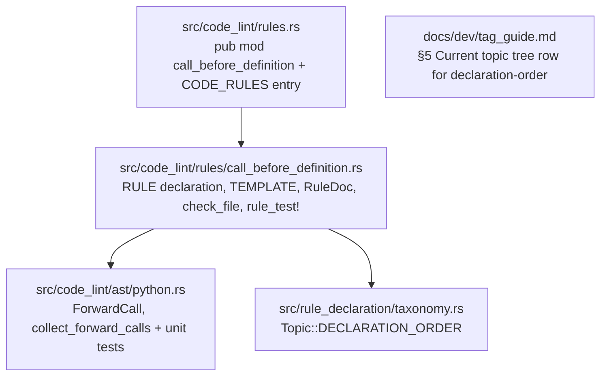

# Phase 3: Design & Plan — `call-before-definition`

This document records **Phase 3 (Design & Plan)** for `call-before-definition` (ported and redesigned from Polybot's `DefineBeforeUseRule`, [check_custom_lints.py:L3049-L3133](../../../scratch/polybot_reference/check_custom_lints.py#L3049-L3133)). It builds on the validated decisions in [01_understand.md](01_understand.md) (`D1`–`D8`, `Q1`–`Q3`) and [02_references.md](02_references.md) (`R1`–`R7`).

> Status: **VALIDATED** (2026-10-03). All Phase 1–2 open questions (`Q1`–`Q3`) resolved and incorporated.

---

## 1. Validated Scope & Decisions Summary

| ID | Decision | Validated Choice |
| :--- | :--- | :--- |
| **D1** | **Rule name & file** | `call-before-definition` (`src/code_lint/rules/call_before_definition.rs`, `pub const RULE`). |
| **D2** | **Language & target** | `SupportLang::Python`, `RuleTarget::SourceOnly`, `RuleOptions::code_rule(())` (default `enforcement-mode = "ban"`). |
| **D3** | **Top-level statements** | **Dropped** (covered with full control-flow/scope precision by Ruff `F821` `undefined-name`). |
| **D4** | **Classification** | `topics: &[Topic::DECLARATION_ORDER]`, `Precision::Heuristic`, `Consensus::Opinionated`, `ImpactedQuality::Maintainability`. |
| **D5** | **Mutual recursion** | **Exempted via Strongly Connected Components (SCCs)**: if `callee` can reach `caller` in the scope's intra-scope call graph (`caller == callee` or mutual recursion cycle $u \to^+ v \to^+ u$), the call is exempt. |
| **D6** | **Class constructors** | **Exempted**: constructor lifecycle methods (`__init__`, `__new__`, `__post_init__`) are never flagged as callers when invoking `self.<method>()` / `cls.<method>()` defined later in the class, preserving standard Python class layout (`__init__` at top). |
| **D7** | **Overloads, properties, & `rule_test!` epochs** | `@overload` stubs + implementation and `@property` + `@<name>.setter` / `@<name>.deleter` share one logical function entry at the earliest definition position in the epoch. A non-`@overload`, non-accessor `def` whose name is already present in the current epoch flushes the epoch and starts a new one, so `rule_test!` (`RepeatCheck::SameCode`) works out of the box. |
| **D8** | **Call-site only & deduplication** | Only `call` expressions (`callee(...)` in module functions; `<receiver>.callee(...)` in non-`@staticmethod` class methods where `<receiver>` is the method's first parameter `self` or `cls`) are inspected. Reports at most once per `(caller, callee)` pair at the first forward `call` node. |

---

## 2. Architecture & Component Changes



### 2.1 Taxonomy Additions (`Topic::DECLARATION_ORDER`)
1. **[src/rule_declaration/taxonomy.rs](../../../src/rule_declaration/taxonomy.rs)**:
   Add `Topic::DECLARATION_ORDER` on `impl Topic`:
   ```rust
   /// Order in which declarations appear in a scope.
   pub(crate) const DECLARATION_ORDER: Self = Self {
       label: "declaration-order",
       parent: None,
       description: "Order in which declarations appear in a scope.",
       scope_note: "Ordering of functions, methods and items within a module or class. Not \
                    nesting depth (see `nesting`) or naming.",
       synonyms: &[],
   };
   ```
2. **[src/rule_selection/taxonomy.rs](../../../src/rule_selection/taxonomy.rs)**:
   - No manual list edit is required in `src/rule_selection/taxonomy.rs`: `all_topics()` ([taxonomy.rs:L231-L238](../../../src/rule_selection/taxonomy.rs#L231-L238)) automatically derives the active topic set from `REGISTERED_RULES`.
   - The test `topic_tree_table_matches_the_topics` ([taxonomy.rs:L393-L434](../../../src/rule_selection/taxonomy.rs#L393-L434)) parses `docs/dev/tag_guide.md` §5 and asserts exact set equality against `all_topics()`.
3. **[docs/dev/tag_guide.md](../tag_guide.md) §5 (`Current topic tree`)**:
   Add the matching row to the §5 table:
   ```markdown
   | `declaration-order` | — | | Order in which declarations appear in a scope. | Ordering of functions, methods and items within a module or class. Not nesting depth (see `nesting`) or naming. |
   ```

---

## 3. Detailed AST & Rule Design

### 3.1 Public AST API (`src/code_lint/ast/python.rs`)

```rust
/// A call inside a Python function or method to a sibling function or method defined later in
/// the same module or class scope.
pub struct ForwardCall<'a> {
    /// The `call` expression AST node (`callee(...)` or `self.callee(...)`).
    pub node: AstNode<'a>,
    /// Name of the enclosing function or method making the call.
    pub caller_name: String,
    /// Name of the called sibling function or method defined later in the scope.
    pub callee_name: String,
}

/// Collects forward sibling calls in module and class scopes across `file`, in source order.
///
/// Exempts direct and mutual recursion (strongly connected components in the intra-scope call
/// graph), class constructor callers (`__init__`, `__new__`, `__post_init__`), locally shadowed
/// names, `@overload` / `@property` accessor groups, and non-call references. Reports at most
/// one [`ForwardCall`] per `(caller, callee)` pair per declaration epoch, anchored at the first
/// offending `call` node.
#[must_use]
pub fn collect_forward_calls(file: &ParsedFile) -> Vec<ForwardCall<'_>>;
```

### 3.2 Algorithm for `collect_forward_calls` (`src/code_lint/ast/python.rs`)

#### Step 1: Discover Scopes (`module` and `class_definition` bodies)
- Evaluate the root `module` node (`is_class = false`) and the `body` (`block`) of every `class_definition` in `file.grep.root().dfs()` (`is_class = true`) in source order, sorting collected `ForwardCall`s by `node.span().start`.

#### Step 2: Partition Direct Function Definitions into Declaration Epochs (`D7`)
For a scope container (`module` or class `block`), iterate over direct child statements:
1. Extract `func_node` (`kind() == "function_definition"`), either directly or via `decorated_definition(&stmt)`. Let `outer_node` be `stmt` (so its start position includes leading decorators).
2. Extract `name = func_node.field("name")?.text().to_string()` and `decorators = extract_decorators_raw(&outer_node)`.
3. Classify decorator roles:
   - `is_overload`: any decorator has `terminal_name == "overload"`.
   - `is_property_accessor`: any decorator has `terminal_name` in `["setter", "deleter"]` or `path == format!("{name}.setter")` or `path == format!("{name}.deleter")`.
   - `is_staticmethod`: any decorator has `terminal_name == "staticmethod"`.
4. **Epoch continuation vs. flush check**:
   - Look up `name` in `current_epoch`:
     - If `name` is **not** in `current_epoch`: insert a new `LogicalFunction` entry with `def_order = next_order`, `has_overload = is_overload`, `has_non_overload_def = !is_overload`, and add this definition node to its `defs: Vec<FunctionDefPart>`.
     - If `name` **is** already in `current_epoch`:
       - If `is_property_accessor` **or** (`entry.has_overload && (!entry.has_non_overload_def || is_overload)`):
         append this `FunctionDefPart` to `entry.defs` (updating `entry.has_non_overload_def |= !is_overload`), preserving `entry.def_order` (the earliest definition position in the epoch).
       - Otherwise (a non-overload, non-accessor redefinition of an already-defined function name, as produced by `rule_test!` repeating `{code}\n{code}`):
         flush `current_epoch` to `epochs` and start a new epoch containing this definition!

#### Step 3: Extract Intra-Scope Candidate Calls per Function (`C1`, `C2`, `C3`)
For each `LogicalFunction` in an epoch (knowing the set of `sibling_names: HashSet<&str>` in that epoch):
1. For each `FunctionDefPart` (`func_node`, `is_staticmethod`):
   - If `is_class`:
     - Determine `receiver_name: Option<String>`: if `!is_staticmethod`, inspect `extract_parameters_raw(&params_node)`; if the first parameter has `kind == PythonParameterKind::Receiver` (`self` or `cls`), set `receiver_name = Some(first_param.name)`. Otherwise `None` (no class-method calls can match).
     - Walk `func_node.field("body")` (stopping at nested `class_definition` nodes).
     - At each `call` node, inspect `function = call_node.field("function")`:
       - Match when `function.kind() == "attribute"`, `function.field("object")` has `kind() == "identifier"` and `text() == receiver_name`, and `function.field("attribute")` has `text()` in `sibling_names` (and `receiver_name` is not shadowed in an enclosing nested `def`/`lambda`'s local bindings).
   - If `!is_class` (module scope):
     - Collect `outer_bindings = collect_function_scope_bindings(&func_node)` (parameters + local bindings in `func_node` body, stopping at nested `function_definition`, `lambda`, and `class_definition`).
     - Walk `func_node.field("body")` (stopping at nested `class_definition`; when entering a nested `function_definition`, `lambda`, or comprehension/generator expression, union that inner scope's parameters/comprehension bindings into `active_bindings` for its subtree).
     - At each `call` node, inspect `function = call_node.field("function")`:
       - Match when `function.kind() == "identifier"`, `callee = function.text()`, `callee` is in `sibling_names`, and `!active_bindings.contains(callee)`.
2. Record all matched calls `(callee_name, call_node)` on `LogicalFunction`, preserving source order.
   - Note: Only `func_node.field("body")` is walked—never `parameters` (default arguments or parameter annotations), `return_type`, or `decorator` nodes.

#### Step 4: Local Scope Binding Extraction (`collect_function_scope_bindings`, `F4` Fix)
Within a function/lambda/comprehension scope (without crossing into nested `function_definition`, `lambda`, or `class_definition` bodies):
- **Parameters**: extract all bound identifier names from `parameters` / `lambda_parameters` (`identifier`, `typed_parameter`, `default_parameter`, `typed_default_parameter`, `list_splat_pattern`, `dictionary_splat_pattern`).
- **Assignments & Mutations**: `assignment` and `augmented_assignment` (`left` field), extracting identifier targets via `extract_target_identifiers` which recurses into `pattern_list`, `tuple_pattern`, `list_pattern`, `parenthesized_expression`, `list_splat_pattern` while **stopping immediately** at `attribute` (`self.x = 1`), `subscript` (`d[x] = 1`), and `type` nodes.
- **Walrus operator**: `named_expression` (`name` field).
- **Loops & Comprehensions**: `for_statement` and `for_in_clause` (`left` field).
- **Context managers & Exception handlers**: `with_item` and `except_clause` (`as_pattern` $\to$ `alias` field).
- **Pattern matching**: `case_clause` (`case_pattern` $\to$ `extract_from_pattern`).
- **Nested definitions & Imports**: direct `function_definition` / `class_definition` (`name` field) and `import_statement` / `import_from_statement` (via existing `extract_from_import`).
- **`global` declarations**: If `global_statement` lists an identifier `x`, remove `x` from the local binding set of that scope (since `global x; x = ...` mutates the module-level binding rather than creating a local shadow).

#### Step 5: Mutual Recursion (SCC) & Constructor Exemptions and Emission (`D5`, `D6`, `D8`)
For each epoch:
1. Build the directed adjacency map `call_graph: HashMap<&str, HashSet<&str>>` where `(u, v) in call_graph` iff function `u` has at least one candidate call to sibling `v`.
2. For each `caller` in the epoch:
   - **Constructor exemption (`D6`)**: if `is_class && matches!(caller.name.as_str(), "__init__" | "__new__" | "__post_init__")`, skip `caller`.
   - Maintain `reported_callees: HashSet<&str>` for `(caller, callee)` deduplication (`D8`).
   - For each candidate call `(callee_name, call_node)` in `caller.calls`:
     - Look up `callee` in the epoch.
     - If `callee.def_order <= caller.def_order`: skip (defined before or at `caller`, including self-recursion `callee == caller`).
     - If `!reported_callees.insert(callee_name)`: skip (already reported for this `caller`).
     - **Mutual recursion check (`D5`)**: if `can_reach(callee_name, &caller.name, &call_graph)` is `true` (via DFS/BFS over `call_graph`), skip (both functions belong to the same Strongly Connected Component).
     - Emit `ForwardCall { node: call_node, caller_name: caller.name.clone(), callee_name: callee_name.to_string() }`.

---

### 3.3 Rule Declaration, Message Template, & Documentation (`src/code_lint/rules/call_before_definition.rs`)

```rust
//! Flags functions and methods that call a sibling function or method defined later in the same
//! scope (`call-before-definition`).

use crate::code_lint::ast::ParsedFile;
use crate::code_lint::ast::python::collect_forward_calls;
use crate::code_lint::contract::{CodeRule, RuleTarget};
use crate::diagnostic::{Diagnostic, RuleName, ViolationTemplate, violation_template};
use crate::rule_declaration::{
    Classification, Consensus, Declaration, Example, ImpactedQuality, Precision, Reference,
    RuleDoc, RuleOptions, Topic,
};
use ast_grep_language::SupportLang;
use std::path::Path;

const TEMPLATE: ViolationTemplate = violation_template! {
    summary: "Function `{function}` calls `{callee}()` before `{callee}` is defined.",
    rationale: "Calling a helper before its declaration forces readers scanning top-to-bottom to jump ahead in the file to learn its contract before finishing the caller.",
    suggestion: "Move the definition of `{callee}` above `{function}`.",
};

/// The rule's declaration.
pub const RULE: CodeRule<()> = CodeRule {
    declaration: Declaration {
        name: RuleName("call-before-definition"),
        template: &TEMPLATE,
        languages: &[SupportLang::Python],
        options: RuleOptions::code_rule(()),
        classification: Classification {
            topics: &[Topic::DECLARATION_ORDER],
            precision: Precision::Heuristic,
            consensus: Consensus::Opinionated,
            impacted_quality: ImpactedQuality::Maintainability,
        },
        doc: RuleDoc {
            summary: "Flags functions and methods that call a sibling function or method defined \
                      later in the same module or class.",
            what_it_does: "Checks Python module and class bodies for functions and methods that \
                           call a sibling function (`helper()`) or method (`self.helper()`, \
                           `cls.helper()`) whose definition appears later in the same scope. \
                           At most one finding is reported per caller and callee pair, at the \
                           first forward call site.\n\n\
                           Several constructs are not flagged: direct and mutual recursion \
                           (where two or more functions call each other in a cycle, so one must \
                           appear first), calls inside class constructors (`__init__`, \
                           `__new__`, `__post_init__`, which stay at the top of the class), \
                           `@overload` stub groups and `@property` setter or deleter pairs, \
                           calls where the callee name is shadowed by a local variable, \
                           parameter or import, and non-call references such as type \
                           annotations, default parameter values, decorators, attribute \
                           assignments (`self.value = 1`), and first-class function callbacks. \
                           Top-level module statements are not checked (covered by Ruff \
                           `F821`). Test files are not checked.",
            why_is_this_bad: "In a codebase organized bottom-up (leaf helpers first, callers \
                              and entrypoints such as `main()` at the bottom), a forward call \
                              breaks sequential reading order: a reader scanning from top to \
                              bottom encounters a call to a local helper before seeing its \
                              signature, parameters or docstring, and has to jump down and \
                              back up to follow the control flow.\n\n\
                              Move the helper function or method definition above the first \
                              function or method that calls it.",
            references: &[
                Reference {
                    title: "ESLint: no-use-before-define",
                    url: "https://eslint.org/docs/latest/rules/no-use-before-define",
                },
                Reference {
                    title: "Ruff F821: undefined-name",
                    url: "https://docs.astral.sh/ruff/rules/undefined-name/",
                },
            ],
            examples: &[Example {
                language: SupportLang::Python,
                flagged: indoc::indoc! {r#"
                    def load_port(raw: str) -> int:
                        return parse_int(raw.strip())

                    def parse_int(value: str) -> int:
                        return int(value)
                "#},
                flagged_span: "parse_int(raw.strip())",
                fixed: indoc::indoc! {r#"
                    def parse_int(value: str) -> int:
                        return int(value)

                    def load_port(raw: str) -> int:
                        return parse_int(raw.strip())
                "#},
            }],
        },
    },
    target: RuleTarget::SourceOnly,
    check: check_file,
};

fn check_file(
    rule: &CodeRule<()>,
    path: &Path,
    file: &ParsedFile,
    (): &(),
) -> Vec<Diagnostic> {
    collect_forward_calls(file)
        .into_iter()
        .map(|call| {
            rule.diagnostic_at_node(
                path,
                &call.node,
                &[
                    ("function", &call.caller_name),
                    ("callee", &call.callee_name),
                ],
            )
        })
        .collect()
}
```

### 3.4 Registry Style & Dogfooding Verification
- **Rule name**: `call-before-definition` (3 words, kebab-case, no polarity prefix/suffix, names the flagged pattern).
- **Template**:
  - `summary`: starts with `"Function"`, 1 sentence ending with `.`, backtick-quoted placeholders `{function}` and `{callee}`, no fix verbs, no judgement words.
  - `rationale`: 1 sentence ending with `.`, no `"must"`/`"should"`, does not start with a fix verb.
  - `suggestion`: starts with `"Move"` (in `SUGGESTION_VERBS`), 1 sentence ending with `.`.
- **`RuleDoc::summary`**: 1 sentence starting with `"Flags "`.
- **`repeated-literal` dogfooding**: In `call_before_definition.rs`, `"function"` and `"callee"` appear once each, so `repeated-literal` emits 0 diagnostics on the new file.

---

## 4. Comprehensive Test Plan

### 4.1 `rule_test!` Cases (`src/code_lint/rules/call_before_definition.rs`)

#### Fail Cases (each emits 1 diagnostic on first pass, 2 on `RepeatCheck::SameCode` pass)
1. `module_function_calls_later_function`:
   `def run(): return helper()` before `def helper(): return 1` $\to$ flags `helper()`.
2. `async_function_calls_later_async_function`:
   `async def fetch(): return await load()` before `async def load(): return 1` $\to$ flags `await` inner call `load()`.
3. `class_method_calls_later_self_method`:
   `class Runner:` with `def run(self): return self.step()` before `def step(self): return 1` $\to$ flags `self.step()`.
4. `classmethod_calls_later_cls_method`:
   `class Config:` with `@classmethod def from_env(cls): return cls.parse()` before `@classmethod def parse(cls): ...` $\to$ flags `cls.parse()`.
5. `call_inside_nested_closure_or_comprehension_to_later_module_function`:
   `def process(items): return [transform(x) for x in items]` before `def transform(x): return x` $\to$ flags `transform(x)`.
6. `call_after_non_shadowing_nested_lambda_parameter`:
   `def run(items): _ = map(lambda helper: helper, items); return helper()` before `def helper(): return 1` $\to$ lambda param `helper` only shadows inside the lambda; the outer `helper()` call is still flagged!
7. `attribute_assignment_on_self_does_not_shadow_module_function`:
   `def run(obj): obj.helper = 1; return helper()` before `def helper(): return 2` $\to$ `obj.helper = 1` does not create a local binding `helper`; `helper()` is flagged!
8. `global_declaration_keeps_module_function_unshadowed`:
   `def run(): global helper; return helper()` before `def helper(): return 1` $\to$ flagged.
9. `multiple_calls_to_same_later_function_reported_once`:
   `def run(): a = helper(1); b = helper(2); return a + b` before `def helper(x): return x` $\to$ flags only `helper(1)` (1 diagnostic).
10. `one_way_call_into_mutual_recursion_cycle_flagged`:
    `def entry(): return even(4)` before mutually recursive `def even(n): return odd(n - 1)` and `def odd(n): return even(n - 1)` $\to$ `even` and `odd` are exempt, but `entry`'s call `even(4)` is not in the cycle and is flagged!

#### Pass Cases (0 diagnostics)
1. `defined_before_use_module_and_class`:
   `def helper(): ...` above `def run(): return helper()`, and `def step(self): ...` above `def run(self): return self.step()`.
2. `direct_self_recursion`:
   `def factorial(n): return 1 if n <= 1 else n * factorial(n - 1)` and recursive `self.walk()` in a class.
3. `mutual_recursion_pair_module_and_class`:
   `def is_even(n): return is_odd(n - 1)` above `def is_odd(n): return is_even(n - 1)` (both module-level and class methods `self.is_odd` / `self.is_even`).
4. `mutual_recursion_three_way_cycle`:
   `def parse_expr(): return parse_term()` $\to$ `def parse_term(): return parse_atom()` $\to$ `def parse_atom(): return parse_expr()`.
5. `class_constructors_calling_later_helpers_exempt`:
   `__init__`, `__new__`, and `__post_init__` calling `self._validate()` / `cls._allocate()` / `self._normalize()` defined below them in the class.
6. `overload_stubs_and_implementation_above_or_grouped`:
   `@overload def parse(x: int) -> int: ...`, `@overload def parse(x: str) -> str: ...`, `def parse(x: int | str) -> int | str: ...` called by a function below the `@overload` block (or `@overload` stubs above caller and implementation below `@overload`).
7. `property_getter_and_setter_pair`:
   `@property def value(self): ...` and `@value.setter def value(self, v): ...` with a method between/after them.
8. `shadowed_by_parameter_or_nested_lambda_parameter`:
   `def run(helper): return helper()` and `def run(items): return list(map(lambda helper: helper(1), items))` before `def helper(x): ...`.
9. `shadowed_by_local_assignments_and_unpacking`:
   Simple assignment `helper = get_fn()`, tuple unpacking `first, helper = pair`, starred unpacking `[helper, *rest] = fns`, augmented assignment `helper += 1`, and walrus `if (helper := get_fn()): helper()` before `def helper(): ...`.
10. `shadowed_by_for_with_except_match_and_import`:
    `for helper in fns: helper()`, `[helper() for helper in fns]`, `with get_fn() as helper: helper()`, `except Err as helper: helper()`, `match x: case helper: helper()`, `from mod import helper; helper()`, and local `def helper(): ...` before module-level `def helper(): ...`.
11. `non_call_references_and_annotations_not_flagged`:
    Type annotations (`def f(x: helper) -> helper:`), default arguments (`def f(fn=helper):`), decorators (`@helper`), first-class callbacks (`register(helper)`), and attribute assignments/reads (`self.helper = 1`, `return self.helper`) before `def helper(): ...`.
12. `other_receiver_and_staticmethod_not_flagged`:
    In a class, calling `other.step()` (receiver is not `self`/`cls`) or calling `self.step()` inside a `@staticmethod def run(self):` before `def step(self):`.
13. `top_level_statements_not_checked`:
    `if __name__ == "__main__": main()` and top-level calls (deferred to Ruff `F821`).

### 4.2 Unit Tests in `src/code_lint/ast/python.rs` (`mod tests`)
- `test_collect_forward_calls_multiple_occurrences_and_cycles`:
  Tests multi-diagnostic scenarios that `rule_test!` single-span cases cannot express directly (e.g., a function calling two distinct later functions `b()` and `c()` emits 2 `ForwardCall`s in source order; two independent functions both calling a later `helper()` emit 2 `ForwardCall`s).

### 4.3 Per-Exemption Mutation Verification Plan
Before completing Phase 4/5, temporarily mutate each exemption in `src/code_lint/ast/python.rs` and verify that at least one test in `cargo test` fails:
1. **Direct & mutual recursion (`can_reach`)** $\to$ killed by `direct_self_recursion`, `mutual_recursion_pair_module_and_class`, `mutual_recursion_three_way_cycle`.
2. **Constructor exemption (`__init__`, `__new__`, `__post_init__`)** $\to$ killed by `class_constructors_calling_later_helpers_exempt`.
3. **Overload & property grouping (`is_overload`, `is_property_accessor`)** $\to$ killed by `overload_stubs_and_implementation_above_or_grouped`, `property_getter_and_setter_pair`.
4. **Epoch splitting on non-overload redefinition** $\to$ killed by all `fail` cases under `assert_every_occurrence_reported`.
5. **`@staticmethod` receiver check** $\to$ killed by `other_receiver_and_staticmethod_not_flagged`.
6. **Local binding shadowing (parameters, unpacking, `:=`, `for`, comprehensions, `with`, `except`, `case`, `import`, nested `lambda`)** $\to$ killed by `shadowed_by_parameter_or_nested_lambda_parameter`, `shadowed_by_local_assignments_and_unpacking`, `shadowed_by_for_with_except_match_and_import`.
7. **Stopping target extraction at `attribute` / `subscript`** $\to$ killed by `attribute_assignment_on_self_does_not_shadow_module_function`.
8. **Skipping `parameters` / `return_type` / `decorator` on `caller`** $\to$ killed by `non_call_references_and_annotations_not_flagged`.

---

## 5. Implementation Steps (Phase 4 Preview)

1. **Step 1 (`taxonomy.rs` & `tag_guide.md`)**: Add `Topic::DECLARATION_ORDER` in `src/rule_declaration/taxonomy.rs` and its row in `docs/dev/tag_guide.md` §5.
2. **Step 2 (`ast/python.rs`)**: Implement `ForwardCall`, `collect_forward_calls`, and unit tests in `src/code_lint/ast/python.rs` → verify with `cargo test ast::python`.
3. **Step 3 (`rules/call_before_definition.rs` & `rules.rs`)**: Create `src/code_lint/rules/call_before_definition.rs`, register `pub mod call_before_definition` and `&call_before_definition::RULE` in `src/code_lint/rules.rs`, and update CLI snapshot if needed → verify with:
   ```bash
   cargo fmt --check && cargo clippy --all-targets -- -D warnings && cargo test && cargo doc --no-deps --document-private-items
   ```
4. **Step 4 (Mutation Audit)**: Run the 8 mutation checks in §4.3 to confirm every exemption branch is tested.
