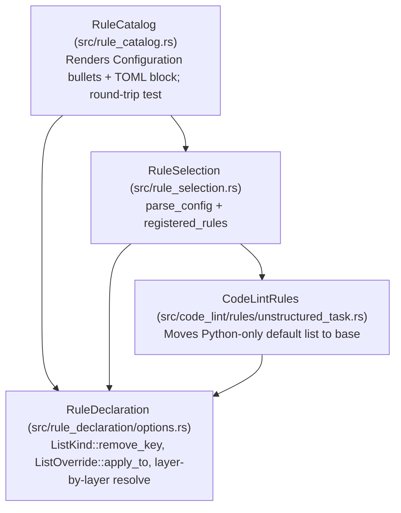

# Phase 3: Design & Plan — `--explain` TOML Block & List Option Operations

This document records **Phase 3 (Design/Plan)** for adding a ready-to-paste `[rules.<name>]` TOML block to `--explain` and completing the symmetric 3-operation list-option model (`replace` / `extend-*` / `remove-*`). It implements decisions D1–D6 ([01_understand.md](01_understand.md)) and references R1–R5 / CP1–CP4 ([02_references.md](02_references.md)).

> Status: **VALIDATED** (2026-10-02). Next: **Phase 4 (Execute)**.

---

## 1. Definition of Done

### 1.1 Critical User Journeys (CUJs)

| ID | Journey | Acceptance Criteria |
| :--- | :--- | :--- |
| **CUJ1** | A user runs `omni-code-lint --explain sleep-in-tests` (or any configurable rule) and copies the TOML block into `.omnilint.toml`. | `## Configuration` renders the schema bullet list followed by a fenced `toml` block with `[rules.sleep-in-tests]` and any non-empty `[rules.sleep-in-tests.<lang>]` tables. Pasting it into `.omnilint.toml` parses without error and produces the exact same effective options per language as the built-in defaults. |
| **CUJ2** | A user runs `omni-code-lint --explain abbreviated-name` (which bans `"str"` in general but exempts `"str"` in Rust). | The TOML block renders `banned = [...]` under `[rules.abbreviated-name]` and `remove-banned = ["str"]` under `[rules.abbreviated-name.rust]`. Pasting it into `.omnilint.toml` round-trips to the exact default sets for both Python (includes `"str"`) and Rust (excludes `"str"`). |
| **CUJ3** | A user wants to allow one default-banned abbreviation (e.g. `"ctx"`) in their project or for a single language without copying the 17-item default list. | Writing `[rules.abbreviated-name]` `remove-banned = ["ctx"]` (or under `[rules.abbreviated-name.python]`) removes `"ctx"` while keeping the remaining defaults intact. |
| **CUJ4** | A user combines `replace`, `extend-*`, and `remove-*` across `[rules.<name>]` and `[rules.<name>.<lang>]`. | Resolution folds general-to-specific (`default` $\to$ `[rules.<name>]` $\to$ `[rules.<name>.<lang>]`), and within each table applies `replace` $\to$ `extend` $\to$ `remove` (D3). |
| **CUJ5** | A user runs `--explain` on a rule with `RuleOptions::none()` (suppression audits, `edit-of-described-commit`). | `## Configuration` is omitted entirely, as before. |

### 1.2 Metrics & Invariants

| Metric / Invariant | Target |
| :--- | :--- |
| Round-trip fidelity across all 27 registered rules | 100%: for every configurable rule, `parse_config(extracted_toml)` matches `None` overrides on `enforcement_mode` and every `OptionSpec` across all `rule.languages`. |
| Option declaration hygiene (`tests/registry.rs`) | 100%: every language in option overrides belongs to `rule.languages` (no duplicates), and single-language rules declare all defaults in `base` (empty `overrides`, `extend`, `remove`). |
| Effective default preservation (NG2) | 0 changes to `resolve(lang, None)` for any existing rule and language. |

---

## 2. Architecture & Dependency DAG

No component boundaries or edges in [src/architecture.rs](../../../src/architecture.rs) change. Every modification stays within the existing downward-pointing DAG:



| Component | Owns | Does Not Own |
| :--- | :--- | :--- |
| `RuleDeclaration` (`src/rule_declaration/options.rs`) | `ListKind::{replace_key, extend_key, remove_key}`, `ListOverride { replace, extend, remove }`, layer-by-layer `ListOption::resolve`, `DeclaredOptions::enforcement_mode`, TOML validation in `OptionValues::set` | Markdown or TOML string rendering |
| `CodeLintRules` (`src/code_lint/rules/unstructured_task.rs`) | Rule-specific `BANNED` `FilterListDefaults` (`base` list) | Option resolution or catalog rendering |
| `RuleCatalog` (`src/rule_catalog.rs`) | `configuration_lines` (3 bullets for `ListOption`) + `configuration_toml` (fenced `toml` block) + round-trip test over `registered_rules()` | Config parsing logic (delegates to `rule_selection::parse_config`) |

---

## 3. Detailed Design

### 3.1 `ListKind`, `ListOverride`, and Layer-by-Layer Resolution (`src/rule_declaration/options.rs`)

1. **`ListKind` keys (D2)**:
   ```rust
   #[derive(Debug, Clone, Copy, PartialEq, Eq)]
   pub enum ListKind {
       /// Items the rule flags: `banned`, `extend-banned` and `remove-banned`.
       Deny,
       /// Items the rule accepts: `allowed`, `extend-allowed` and `remove-allowed`.
       Allow,
   }

   impl ListKind {
       /// The key whose items replace the inherited set.
       #[must_use]
       pub const fn replace_key(self) -> &'static str {
           match self {
               Self::Deny => "banned",
               Self::Allow => "allowed",
           }
       }

       /// The key whose items are added to the inherited set.
       #[must_use]
       pub const fn extend_key(self) -> &'static str {
           match self {
               Self::Deny => "extend-banned",
               Self::Allow => "extend-allowed",
           }
       }

       /// The key whose items are removed from the inherited set.
       #[must_use]
       pub const fn remove_key(self) -> &'static str {
           match self {
               Self::Deny => "remove-banned",
               Self::Allow => "remove-allowed",
           }
       }
   }
   ```
   And `OptionSpec::keys` returns:
   ```rust
   Self::List(option) => vec![
       option.kind.replace_key(),
       option.kind.extend_key(),
       option.kind.remove_key(),
   ],
   ```

2. **`ListOverride` and `ListOption::resolve` (D3, CP1)**:
   ```rust
   #[derive(Debug, Clone, Default, PartialEq, Eq)]
   struct ListOverride {
       replace: Option<HashSet<String>>,
       extend: HashSet<String>,
       remove: HashSet<String>,
   }

   impl ListOverride {
       fn apply_to(&self, items: &mut HashSet<String>) {
           if let Some(replacement) = &self.replace {
               items.clone_from(replacement);
           }
           items.extend(self.extend.iter().cloned());
           for item in &self.remove {
               items.remove(item);
           }
       }
   }
   ```
   In `ListOption::resolve`:
   ```rust
   fn resolve(self, language: SupportLang, overrides: Option<&RuleOverrides>) -> HashSet<String> {
       let mut items = self.default.resolve_default_for_lang(language);
       if let Some(overrides) = overrides {
           overrides.global.list.apply_to(&mut items);
           if let Some(language_values) = overrides.for_language(language) {
               language_values.list.apply_to(&mut items);
           }
       }
       items
   }
   ```
   In `OptionValues::set`, add the branch for `list.kind.remove_key()`:
   ```rust
   OptionSpec::List(list) if key == list.kind.remove_key() => {
       self.list.remove = parse_items(value).map_err(error)?;
       return Ok(());
   }
   ```

3. **`DeclaredOptions::enforcement_mode` helper**:
   Move the body of `RuleOptions::enforcement_mode` onto `DeclaredOptions::enforcement_mode(&self, language: SupportLang, overrides: Option<&RuleOverrides>) -> EnforcementMode` (or a shared private function `resolve_enforcement_mode`), and have `RuleOptions::enforcement_mode` call it. This lets `RuleCatalog` tests resolve `enforcement_mode` directly from `RegisteredRule.options: DeclaredOptions`.

### 3.2 `unstructured-task` Default Normalization & Registry Guard (`src/code_lint/rules/unstructured_task.rs`, `tests/registry.rs`)

1. In [src/code_lint/rules/unstructured_task.rs](../../../src/code_lint/rules/unstructured_task.rs) (L14–33), move the 7 Python call patterns from `extend: &[(SupportLang::Python, &[...])]` into `base: &[...]`, leaving `extend: &[]` (D6).
2. In [tests/registry.rs](../../../tests/registry.rs) (`validate_options`), pass `rule: &DeclaredRule` and check:
   - Every language in `enforcement_mode.overrides`, `count.default.overrides`, `list.default.extend`, and `list.default.remove` is in `rule.languages`, with no duplicate language in the same slice.
   - When `rule.languages.len() <= 1`, `enforcement_mode.overrides`, `count.default.overrides`, `list.default.extend`, and `list.default.remove` must be empty (single-language rules put their defaults in `base`).

### 3.3 `--explain` Configuration Section & TOML Block (`src/rule_catalog.rs`)

1. **Bullet list (`configuration_lines`)**:
   Add the third bullet for `OptionSpec::List`:
   ```rust
   format!(
       "- `{}` (list of strings): items removed from the default.",
       list.kind.remove_key()
   ),
   ```

2. **TOML block (`configuration_toml`) (D4, D5)**:
   When `!configuration.is_empty()`, `render_rule` appends:
   ```rust
   lines.push(String::new());
   lines.push("```toml".to_owned());
   lines.extend(configuration_toml(rule));
   lines.push("```".to_owned());
   ```
   where `configuration_toml(rule: &RegisteredRule) -> Vec<String>` emits:
   - `[rules.<rule.name>]`
   - `enforcement-mode = "<base>"` (if `rule.options.enforcement_mode` is `Some`)
   - For each `OptionSpec`:
     - `OptionSpec::Count(count)` $\to$ `"{} = {}", count.key, count.default.base`
     - `OptionSpec::List(list)` $\to$ `"{} = {}", list.kind.replace_key(), toml_string_array(list.default.base)`
   - For each `&language` in `rule.languages`:
     - Collect any per-language overrides for `language`:
       - `enforcement-mode = "<mode>"` if `enforcement_mode.overrides` has `language`
       - `"{} = {value}", count.key` if `count.default.overrides` has `language`
       - `"{} = {}", list.kind.extend_key(), toml_string_array(items)` if `list.default.extend` has `language` with `!items.is_empty()`
       - `"{} = {}", list.kind.remove_key(), toml_string_array(items)` if `list.default.remove` has `language` with `!items.is_empty()`
     - If non-empty, push `""`, `format!("[rules.{}.{}]", rule.name, support_lang_name(language))`, and those lines.
   - `toml_string_array(items: &[&str]) -> String` formats each element with `toml::Value::String((*item).to_owned()).to_string()`, joined by `", "` inside `[...]`.

3. **Round-trip test (`src/rule_catalog.rs`)**:
   `explain_toml_block_round_trips_to_default_options_for_every_rule`:
   - Iterates over `registered_rules()`.
   - Renders `explain(rule.name.0).unwrap()`.
   - If `rule.options.keys().is_empty()`, asserts `!rendered.contains("## Configuration")`.
   - Otherwise, extracts the ```` ```toml ... ``` ```` block inside `## Configuration`, parses it with `crate::rule_selection::parse_config(toml_block).unwrap()`, looks up `let overrides = config.rule_overrides.get(&rule.name)`, and asserts `overrides.is_some()`.
   - For each `&lang` in `rule.languages`:
     - Asserts `rule.options.enforcement_mode(lang, overrides) == rule.options.enforcement_mode(lang, None)`.
     - For each `spec` in `&rule.options.options`:
       - `OptionSpec::Count(count)` $\to$ `assert_eq!(count.resolve(lang, overrides), count.resolve(lang, None))`
       - `OptionSpec::List(list)` $\to$ `assert_eq!(list.resolve(lang, overrides), list.resolve(lang, None))`

---

## 4. Ordered Task Plan (Audit $\to$ RED $\to$ GREEN $\to$ Verify)

| # | Task | Files | RED (Failing Test) | GREEN (Minimal Implementation) |
| :--- | :--- | :--- | :--- | :--- |
| **T1** | Symmetric list keys (`remove-banned` / `remove-allowed`) and layer-by-layer `ListOption::resolve` | [src/rule_declaration/options.rs](../../../src/rule_declaration/options.rs) | Update `list_replaces_from_the_nearest_table_then_extends_from_every_table` to test layer-by-layer `replace` / `extend-*` / `remove-*` across global and language tables (`Deny` and `Allow`), plus `invalid_options_are_rejected_with_their_key_path` (`unrelated_key`). | Add `ListKind::remove_key`, `ListOverride::remove`, `ListOverride::apply_to`, layer-by-layer `ListOption::resolve`, `OptionValues::set` arm, and `DeclaredOptions::enforcement_mode`. |
| **T2** | Normalize `unstructured-task` defaults and guard option language overrides in `tests/registry.rs` | [src/code_lint/rules/unstructured_task.rs](../../../src/code_lint/rules/unstructured_task.rs), [tests/registry.rs](../../../tests/registry.rs) | Add single-language `base`-only assertion and `rule.languages` membership assertion in `validate_options` in `tests/registry.rs` (fails on `unstructured-task`). | Move `unstructured-task`'s `BANNED` items from `extend` to `base`. |
| **T3** | Render `remove-*` bullet and fenced `toml` block in `--explain`, guarded by round-trip test | [src/rule_catalog.rs](../../../src/rule_catalog.rs), [tests/snapshots/cli__explain_sleep_in_tests.snap](../../../tests/snapshots/cli__explain_sleep_in_tests.snap) | Add `explain_toml_block_round_trips_to_default_options_for_every_rule` in `src/rule_catalog.rs` (fails because no `toml` block is rendered). | Add `remove_key` bullet in `configuration_lines`, implement `configuration_toml` in `src/rule_catalog.rs`, and update `tests/snapshots/cli__explain_sleep_in_tests.snap`. |
| **T4** | Update ADRs, developer guides, and `ROADMAP.md` | [decisions/009_rule_declaration_and_options.md](../../../decisions/009_rule_declaration_and_options.md), [decisions/010_naming_and_message_conventions.md](../../../decisions/010_naming_and_message_conventions.md), [docs/dev/naming_and_message_style_guide.md](../naming_and_message_style_guide.md), [docs/dev/adding_a_rule.md](../adding_a_rule.md), [ROADMAP.md](../../../ROADMAP.md) | — | Update docs to reflect `remove-banned` / `remove-allowed`, layer-by-layer resolution, and the `--explain` TOML block; remove the completed item from `ROADMAP.md` §5. |

### Standard Verification (run after every task)
```bash
cargo fmt --check && cargo clippy --all-targets -- -D warnings && cargo test && cargo doc --no-deps --document-private-items
```
Manual checkpoint after T3: inspect `cargo run --bin omni-code-lint -- --explain abbreviated-name`, `--explain sleep-in-tests`, `--explain repeated-index-access`, and `--explain unstructured-task`.
