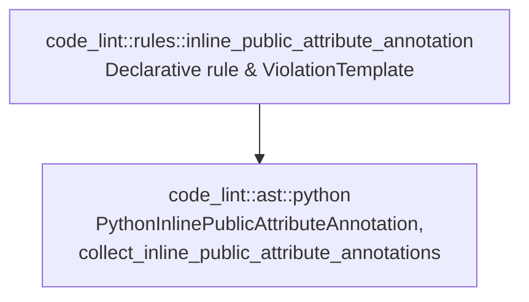

# Phase 3: Design & Plan — `inline-public-attribute-annotation`

Builds on validated [01_understand.md](01_understand.md) (G1–G4, NG1–NG4, D1–D6, Q1–Q3) and [02_references.md](02_references.md) (R1–R7).

> **Status**: **VALIDATED** (2026-10-03). Approved for Phase 4 implementation.

---

## 1. Definition of Done

### 1.1 Critical User Journeys

1. **Public attribute annotated inline in `__init__` or another instance method**:
   - `def __init__(self) -> None: self.timeout: int = 30` in `class Client:` is flagged on `self.timeout: int = 30` with:
     - **Summary**: ``Public attribute `self.timeout` of `Client` is annotated inline in `__init__` with `int`.``
     - **Rationale**: ``Inline attribute annotations inside methods are omitted from `Client.__annotations__` at runtime and hide the class's public data contract inside method bodies.``
     - **Suggestion**: ``Move `timeout: int` to the body of `Client` and assign `self.timeout` without a type annotation in `__init__`.``
2. **Value-less inline public attribute annotation in an instance method**:
   - `def setup(self) -> None: self.host: str` in `class Server:` is flagged on `self.host: str`.
3. **Redundant inline annotation when class body already annotates the attribute**:
   - `class Worker:` with `count: int` in the class body and `self.count: int = 0` in `__init__` still flags `self.count: int = 0`.
4. **Parameterized `Final[T]` vs. bare `Final` (`D5` / `Q3`)**:
   - `self.max_retries: Final[int] = 3` in `__init__` is **flagged** (`max_retries: Final[int]` is valid in the class body per PEP 591).
   - `self.max_retries: Final = 3` (or `typing.Final`, `typing_extensions.Final`, `Annotated[Final, "meta"]`) in `__init__` is **exempt** (bare `max_retries: Final` without `= 3` is invalid in a class body per PEP 591).
5. **Private attributes (`_foo`) and unannotated assignments (`self.foo = 1`)**:
   - `self._cache: dict[str, int] = {}` inline in `__init__`, `_cache: dict[str, int]` in the class body, and unannotated `self.timeout = 30` in `__init__` are **not** flagged.

### 1.2 Verification Metrics

- `cargo fmt --check && cargo clippy --all-targets -- -D warnings && cargo test && cargo doc --no-deps --document-private-items` green.
- All `tests/registry.rs`, `tests/architecture_conformance.rs`, and `test_self_dogfooding_code_lint` checks green.

---

## 2. Architecture & Component Boundaries



- **AST Layer ([python.rs](../../../src/code_lint/ast/python.rs))**: Owns all Tree-sitter CST node kind and field queries (`class_definition`, `decorated_definition`, `function_definition`, `assignment`, `attribute`, `type`), decorator filtering (`@staticmethod`, `@classmethod`), receiver parameter checking (`self`), scope-boundary stopping (`function_definition`, `class_definition`, `lambda`), and bare `Final` detection (`is_bare_final_annotation`).
- **Rule Layer (`src/code_lint/rules/inline_public_attribute_annotation.rs`)**: Iterates over `collect_inline_public_attribute_annotations(file)` and maps each item to a `Diagnostic` at `item.assignment_node`.

---

## 3. Detailed Design

### 3.1 AST Extractor in `src/code_lint/ast/python.rs`

```rust
/// A public Python instance attribute annotated inline (`self.<name>: <type>`) inside an instance method.
pub struct PythonInlinePublicAttributeAnnotation<'a> {
    /// Name of the enclosing class (`{class}`).
    pub class_name: String,
    /// Name of the enclosing instance method (`{function}`).
    pub method_name: String,
    /// Public attribute identifier (`{name}`, without `"self."`).
    pub name: String,
    /// Source text of the type annotation (`{expression}`, e.g. `"int"` or `"Final[int]"`).
    pub annotation_text: String,
    /// Full `assignment` AST node (`self.foo: int = 1` or `self.foo: int`).
    pub assignment_node: AstNode<'a>,
}

/// Collects inline type annotations on public instance attributes (`self.<attr>: <type>`) inside
/// instance methods across `file`.
///
/// Only direct instance methods (not decorated with `@staticmethod` or `@classmethod`, and whose
/// first parameter is the receiver `self`) of a `class_definition` are inspected. Nested functions,
/// nested classes, and lambdas inside a method are not entered. Private attributes starting with
/// `_` and unparameterized `Final` annotations (`self.x: Final = 1`) are skipped.
#[must_use]
pub fn collect_inline_public_attribute_annotations(
    file: &ParsedFile,
) -> Vec<PythonInlinePublicAttributeAnnotation<'_>>;
```

#### Internal Helpers in `src/code_lint/ast/python.rs`

1. **`is_bare_final_annotation(type_node: &RawNode<'_>) -> bool`**:
   - Unwraps outer `"type"` and `"parenthesized_expression"` nodes, and unwraps `Annotated[T, ...]` (`is_std_type_constructor(&base_path, &base_terminal, &["Annotated"])`) to its first type argument `T`.
   - If the unwrapped node is a `"generic_type"` or `"subscript"` (such as `Final[int]`), returns `false`.
   - Otherwise resolves `(path, terminal) = resolve_path_and_terminal_raw(&current)` and returns `is_std_type_constructor(&path, &terminal, &["Final"])` (matching `Final`, `typing.Final`, `typing_extensions.Final`).

2. **`is_instance_method_with_self_receiver(function_node: &RawNode<'_>) -> bool`**:
   - Checks `!extract_decorators_raw(function_node).iter().any(|dec| matches!(dec.terminal_name.as_str(), "staticmethod" | "classmethod"))`.
   - Checks `extract_parameters_raw(function_node).first().is_some_and(|param| param.kind == PythonParameterKind::Receiver && param.name == "self")`.

3. **`collect_method_inline_public_attr_annotations_rec<'a>(...)`**:
   - Stops recursion immediately if `matches!(node.kind().as_ref(), "function_definition" | "class_definition" | "lambda")`.
   - When `node.kind() == "assignment"`:
     - Extracts `(Some(left), Some(type_node)) = (node.field("left"), node.field("type"))`.
     - Checks `left.kind() == "attribute"`, `left.field("object").is_some_and(|obj| obj.kind() == "identifier" && obj.text() == "self")`, and `let Some(attribute_node) = left.field("attribute")`.
     - Checks `!attr_name.starts_with('_')` and `!is_bare_final_annotation(&type_node)`.
     - Pushes `PythonInlinePublicAttributeAnnotation` with `assignment_node: AstNode::from_raw(node.clone())` and `annotation_text: type_node.text().into_owned()`.
   - Recurses into `node.children()` (covering `if`/`else`, `for`, `while`, `with`, `try`/`except`/`finally`, `match`/`case` blocks inside the method).

---

### 3.2 Rule Definition (`src/code_lint/rules/inline_public_attribute_annotation.rs`)

```rust
const TEMPLATE: ViolationTemplate = violation_template! {
    summary: "Public attribute `self.{name}` of `{class}` is annotated inline in `{function}` with `{expression}`.",
    rationale: "Inline attribute annotations inside methods are omitted from `{class}.__annotations__` at runtime and hide the class's public data contract inside method bodies.",
    suggestion: "Move `{name}: {expression}` to the body of `{class}` and assign `self.{name}` without a type annotation in `{function}`.",
};
```

- **Classification**:
  - `topics: &[Topic::STATIC_TYPING]`
  - `precision: Precision::Exact`
  - `consensus: Consensus::Opinionated`
  - `impacted_quality: ImpactedQuality::Maintainability`
- **Options & Target**:
  - `languages: &[SupportLang::Python]`
  - `options: RuleOptions::code_rule(())` (default `EnforcementMode::Ban`)
  - `target: RuleTarget::SourceOnly`
- **Documentation (`RuleDoc`)**:
  - **`summary`**: `"Flags public Python instance attributes annotated inline inside methods instead of in the class body."`
  - **`what_it_does`**:
    ```text
    Flags annotated assignments to public instance attributes (`self.attr: Type = value` or
    `self.attr: Type`) inside instance methods in Python source files (test files are not
    checked). Only direct instance methods whose first parameter is `self` and that are not
    decorated with `@staticmethod` or `@classmethod` are inspected. Private attributes
    starting with `_`, unannotated assignments (`self.attr = value`), and unparameterized
    `Final` annotations (`self.attr: Final = value`) are not flagged.
    ```
  - **`why_is_this_bad`**:
    ```text
    A public attribute is part of a class's external interface. When its type annotation is
    written inline on `self.attr: Type` inside `__init__` or another method, Python's
    compiler discards the annotation at compile time rather than storing it in
    `cls.__annotations__`, so `typing.get_type_hints()` and `inspect.get_annotations()`
    cannot see it, and readers must scan method bodies to discover the class's public
    attributes.

    Declare `attr: Type` in the class body and assign `self.attr = value` without an inline
    type annotation inside methods. Internal state that does not belong to the class's
    public contract can be prefixed with `_` and annotated either in the class body or inline.
    ```
  - **`references`**:
    - `Reference { title: "PEP 526: Syntax for Variable Annotations — Class and instance variable annotations", url: "https://peps.python.org/pep-0526/#class-and-instance-variable-annotations" }`
    - `Reference { title: "Google Python Style Guide: Type Annotations", url: "https://google.github.io/styleguide/pyguide.html#319-type-annotations" }`
  - **`examples`**:
    - `flagged`:
      ```python
      class Connection:
          def __init__(self, host: str) -> None:
              self.host = host
              self.retries: int = 3
      ```
    - `flagged_span`: `"self.retries: int = 3"`
    - `fixed`:
      ```python
      class Connection:
          retries: int

          def __init__(self, host: str) -> None:
              self.host = host
              self.retries = 3
      ```

---

## 4. Test Plan

### 4.1 `rule_test!` Cases (`src/code_lint/rules/inline_public_attribute_annotation.rs`)

#### `pass` Cases (10 cases)
1. `class_body_public_and_private_annotations`:
   - `class Connection:` declares `host: str`, `retries: int = 3`, `_socket: object | None = None`, `MAX_POOL: ClassVar[int] = 10` in the class body, and assigns `self.host = host`, `self.retries = retries` (unannotated) in `__init__`.
2. `inline_private_attribute_annotations_exempt`:
   - `self._cache: dict[str, int] = {}` and `self.__secret: str = "x"` inside `__init__` and `reset()`.
3. `unannotated_public_attribute_assignments_exempt`:
   - `self.host = host`, `self.count += 1`, `self.items[0] = "a"` in `__init__` and helper methods.
4. `bare_final_inline_annotation_exempt`:
   - `self.id: Final = 1`, `self.name: typing.Final = "a"`, `self.code: typing_extensions.Final = 2`, `self.tag: Annotated[Final, "meta"] = "v"` in `__init__` (`D5` / `Q3`).
5. `staticmethod_and_classmethod_exempt`:
   - `@staticmethod def build(self: Any) -> None: self.value: int = 1` and `@classmethod def from_env(cls) -> None: cls.value: int = 1`.
6. `non_self_first_parameter_or_other_object_attribute_exempt`:
   - `def __new__(cls) -> Self: cls.instance: Any = None` and `def copy_into(self, other: Box) -> None: other.value: int = 1` and `self.inner.value: int = 1` (nested attribute `self.inner.value`, where `left.object` is `self.inner`, not `"self"`).
7. `nested_function_and_lambda_inside_method_not_entered`:
   - Inside `def run(self) -> None:`, a nested `def helper(self: Any) -> None: self.leaked: int = 1` is not treated as a method of the outer class.
8. `local_variable_annotations_in_method_exempt`:
   - `def compute(self) -> int: result: int = 1; return result`.
9. `module_level_function_with_self_param_exempt`:
   - Top-level `def standalone(self: Any) -> None: self.value: int = 1` outside any class.
10. `pydantic_and_attrs_and_slots_private_class_attributes_exempt`:
    - Verifies that `_private: int` in `@dataclass`, `BaseModel`, and `__slots__` classes with `self._private = 1` in `__init__` (Polybot's dropped Check 2) and multiple `self._private: int` in `if`/`else` branches (Polybot's dropped Check 3) pass cleanly.

#### `fail` Cases (9 cases — 1 diagnostic each)
1. `inline_public_attribute_in_init`:
   - `self.retries: int = 3` in `__init__` $\Rightarrow$ `"self.retries: int = 3"`.
2. `valueless_inline_public_attribute_in_init`:
   - `self.retries: int` (without `= value`) in `__init__` $\Rightarrow$ `"self.retries: int"`.
3. `inline_public_attribute_in_regular_method`:
   - `def reset(self) -> None: self.count: int = 0` $\Rightarrow$ `"self.count: int = 0"`.
4. `inline_public_attribute_in_async_method`:
   - `async def connect(self) -> None: self.connected: bool = True` $\Rightarrow$ `"self.connected: bool = True"`.
5. `inline_public_attribute_in_property_or_decorated_method`:
   - `@property def status(self) -> str: self.cached_status: str = "ok"; return self.cached_status` $\Rightarrow$ `"self.cached_status: str = \"ok\""`.
6. `inline_public_attribute_inside_control_flow_block`:
   - `if flag: self.mode: str = "fast"` inside `__init__` $\Rightarrow$ `"self.mode: str = \"fast\""`.
7. `parameterized_final_inline_annotation_flagged`:
   - `self.id: Final[int] = 1` in `__init__` $\Rightarrow$ `"self.id: Final[int] = 1"`.
8. `redundant_inline_annotation_when_also_annotated_in_class_body`:
   - `class Worker: count: int` + `def __init__(self) -> None: self.count: int = 0` $\Rightarrow$ `"self.count: int = 0"`.
9. `inline_public_attribute_in_nested_class_method`:
   - Method of an inner class `class Outer: def f(self) -> None: class Inner: def __init__(self) -> None: self.x: int = 1` flags `self.x: int = 1` with `class = "Inner"`.

### 4.2 Per-Exemption Mutation Check Matrix

Per `rule_test!` standards, each exemption in `collect_inline_public_attribute_annotations` has a dedicated `pass` test that fails if that exemption is removed:

| Exemption in `ast/python.rs` | Dedicated `pass` Case |
| :--- | :--- |
| `!attr_name.starts_with('_')` (private attributes) | `inline_private_attribute_annotations_exempt` |
| `!is_bare_final_annotation(&type_node)` (bare `Final` / `Annotated[Final, ...]`) | `bare_final_inline_annotation_exempt` |
| Skip `@staticmethod` and `@classmethod` | `staticmethod_and_classmethod_exempt` |
| Require `first_param.kind == Receiver && first_param.name == "self"` | `non_self_first_parameter_or_other_object_attribute_exempt` |
| Require `left.object` is identifier `"self"` (not `other.x` or `self.inner.x`) | `non_self_first_parameter_or_other_object_attribute_exempt` |
| Stop at nested `function_definition` inside method body | `nested_function_and_lambda_inside_method_not_entered` |

### 4.3 Unit Tests in `src/code_lint/ast/python.rs` (`mod tests`)

- `test_collect_inline_public_attribute_annotations`:
  - Verifies `(class_name, method_name, name, annotation_text)` tuples across `__init__`, `async def`, nested `if` blocks, nested classes (`Inner`), parameterized `Final[int]`, while ignoring `_private`, bare `Final`, `Annotated[Final, ...]`, `@staticmethod`, `@classmethod`, and nested functions.

---

## 5. Step-by-Step Task Plan

| # | Task | Verification |
| :--- | :--- | :--- |
| **T1** | Add `PythonInlinePublicAttributeAnnotation`, `collect_inline_public_attribute_annotations`, and unit tests to [python.rs](../../../src/code_lint/ast/python.rs). | `cargo test ast::python` |
| **T2** | Create `src/code_lint/rules/inline_public_attribute_annotation.rs` and register `inline_public_attribute_annotation::RULE` in [rules.rs](../../../src/code_lint/rules.rs). | `cargo test inline_public_attribute_annotation` & `cargo test --test registry` |
| **T3** | Update CLI snapshot (`tests/snapshots/cli__list_rules.snap`) if needed, and run full verification suite (`fmt`, `clippy`, `test`, `doc`, dogfooding). | `cargo fmt --check && cargo clippy --all-targets -- -D warnings && cargo test && cargo doc --no-deps --document-private-items` |
