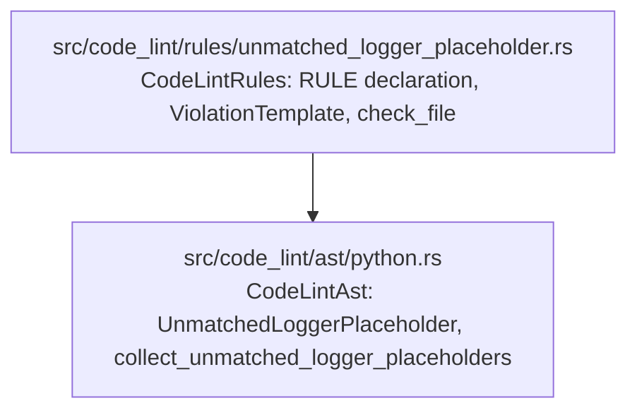

# Phase 3: Design & Plan — `unmatched-logger-placeholder`

Builds on [01_understand.md](01_understand.md) (`D1`–`D5`) and [02_references.md](02_references.md) (`R1`–`R7`, `R-D1`–`R-D4`).

> **Status**: **VALIDATED** (2026-10-03).

---

## 1. Definition of Done

### 1.1 Critical User Journeys

1. **Botched `f`-string refactor (`logger.info("Order {order_id} filled", order_id)`)**:
   - Flagged at the call expression with:
     - **Summary**: `` `logger.info()` passes positional arguments to a message with unmatched named placeholder `{order_id}`. ``
     - **Rationale**: `Positional format arguments do not bind to named placeholders, so formatting raises `KeyError` or `TypeError` at runtime.`
     - **Suggestion**: `Pass `order_id=...` as a keyword argument, or replace `{order_id}` with `{}` (or `%s` for `logging`).`
2. **Valid Loguru keyword formatting + `extra` context capture (`logger.info("Order {order_id} filled", order_id=123)`)**:
   - Passes with 0 diagnostics (`order_id=` keyword argument satisfies `{order_id}`).
3. **Zero-argument log call with literal braces (`logger.info("Registered route /orders/{order_id}")`)**:
   - Passes with 0 diagnostics (no positional format arguments are passed, so neither Loguru nor `logging` interpolates the string).
4. **Structured `structlog` event call (`logger.info("GET /orders/{order_id}", status=200)`)**:
   - Passes with 0 diagnostics (no positional format arguments are passed).
5. **Positional or indexed placeholders (`logger.info("Order {} filled", order_id)`, `logger.info("Order {0.id} filled", order)`)**:
   - Passes with 0 diagnostics (`{}` and `{0.id}` are positional placeholders).
6. **`logger.log(level, "Order {order_id} filled", order_id)`**:
   - Inspects `args[1]` as the format string and `args[2..]` as the positional format arguments, flagging the call.

### 1.2 Verification Metrics

- `cargo fmt --check && cargo clippy --all-targets -- -D warnings && cargo test && cargo doc --no-deps --document-private-items` passes 100%.
- `tests/registry.rs` naming, template wording, placeholder vocabulary, doc summary, and executed example checks pass with zero changes to the closed lists in `tests/registry.rs`.
- `test_self_dogfooding_code_lint` passes across the repository.

---

## 2. Architecture & Component Boundaries



- **`src/code_lint/ast/python.rs` (`CodeLintAst`)**:
  - Owns all Tree-sitter CST node kind and field inspections (`"call"`, `"attribute"`, `"argument_list"`, `"keyword_argument"`, `"dictionary_splat"`, `"string"`, `"concatenated_string"`) and PEP 3101 format string parsing.
  - Exposes a single typed struct `UnmatchedLoggerPlaceholder<'a>` and extractor `collect_unmatched_logger_placeholders(file: &ParsedFile) -> Vec<UnmatchedLoggerPlaceholder<'_>>` (matching other Python-only rules such as `mutable_dataclass.rs` and `mutable_module_constant.rs`).
- **`src/code_lint/rules/unmatched_logger_placeholder.rs` (`CodeLintRules`)**:
  - Declares `pub const RULE: CodeRule` and maps each `UnmatchedLoggerPlaceholder` to a `Diagnostic` via `rule.diagnostic_at_node(path, &finding.call_node, &[("callee", &finding.callee), ("name", &finding.placeholder)])`.

---

## 3. Detailed AST Design (`src/code_lint/ast/python.rs`)

### 3.1 Public Types & Function Signatures

```rust
/// A Python logger call whose message string literal contains a named PEP 3101 placeholder
/// `{name}` while positional format arguments are passed without a matching `name=` keyword
/// argument or `**kwargs` unpacking.
pub struct UnmatchedLoggerPlaceholder<'a> {
    /// The full `call` AST node (`logger.info("Order {order_id}", order_id)`).
    pub call_node: AstNode<'a>,
    /// Source text of the invoked logger method (`logger.info`, `self.logger.error`, `logging.log`).
    pub callee: String,
    /// The first unmatched named placeholder root identifier (`order_id`).
    pub placeholder: String,
}

/// Collects logger calls in `file` that pass positional format arguments to a message literal
/// containing an unmatched named PEP 3101 placeholder.
#[must_use]
pub fn collect_unmatched_logger_placeholders(
    file: &ParsedFile,
) -> Vec<UnmatchedLoggerPlaceholder<'_>>;
```

### 3.2 Logger Callee Matching (`extract_logger_method`)

A `call` node's `function` field matches when:
1. `function.kind() == "attribute"`.
2. `method = function.field("attribute")?.text()` is in `LOGGER_METHODS`:
   ```rust
   const LOGGER_METHODS: &[&str] = &[
       "trace",
       "debug",
       "info",
       "success",
       "warning",
       "warn",
       "error",
       "critical",
       "fatal",
       "exception",
       "log",
   ];
   ```
3. `receiver = function.field("object")?` is either:
   - `receiver.kind() == "identifier"` with `matches!(receiver.text().as_ref(), "logger" | "log" | "logging")` (matches `logger.info`, `log.warning`, `logging.error`), **or**
   - `receiver.kind() == "attribute"` whose `receiver.field("attribute")?.text()` is `"logger"` or `"log"` (matches `self.logger.info`, `cls.log.error`, `app.state.logger.debug`).

### 3.3 Call Argument Partitioning

Given `arguments = call_node.field("arguments")?` (`argument_list`):
1. Iterate over `arguments.children().filter(|c| c.is_named() && !c.is_extra())`:
   - If any child has `child.kind() == "dictionary_splat"` (`**kwargs`): **abort and skip the call** (`kwargs` may supply the named placeholder dynamically at runtime).
   - If `child.kind() == "keyword_argument"`: record `child.field("name")` text in `keyword_names: HashSet<String>`.
   - Otherwise (positional argument or `list_splat` `*args`): push `child` to `positional_args: Vec<RawNode<'_>>`.
2. Determine the message argument index (`msg_index`):
   - `let msg_index = usize::from(method == "log");` (`1` for `.log(level, msg, ...)`, `0` for all other methods).
3. Require at least one positional format argument after `msg_index`:
   - If `positional_args.len() <= msg_index + 1`: **skip the call** (either no message argument or zero positional format arguments after the message).
4. Extract the static string content of `msg_node = &positional_args[msg_index]` via `extract_plain_string_literal(msg_node)`:
   - If `msg_node.kind() == "string"`:
     - Split via `delimited_string_parts(msg_node)` into `(opening, content)`.
     - Reject if `opening.contains(['f', 'F', 'b', 'B', 't', 'T'])` (f-strings, byte strings, and Python 3.14 template strings are not `str.format` templates).
     - Return `Some(content)`.
   - If `msg_node.kind() == "concatenated_string"`:
     - Iterate over all named, non-extra children. If all children are `"string"` nodes accepted by the plain-string check above, concatenate their `content` slices in order and return `Some(combined)`; otherwise return `None`.
   - For any other node kind (variable, `.format()` call, `%` expression, etc.), return `None`.

### 3.4 PEP 3101 Named Placeholder Extraction (`first_unmatched_named_placeholder`)

Given `message: &str` and `keyword_names: &HashSet<String>`:
1. Parse `message` left-to-right to validate balanced PEP 3101 braces and collect replacement field root names in order:
   - Outside `{...}`:
     - `{{` $\to$ consume both characters as an escaped literal `{`.
     - `}}` $\to$ consume both characters as an escaped literal `}`.
     - Single `}` $\to$ malformed format string (`ValueError` in `str.format`), return `None` for the entire string.
     - Single `{` $\to$ enter replacement field `{...}`.
   - Inside a replacement field `{...}`:
     - Split the replacement field body before any format spec `:` (at top level of the field) and conversion `!`:
       - The `field_name` is the prefix up to the first `!`, `:`, or `}`.
       - Extract the **root `arg_name`** of `field_name`: the substring before the first `.` or `[`.
       - Validate that the remainder of `field_name` (after `arg_name`, if any) consists of valid `.identifier` or `[...]` subscript segments, and that if `!` is present, it is followed by a single conversion character (`r`, `s`, or `a`) before `:` or `}`.
     - If `:format_spec` is present, allow one level of nested `{nested_field}` inside `format_spec` (extracting its root `arg_name` as well); if an unclosed `{` or deeper nesting is encountered, return `None` (malformed format string).
2. For each extracted root `arg_name`:
   - If `arg_name.is_empty()` (`{}`) or `arg_name.chars().all(|c| c.is_ascii_digit())` (`{0}`, `{0.id}`, `{1[key]}`): positional placeholder $\to$ continue.
   - If `is_python_identifier(arg_name)` (`first` char is ASCII alphabetic, `_`, or non-ASCII `char::is_alphabetic`; remaining chars are ASCII alphanumeric, `_`, or non-ASCII `char::is_alphanumeric`):
     - If `!keyword_names.contains(arg_name)`: record `arg_name` as a candidate unmatched named placeholder.
   - Otherwise (for example, `{a, b}` or `{"k": 1}` where `arg_name` is `"a, b"` or `"\"k\""`, not a Python identifier): not a valid PEP 3101 named placeholder $\to$ ignore.
3. After confirming the entire string has balanced braces, return the first unmatched named placeholder `Some(name)`.

---

## 4. Rule Declaration, Classification & Message (`src/code_lint/rules/unmatched_logger_placeholder.rs`)

### 4.1 `Precision::Exact` vs. `Precision::Heuristic` (`docs/dev/tag_guide.md` §2.2)

Per [tag_guide.md §2.2](../tag_guide.md):
- *"Design proxy vs. rule bug: an incidental implementation defect or single-file AST lack of import resolution (tracked under Rule Defects in `ROADMAP.md`) is a bug to fix, not a reason to classify the rule as `heuristic`."*
- In Omni, `error-log-in-except` (`logging.error`), `sleep-in-tests` (`time.sleep`), `mock-call-assertion` (`$OBJ.assert_called_once`), and `type-cast` (`cast`) all match calls by syntactic call-site name and are classified `Precision::Exact`.
- However, unlike `logging.error` or `assert_called_once`, `unmatched-logger-placeholder` also matches any receiver named `log` or `*.log` calling `.info(...)` / `.error(...)` / `.log(...)`. Because `Precision::Exact` vs. `Precision::Heuristic` does not affect runtime behavior and `error-log-in-except` uses `Precision::Exact`, we declare **`Precision::Exact`** (consistent with `error-log-in-except` and `mock-call-assertion`).

### 4.2 Exact `ViolationTemplate`, `Classification`, and `RuleDoc`

```rust
const TEMPLATE: ViolationTemplate = violation_template! {
    summary: "`{callee}()` passes positional arguments to a message with unmatched named placeholder `{{name}}`.",
    rationale: "Positional format arguments do not bind to named placeholders, so formatting raises `KeyError` or `TypeError` at runtime.",
    suggestion: "Pass `{name}=...` as a keyword argument, or replace `{{name}}` with `{}` (or `%s` for `logging`).",
};

pub const RULE: CodeRule = CodeRule {
    declaration: Declaration {
        name: RuleName("unmatched-logger-placeholder"),
        template: &TEMPLATE,
        languages: &[SupportLang::Python],
        options: RuleOptions::code_rule(()),
        classification: Classification {
            topics: &[Topic::LOGGING],
            precision: Precision::Exact,
            consensus: Consensus::Unopinionated,
            impacted_quality: ImpactedQuality::Reliability,
        },
        doc: RuleDoc {
            summary: "Flags logger calls that pass positional arguments to a message with an unmatched named placeholder.",
            what_it_does: "Flags calls to `logger.<level>(...)`, `log.<level>(...)`, \
                           `logging.<level>(...)`, `<expr>.logger.<level>(...)` and \
                           `<expr>.log.<level>(...)` (across `trace`, `debug`, `info`, \
                           `success`, `warning`, `warn`, `error`, `critical`, `fatal`, \
                           `exception` and `log`) when the message string literal contains a \
                           named replacement field such as `{order_id}`, at least one \
                           positional format argument is passed after the message, no \
                           `**kwargs` unpacking is present, and no matching `order_id=...` \
                           keyword argument is provided. For `.log(level, message, ...)`, \
                            the second positional argument is inspected as the message.",
            why_is_this_bad: "When refactoring an f-string log call such as \
                              `logger.info(f\"Order {order_id} filled\")` to use lazy logger \
                              formatting, stripping the `f` prefix and appending `order_id` \
                              positionally leaves `{order_id}` in the format string. Positional \
                              arguments never bind to named placeholders: `loguru` and \
                              `str.format` raise `KeyError: 'order_id'` at runtime, while \
                              standard library `logging` raises `TypeError` because the string \
                              has no `%` specifiers.\n\n\
                              Either pass `order_id=order_id` as a keyword argument (which \
                              `loguru` formats and captures into `record[\"extra\"]`), or \
                              replace `{order_id}` with positional `{}` (for `loguru`) or `%s` \
                              (for standard library `logging`).",
            references: &[
                Reference {
                    title: "Loguru documentation: formatting and extra context",
                    url: "https://loguru.readthedocs.io/en/stable/api/logger.html",
                },
                Reference {
                    title: "Python docs: Format String Syntax (PEP 3101)",
                    url: "https://docs.python.org/3/library/string.html#formatstrings",
                },
            ],
            examples: &[Example {
                language: SupportLang::Python,
                flagged: indoc::indoc! {r#"
                    logger.info("Order {order_id} filled", order_id)
                "#},
                flagged_span: r#"logger.info("Order {order_id} filled", order_id)"#,
                fixed: indoc::indoc! {r#"
                    logger.info("Order {} filled", order_id)
                "#},
            }],
        },
    },
    target: RuleTarget::All,
    check: check_file,
};
```

---

## 5. Complete Test Plan

### 5.1 `rule_test!` Cases (`src/code_lint/rules/unmatched_logger_placeholder.rs`)

#### `pass` Cases (16 cases)
1. `positional_empty_braces_with_positional_arg`:
   `logger.info("Order {} filled", order_id)`
2. `positional_numbered_braces_with_positional_arg`:
   `logger.info("Order {0} filled for {1}", order_id, user_id)`
3. `positional_compound_attribute_and_subscript`:
   `logger.info("Order {0.id} item {0[sku]}", order)`
4. `positional_with_conversion_and_format_spec`:
   `logger.info("Latency {:.2f}ms for {!r}", latency_ms, request)`
5. `named_placeholder_with_matching_keyword_arg`:
   `logger.info("Order {order_id} filled", order_id=order_id)`
6. `named_compound_placeholder_with_matching_keyword_arg`:
   `logger.info("Order {order.id} item {items[0]}", order=order, items=items)`
7. `mixed_positional_and_matched_named_placeholder`:
   `logger.info("Order {} for {user_id}", order_id, user_id=user_id)`
8. `zero_format_args_with_literal_braces`:
   `logger.info("Registered FastAPI route /orders/{order_id}")`
9. `zero_positional_format_args_with_structlog_kwargs`:
   `logger.info("GET /orders/{order_id}", status_code=200, latency_ms=12)`
10. `zero_positional_format_args_with_exc_info_kwarg`:
    `logger.error("Failed on route /orders/{order_id}", exc_info=True)`
11. `escaped_double_braces_with_positional_arg`:
    `logger.info("Literal {{order_id}} for {}", order_id)`
12. `f_string_message_not_flagged`:
    `logger.info(f"Order {order_id} filled: {}", status)`
13. `dictionary_splat_kwargs_exempt`:
    `logger.info("Order {order_id} filled", extra_pos, **context)`
14. `non_identifier_braces_json_or_set_with_positional_arg`:
    `logger.info("Payload {\"order_id\": 1} and {a, b}: %s", status)`
15. `malformed_unclosed_brace_ignored`:
    `logger.info("Malformed {order_id in input: %s", status)`
16. `logger_log_level_first_arg_with_valid_message`:
    `logger.log("INFO", "Order {} filled", order_id)` and `logger.log(" {named} ", "Order {} filled", order_id)`
17. `non_logger_call_ignored`:
    `formatter.info("Order {order_id} filled", order_id)` and `template.format("Order {order_id}", order_id)`

#### `fail` Cases (10 cases)
1. `named_placeholder_with_positional_arg_on_logger`:
   `logger.info("Order {order_id} filled", order_id)` $\Rightarrow$ `logger.info("Order {order_id} filled", order_id)`
2. `named_placeholder_with_positional_arg_on_log`:
   `log.warning("Retry {attempt} failed", attempt)` $\Rightarrow$ `log.warning("Retry {attempt} failed", attempt)`
3. `named_placeholder_with_positional_arg_on_logging_module`:
   `logging.error("Request {request_id} failed", request_id)` $\Rightarrow$ `logging.error("Request {request_id} failed", request_id)`
4. `named_placeholder_with_positional_arg_on_self_logger`:
   `self.logger.debug("Peer {peer_id} connected", peer_id)` $\Rightarrow$ `self.logger.debug("Peer {peer_id} connected", peer_id)`
5. `named_placeholder_with_conversion_and_format_spec`:
   `logger.error("Order {order_id!r} amount {amount:.2f}", order_id, amount)` $\Rightarrow$ `logger.error("Order {order_id!r} amount {amount:.2f}", order_id, amount)`
6. `named_placeholder_with_attribute_or_subscript_access`:
   `logger.info("Order {order.id} filled", order)` $\Rightarrow$ `logger.info("Order {order.id} filled", order)`
7. `partially_matched_named_placeholders_flags_unmatched`:
   `logger.info("Order {order_id} for {user_id}", user_id, order_id=123)` $\Rightarrow$ `logger.info("Order {order_id} for {user_id}", user_id, order_id=123)`
8. `logger_log_method_checks_second_positional_arg`:
   `logger.log(20, "Order {order_id} filled", order_id)` $\Rightarrow$ `logger.log(20, "Order {order_id} filled", order_id)`
9. `implicitly_concatenated_message_string`:
   ```python
   logger.info(
       "Order {order_id} filled "
       "for user",
       order_id,
   )
   ```
10. `nested_format_spec_named_placeholder_unmatched`:
    `logger.info("Value {:>{width}}", value, width)` $\Rightarrow$ `logger.info("Value {:>{width}}", value, width)`

---

### 5.2 Unit Tests in `src/code_lint/ast/python.rs` (`mod tests`)

1. `test_first_unmatched_named_placeholder_parsing`:
   - Directly tests `first_unmatched_named_placeholder` across:
     - Simple named `{order_id}` (unmatched vs. matched in `keyword_names`)
     - Compound `{order.id}` and `{order[0]}` $\to$ extracts root `"order"`
     - Positional `{0}`, `{0.id}`, `{0[key]}`, `{}` $\to$ `None`
     - Escaped `{{order_id}}` and `{{{order_id}}}` $\to$ `None` vs. `Some("order_id")`
     - Nested format spec `{:{width}}` and `{0:{width}}` $\to$ `Some("width")`
     - Non-identifier braces `{"a": 1}` and `{a, b}` $\to$ `None`
     - Unbalanced `{order_id` or `order_id}` $\to$ `None`
2. `test_collect_unmatched_logger_placeholders_extracts_callee_and_placeholder`:
   - Asserts exact `callee` and `placeholder` fields on `UnmatchedLoggerPlaceholder` for `logger.info`, `self.log.error`, `logging.log`, and ` partially_matched` calls.

---

### 5.3 Per-Exemption Mutation Verification Matrix (for Phase 4)

Every exemption branch in `src/code_lint/ast/python.rs` will be verified during Phase 4 by temporarily disabling the exemption and confirming which `pass` case in `rule_test!` fails:

| Exemption Branch | Temporarily Disabled Check | `rule_test!` `pass` Case That Must Fail |
| :--- | :--- | :--- |
| **E1**: Require $\ge 1$ positional format arg after `msg` | Change `positional_args.len() <= msg_index + 1` to `<= msg_index` | `zero_format_args_with_literal_braces`, `zero_positional_format_args_with_structlog_kwargs`, `zero_positional_format_args_with_exc_info_kwarg` |
| **E2**: Matching keyword argument `name=` | Skip `keyword_names.contains(arg_name)` check | `named_placeholder_with_matching_keyword_arg`, `named_compound_placeholder_with_matching_keyword_arg`, `mixed_positional_and_matched_named_placeholder` |
| **E3**: `**kwargs` (`dictionary_splat`) exemption | Remove `dictionary_splat` early return | `dictionary_splat_kwargs_exempt` |
| **E4**: Root field extraction before `.` and `[` | Check full `field_name.chars().all(is_ascii_digit)` instead of root `arg_name` | `positional_compound_attribute_and_subscript` |
| **E5**: `{{` / `}}` escaped brace skipping | Do not skip `{{` / `}}` | `escaped_double_braces_with_positional_arg` |
| **E6**: Reject `f`-strings (`opening.contains(['f', 'F'])`) | Allow `f`-strings in `extract_plain_string_literal` | `f_string_message_not_flagged` |
| **E7**: `method == "log"` uses `msg_index = 1` | Hardcode `msg_index = 0` | `logger_log_level_first_arg_with_valid_message` (and `logger_log_method_checks_second_positional_arg` fail case) |
| **E8**: Valid Python identifier check on `arg_name` | Accept any non-empty non-digit `arg_name` | `non_identifier_braces_json_or_set_with_positional_arg` |
| **E9**: Balanced brace validation | Emit before verifying balanced closing `}` | `malformed_unclosed_brace_ignored` |

---

## 6. Implementation Task Plan (Phase 4)

| # | Task | Verification |
| :--- | :--- | :--- |
| **T1** | Add `UnmatchedLoggerPlaceholder`, `collect_unmatched_logger_placeholders`, and PEP 3101 placeholder parser + unit tests in `src/code_lint/ast/python.rs`. | `cargo test ast::python` |
| **T2** | Create `src/code_lint/rules/unmatched_logger_placeholder.rs`, register `unmatched_logger_placeholder` in `src/code_lint/rules.rs`, and update `tests/snapshots/cli__list_rules.snap`. | `cargo test --test registry && cargo test --test cli` |
| **T3** | Run the 9-row per-exemption mutation matrix (§5.3) and full verification gate (`cargo fmt --check && cargo clippy --all-targets -- -D warnings && cargo test && cargo doc --no-deps --document-private-items`). | All checks green; log results in `04_execution_log.md`. |
