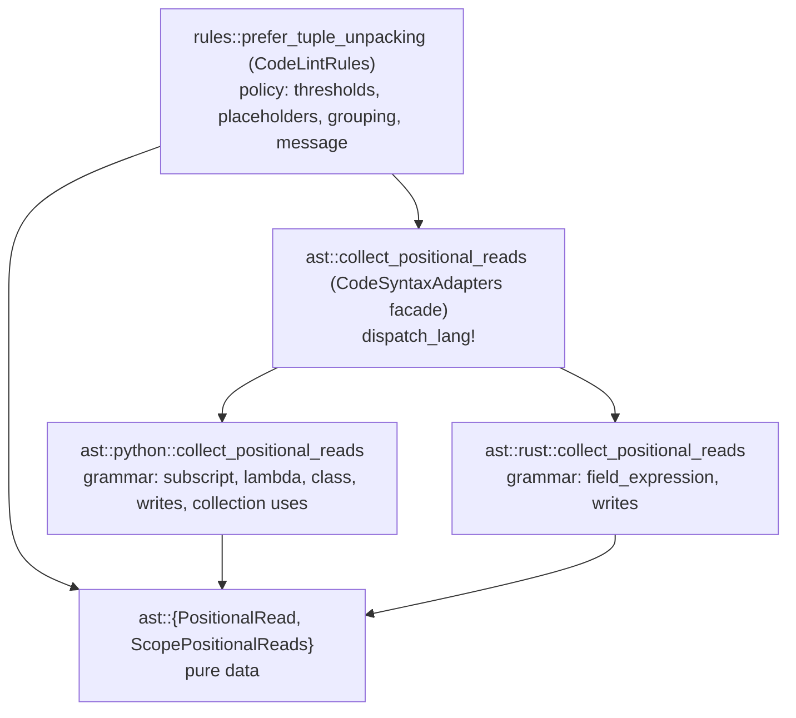

# Phase 3: Design & Plan — `prefer-tuple-unpacking`

This document records **Phase 3 (Design / Plan)** for `prefer-tuple-unpacking`. It implements decisions D1–D17 ([01_understand.md](01_understand.md)) and adjustments R1–R8 ([02_resources.md](02_resources.md)).

> Status: **VALIDATED** (2026-09-27). P1–P3 resolved (§7); T8 added.

---

## 1. Definition of Done

### 1.1 Critical User Journeys

| ID | Journey | Acceptance criteria |
| :--- | :--- | :--- |
| CUJ1 | A Python developer writes `plot(point[0], point[1])` in a function. | Exactly one `prefer-tuple-unpacking` diagnostic, anchored on `point[0]`, naming `point` and positions `0, 1`, suggesting `x, y = point`. After applying the suggestion, zero diagnostics. |
| CUJ2 | A Rust developer writes `SourceSpan::new(cmd.span.0, cmd.span.1)`. | One diagnostic on `cmd.span.0`, suggesting `let (start, end) = …;`. After the fix, zero diagnostics. (The same code in `src/command_lint/rules/jj.rs` sits inside `vec![]`, so it is not detected (R8 gap); it was fixed by hand, see 04 §2.) |
| CUJ3 | A developer indexes a value that is used as a collection (`argv` also iterated, a list that is appended to, `len(rows)`), or reads one position only, or reads sparse positions (`row[0]`, `row[7]`). | Zero diagnostics. |
| CUJ4 | A team tunes strictness in `.omnilint.toml` (`[rules.prefer-tuple-unpacking] min = 3`, `max = 1`). | Thresholds apply through the shared `ThresholdConfig`; README documents what `min` and `max` measure. |
| CUJ5 | A developer suppresses a deliberate case with `# omni:ignore [prefer-tuple-unpacking] -- reason`. | Suppressed like every other code rule (framework behavior, no rule code). |

### 1.2 Metrics

| Metric | Target |
| :--- | :--- |
| False positives on this repository (`src/`, `tests/`) | 0 (dogfooding reports nothing; the one true positive, `jj.rs` L95, is hidden by the macro gap and was fixed by hand, 04 §2) |
| Diagnostics per violating `(scope, receiver)` | Exactly 1 |
| Cost | One CST walk per file, no extra passes (in line with ~11 ms/rule on ~8k lines, `ROADMAP.md`) |
| Test coverage | Every exemption and scope rule has one named `pass` or `fail` case (design guide §6) |

### 1.3 Prototypes / competing tracks

Not needed: the architecture follows existing precedents one-to-one (`max-test-assertions` for per-function aggregation, `collect_environ_subscripts` for subscript collection). The node shapes were verified with a throwaway CST probe (§3.3) instead.

---

## 2. Architecture: Dependency DAG

Dependencies only point down; each layer is the existing component that owns that concern (design guide §7).



| Layer | Owns | Does not own |
| :--- | :--- | :--- |
| Types (`ast.rs`) | `PositionalRead { node, receiver, position }`, `ScopePositionalReads { reads, exempt_receivers }` | Any logic |
| Collectors (`ast/python.rs`, `ast/rust.rs`) | Node kinds, fields, scope boundaries, write context, collection-use facts (D3, D5, D11, D13, R5–R7) | Thresholds, placeholder math, messages |
| Facade (`ast.rs`) | Language dispatch | Anything else |
| Rule (`rules/prefer_tuple_unpacking.rs`) | Grouping by receiver, exclusion of collection receivers, D2 / D12 thresholds, placeholder count (R1), diagnostic (R3, R4) | Tree navigation (it only sees `AstNode` text and span) |

No loosely typed library is involved; `ast_grep_core` stays contained in `code_lint::ast` (architecture conformance test).

---

## 3. Detailed Design

### 3.1 Types (`src/code_lint/ast.rs`, next to `AstCallCandidate`)

```rust
/// A read of one positional element through an integer literal:
/// `receiver[1]`, `receiver[-1]` (Python) or `receiver.1` (Rust).
pub struct PositionalRead<'a> {
    /// The whole indexing expression (`point[0]`, `span.0`), used as the diagnostic anchor.
    pub node: AstNode<'a>,
    /// Source text of the indexed value (`point`, `self.pair`, `rows[i]`).
    pub receiver: String,
    /// The literal position; negative for Python end-relative indices.
    pub position: i64,
}

/// Positional reads of one scope (function body, or Python module top level), in source order.
pub struct ScopePositionalReads<'a> {
    pub reads: Vec<PositionalRead<'a>>,
    /// Receivers the same scope uses as a collection or writes to (D3, D11, R5);
    /// unpacking would not be equivalent for them.
    pub exempt_receivers: HashSet<String>,
}

/// Collects positional reads grouped by scope (D5). Facade over the language collectors.
pub fn collect_positional_reads(file: &ParsedFile) -> Vec<ScopePositionalReads<'_>> {
    dispatch_lang!(file.lang(), collect_positional_reads(file), Vec::new())
}
```

### 3.2 Collectors

Both collectors are one recursive walk carrying `Option<&mut ScopePositionalReads>` (the current group, or `None` where reads are ignored). A group is opened when its scope node is entered and pushed to the output when the walk leaves it, so no scope key is needed and nested scopes never leak into parents.

**Python (`ast/python.rs`)**

| Node | Behavior |
| :--- | :--- |
| `module` | Opens a group (D8). |
| `function_definition` | Opens a new group for its `body` only (D5); parameters (default values) and the return annotation stay in the enclosing group, where Python evaluates them. |
| `class_definition` | Body walked with no group: class-level reads ignored (R6), methods still open groups. |
| `lambda` | Skipped entirely (D5, PEP 3113). |
| `subscript` in write context | Receiver added to `exempt_receivers` (D3). |
| `subscript` with one `integer` (decimal digits) or `unary_operator("-", integer)` index, valid receiver | `PositionalRead` (R7). |
| `subscript` with any other index (`slice`, identifier, `0x1`, several indices `a[1, 2]`) | Receiver added to `exempt_receivers` (D11, R7). |
| `for_statement` / `for_in_clause` | `right` text added to `exempt_receivers` (D11). |
| `call` to `len`, `enumerate`, `zip`, `reversed`, `sorted` | Positional argument texts added (D11), so `for i, x in enumerate(xs)` exempts `xs`. |
| `call` `x.m(...)` with `m` in the mutating-method list | `x` text added (D11). |

- *Valid receiver* (D13): `identifier`, `attribute`, or `subscript`, with no `call` anywhere inside it.
- *Write context*: climbing from the `subscript` through target containers (`pattern_list`, `tuple_pattern`, `list_pattern`, `expression_list`, `parenthesized_expression`, `list_splat_pattern`) reaches the `left` field of `assignment` / `augmented_assignment` / `for_statement` / `for_in_clause`, or a `delete_statement`. Climbing through containers only means `a[p[0]] = 1` still counts `p[0]` as a read.
- *Mutating methods*: `append`, `extend`, `insert`, `pop`, `remove`, `clear`, `sort`, `reverse`, `update`, `setdefault`, `popitem`, `add`, `discard` (list, dict, set).

**Rust (`ast/rust.rs`)**

| Node | Behavior |
| :--- | :--- |
| Anything outside a `function_item` (`source_file`, `impl_item`, `const_item`, `static_item`) | Walked with no group (R6). `const` / `static` items inside a function body get no special case: they group with the function, and the report stays fixable (`const S: u32 = { let (a, b) = P; a + b };`). |
| `function_item` | Opens a new group (D5). |
| `closure_expression` | Transparent: reads belong to the enclosing function (D5). |
| `field_expression` whose `field` is a decimal `integer_literal`, valid receiver, read context | `PositionalRead`. |
| same, as `left` of `assignment_expression` / `compound_assignment_expr` (climbing `tuple_expression` / `parenthesized_expression`, so the swap `(t.0, t.1) = (b, a)` counts), or inside `reference_expression` with `mutable_specifier` | Receiver added to `exempt_receivers` (R5). Nested places (`t.0.x = 1`, `t.0.push(x)`) stay reads: `let (a, b) = &mut t;` fixes them, as in Python. |
| `macro_invocation` | Opaque `token_tree`: nothing collected (known gap, R8; pass case `known_gap_macro_arguments_not_inspected`; support tracked in `ROADMAP.md`). |

- *Valid receiver*: `identifier`, `self`, or `field_expression`, with no `call_expression` inside. `v[i].0` is not a valid receiver (unlike Python `rows[i][0]`): Rust `Index` is an `index()` call (D13).

### 3.3 Verified node shapes (throwaway probe, deleted)

- Python `p[-1]` → `subscript(value=identifier, unary_operator(operator="-", argument=integer))`.
- Python `p[1, 2]` → `subscript` with two `integer` children; the `subscript` field returns only the first, so the collector counts index children.
- Python `p[0x1]` → `integer "0x1"`; decimal check needed.
- Python `del p[0], q[1]` → `delete_statement(expression_list(subscript, subscript))`.
- Rust `t.0.1` → nested `field_expression`s (no float lexing issue); `&mut t.0` → `reference_expression(mutable_specifier, field_expression)`.
- Rust `assert_eq!(t.0, 1)` → `token_tree` of raw tokens: invisible to the collector.

### 3.4 Rule (`src/code_lint/rules/prefer_tuple_unpacking.rs`)

```rust
const DEFAULT_MIN_POSITIONS: LanguageDefaults<usize> = LanguageDefaults::new(2, &[]);
const DEFAULT_MAX_PLACEHOLDERS: LanguageDefaults<usize> = LanguageDefaults::new(2, &[]);
```

`check_file`, per scope:

1. Group reads by `receiver` in first-seen order (`Vec<(receiver, first_node, BTreeSet<i64>)>`, linear lookup as in `collect_duplicate_type_groups`); `BTreeSet` keeps positions ordered without sorting in the rule file (`tests/registry.rs` `.sort` check).
2. Drop receivers in `exempt_receivers`.
3. Keep receivers with `positions.len() >= min` and `placeholders(&positions) <= max`.
4. Emit `diagnostic_at_node(path, &first_node, &[("receiver", …), ("positions", …)])`.

`placeholders` (R1, total count, `*_` free), a private pure function:
`(max_nonneg + 1 − count_nonneg) + (max_abs_neg − count_neg)`, each term 0 when that side is empty.
Examples: `{0, 1}` → 0, `{0, 3}` → 2, `{0, 4}` → 3, `{0, -1}` → 0, `{0, -3}` → 2.

Positions render ascending: `0, 1`, `-1, 0`.

Tags: `Style`, `Opinionated`, `Heuristic` (D9). Target: default `RuleTarget::All` (D8).

### 3.5 Message (R3, R4; design guide §2 orthogonal fields)

```rust
const TEMPLATE: ViolationTemplate = violation_template! {
    summary: {
        base: "`{receiver}` is read by index at positions {positions}.",
        Python => "`{receiver}` is indexed with literal positions {positions}.",
        Rust => "Tuple fields {positions} of `{receiver}` are read by index.",
    },
    rationale: "Positional indices hide what each element means, and every index site silently breaks when the tuple layout changes.",
    suggestion: {
        base: "Unpack the value once into named variables.",
        Python => "Unpack once into named variables (`x, y = point`, or `x, y, *_ = point` when the sequence can be longer); return a `NamedTuple` or dataclass when the tuple crosses a function boundary.",
        Rust => "Destructure once into named bindings (`let (start, end) = span;`, `let Point(x, y) = point;` for tuple structs, or `&span` when fields are not `Copy`); use a struct with named fields when the tuple crosses a function boundary.",
    },
};
```

---

## 4. Test Plan (`rule_test!`, one behavior per case)

All `fail` cases sit inside a `def` / `fn` (D17). The expected snippet is the first read.

| Lang | Kind | Case | Code (abridged) | Snippet |
| :--- | :--- | :--- | :--- | :--- |
| Py | fail | `two_positions_in_function` | `def plot_point(point): plot(point[0], point[1])` | `point[0]` |
| Py | fail | `head_and_tail_positions` | `first, last = xs[0], xs[-1]` in a def | `xs[0]` |
| Py | fail | `attribute_receiver` | `self.pair[0]`, `self.pair[1]` | `self.pair[0]` |
| Py | fail | `subscript_receiver` | `rows[i][0]`, `rows[i][1]` | `rows[i][0]` |
| Py | fail | `two_placeholders_at_limit` | `row[0]`, `row[3]` | `row[0]` |
| Py | fail | `tail_placeholders_at_limit` | `row[0]`, `row[-3]` | `row[0]` |
| Py | fail | `index_inside_write_target_is_read` | `a[p[0]] = p[1]` | `p[0]` |
| Py | fail | `comprehension_groups_with_function` | `[p[0] + p[1] for p in pairs]` | `p[0]` |
| Py | fail | `nested_function_is_own_scope` | outer reads `p[0]`; inner def reads `p[1]`, `p[2]` | `p[1]` |
| Py | pass | `canonical_unpacking` | `x, y = point` | — |
| Py | pass | `single_position_read` | `xs[0]` | — |
| Py | pass | `same_position_twice` | `xs[0] + xs[0]` | — |
| Py | pass | `call_receiver` | `get_pair()[0] + get_pair()[1]` | — |
| Py | pass | `three_placeholders_over_limit` | `row[0]`, `row[4]` | — |
| Py | pass | `tail_placeholders_over_limit` | `row[0]`, `row[-4]` | — |
| Py | pass | `subscript_write_exempts_receiver` | `p[0] = p[1] + p[2]` | — |
| Py | pass | `augmented_write_exempts_receiver` | `p[0] += p[1] + p[2]` | — |
| Py | pass | `delete_exempts_receiver` | `del p[0]` with `p[1]`, `p[2]` read | — |
| Py | pass | `tuple_target_exempts_receiver` | `p[0], q = p[1], p[2]` | — |
| Py | pass | `for_target_exempts_receiver` | `for p[0] in xs:` with `p[1]`, `p[2]` | — |
| Py | pass | `slice_exempts_receiver` | `p[0]`, `p[1]`, `p[2:]` | — |
| Py | pass | `variable_index_exempts_receiver` | `p[0]`, `p[1]`, `p[i]` | — |
| Py | pass | `tuple_key_exempts_receiver` | `grid[0]`, `grid[1]`, `grid[1, 2]` | — |
| Py | pass | `non_decimal_index_exempts_receiver` | `p[0]`, `p[1]`, `p[0x1]` | — |
| Py | pass | `iterated_exempts_receiver` | `for x in argv` with `argv[1]`, `argv[2]` | — |
| Py | pass | `enumerate_exempts_receiver` | `for i, x in enumerate(xs)` with `xs[0]`, `xs[-1]` | — |
| Py | pass | `len_exempts_receiver` | `len(row)` with `row[0]`, `row[1]` | — |
| Py | pass | `mutating_method_exempts_receiver` | `stack.append(x)` with `stack[0]`, `stack[1]` | — |
| Py | pass | `default_arguments_in_enclosing_scope` | module `for x in LIMITS`; `def clamp(lo=LIMITS[0], hi=LIMITS[1])` | — |
| Py | pass | `reads_split_across_functions` | `p[0]` in `f`, `p[1]` in `g` | — |
| Py | pass | `lambda_body_skipped` | `key=lambda p: (p[1], p[0])` | — |
| Py | pass | `class_body_ignored` | class attributes `X = P[0]`, `Y = P[1]` | — |
| Rs | fail | `two_fields_in_function` | `fn width(span: (u32, u32)) -> u32 { span.1 - span.0 }` | `span.1` |
| Rs | fail | `self_tuple_struct_fields` | `impl Range { fn len(&self) -> u32 { self.1 - self.0 } }` | `self.1` |
| Rs | fail | `field_chain_receiver` | `SourceSpan::new(cmd.span.0, cmd.span.1)` | `cmd.span.0` |
| Rs | fail | `closure_groups_with_function` | `let a = t.0; let b = move \|\| t.1;` | `t.0` |
| Rs | fail | `nested_function_is_own_scope` | outer reads `t.0`; inner `fn` reads `t.1`, `t.2` | `t.1` |
| Rs | pass | `canonical_destructuring` | `let (start, end) = span;` | — |
| Rs | pass | `newtype_single_field` | `id.0` | — |
| Rs | pass | `call_receiver` | `pair().0 + pair().1` | — |
| Rs | pass | `field_write_exempts_receiver` | `t.0 += t.1 + t.2;` | — |
| Rs | pass | `mutable_borrow_exempts_receiver` | `let first = &mut t.0; t.1 + t.2` | — |
| Rs | pass | `swap_assignment_exempts_receiver` | `(t.0, t.1) = (t.1, t.0);` | — |
| Rs | pass | `items_outside_functions_ignored` | `const SUM: u32 = PAIR.0 + PAIR.1;` | — |
| Rs | pass | `known_gap_macro_arguments_not_inspected` | `assert_eq!(t.0, t.1);` | — |
| Rs | pass | `reads_split_across_functions` | `t.0` in `f`, `t.1` in `g` | — |
| Rs | pass | `three_placeholders_over_limit` | `t.0`, `t.4` | — |

Every `*_exempts_receiver` case keeps at least two positions on the exempt receiver, so it fails if the exemption is removed (mutation-checked in Phase 6).

**Not testable with `rule_test!`** (accepted): Python module-level flagging (the repeated-occurrence check merges both copies into one module group) is covered at the layer that owns it, by the collector unit test `test_collect_positional_reads_module_scope` in `ast/python.rs` (the rule treats every scope alike). Non-default thresholds are tested centrally in `src/core.rs` (design guide §6).

---

## 5. Task Plan

Each task: **Audit** (re-read the touched code) → **RED** (add failing cases) → **GREEN** (minimal code) → **Verify** (standard verification).

| # | Task | RED | GREEN |
| :--- | :--- | :--- | :--- |
| T1 | Skeleton: types, facade, Python collector (reads + scopes only), rule, registration | `two_positions_in_function`, `canonical_unpacking`, `single_position_read`, `same_position_twice`, a minimal Rust pass/fail pair to satisfy `language_completeness` | Types + facade in `ast.rs`; `python::collect_positional_reads` (module / function groups, decimal index reads); stub `rust::collect_positional_reads`; rule with thresholds and placeholders; `rules.rs` registration |
| T2 | Python receivers and placeholders | `attribute_receiver`, `subscript_receiver`, `call_receiver`, `head_and_tail_positions`, `two_placeholders_at_limit`, `three_placeholders_over_limit` | Receiver validity, unary minus, placeholder math |
| T3 | Python exemptions (D3, D11, R7) | all `*_exempts_receiver` Python cases | Write context, non-literal / slice / tuple-key / non-decimal indices, iteration, `len`, mutating methods |
| T4 | Python scopes (D5, R6) | `nested_function_is_own_scope`, `reads_split_across_functions`, `comprehension_groups_with_function`, `lambda_body_skipped`, `class_body_ignored` | Group push/pop, lambda skip, class no-group walk |
| T5 | Rust collector | all Rust cases | `rust::collect_positional_reads`: function groups, transparent closures, R5 writes, R6 no-group items |
| T6 | Dogfooding | None: planned as a dogfooding failure on `jj.rs` L95, but L95 sits inside `vec![]` (R8 gap), see 04 §2 | `let (start, end) = cmd.span;` |
| T7 | Documentation | — | README catalog entry (`### Code Style` section) with `min` / `max` TOML block; `ROADMAP.md` entry → implemented, related ideas (01 §6) moved to Candidate Rules; `rule_design_guide.md` §6 L62 reworded |
| T8 | Harness evaluation (P2) | — | Evaluate whether and how `rule_test!` should express module-level / per-file aggregate fail cases without weakening the repeated-occurrence guarantee; present options to the user before changing the harness |

### Standard verification (after every task)

1. `cargo fmt --check`
2. `cargo clippy --all-targets -- -D warnings`
3. `cargo test` (unit, `rule_test!`, `registry`, `architecture_conformance`, `cli` incl. dogfooding)
4. Manual checkpoint after T6: `cargo run --bin omni-code-lint -- <scratch fixture>` on a Python and a Rust file covering CUJ1–CUJ3, reading the rendered messages.

(`build_cleaner` does not apply to this Cargo project.)

---

## 6. Rejected Alternatives

| Alternative | Reason |
| :--- | :--- |
| Collector filters collection receivers itself and returns only eligible reads | Hides policy (D11) inside the grammar layer; the rule should state what is exempt (design guide §7). The collector reports facts, the rule decides. |
| Generic `semantic::scopes` engine | No second consumer; adds a component for one rule (simplicity first). Revisit with the unified visitor (`ROADMAP.md`). |
| Scope keyed by function name (`enclosing_non_exempt_function_name`) | Names repeat (methods, the test harness); recursion with group push/pop needs no key. |
| Computed fix pattern in the message (`a, _, c, *_ = row`) | Needs invented names; R4. |

---

## 7. Resolved Points

| ID | Question | Resolution |
| :--- | :--- | :--- |
| P1 | README section: no "Style" section exists yet. | **Validated**: add `### Code Style` with this rule as its first entry. |
| P2 | Python module-level flagging is implemented but untestable in `rule_test!`. | **Validated with follow-up T8**, resolved: no harness change. A collector unit test covers the module scope (the only scope-specific fact; the rule is scope-agnostic). A per-case opt-out from the repeated-occurrence check is deferred to the first per-file rule (`no-repeated-literals`), with a guardrail noted in `ROADMAP.md`. |
| P3 | Suggestion length: Python and Rust suggestions each name three forms. | **Validated**: keep; each form is a distinct, common situation and the rule cannot see types. |
