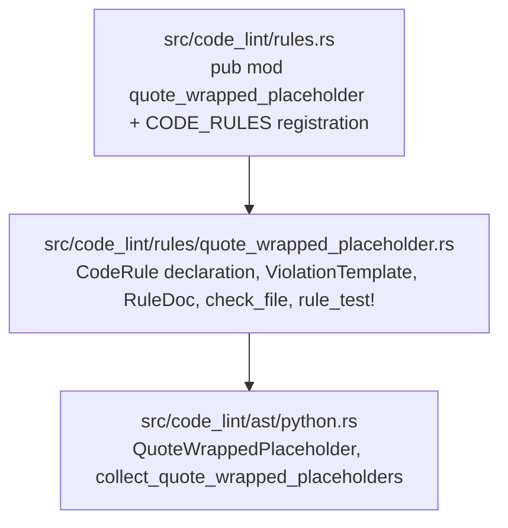

# Phase 3: Design & Plan — `quote-wrapped-placeholder`

Builds on the validated [01_understand.md](01_understand.md) (`D1`–`D9`, `C1`–`C4`) and [02_references.md](02_references.md) (`R1`–`R6`, `R-D5`, `R-D6`, `R-D9`).

> Status: **VALIDATED** (2026-10-03). Approved for Phase 4 implementation.

---

## 1. Definition of Done

### 1.1 Critical User Journeys
1. **F-string with quote-wrapped placeholder**: Writing `raise ValueError(f"Invalid port '{raw_port}' in configuration")` is flagged on the f-string literal with `expression = "'{raw_port}'"` and `replacement = "{raw_port!r}"`.
2. **`.format()` call with quote-wrapped placeholder**: Writing `"Unknown command '{cmd}'".format(cmd=name)` or `"Unknown command '{}'".format(name)` is flagged on the string literal with `replacement = "{cmd!r}"` or `"{!r}"`.
3. **Printf `%` expression or `logging` call with quote-wrapped `%s` / `%(name)s`**: Writing `"Invalid token '%s'" % token` or `logger.warning("Invalid token '%s'", token)` is flagged on the string literal with `replacement = "%r"`.
4. **Unformatted strings, format specifiers, and formal syntax are never flagged**: Plain unformatted strings, docstrings, zero-argument `logger.info("...")` calls, raw/byte strings, placeholders with `!r`/`!s`/`!a`/`:spec`/`=`, and HTML/SQL/JSON/TOML/CLI-flag/backtick-wrapped strings pass with zero diagnostics.

### 1.2 Verification Metrics
- `cargo fmt --check && cargo clippy --all-targets -- -D warnings && cargo test && cargo doc --no-deps --document-private-items` all pass with zero warnings.
- `tests/registry.rs` (`test_rule_names_follow_style_guide`, `test_violation_templates_follow_style_guide`, `test_rule_docs_are_complete`, `assert_documented_examples`) and `tests/architecture_conformance.rs` pass.
- `test_self_dogfooding_code_lint` passes across the repository.

---

## 2. Architecture & Component Boundaries



- **Why no changes to `src/code_lint/ast.rs` or `src/rule_declaration/taxonomy.rs` are needed**:
  - Like `mutable_dataclass.rs` and `mutable_module_constant.rs` (Python-only rules), `quote_wrapped_placeholder.rs` imports `QuoteWrappedPlaceholder` and `collect_quote_wrapped_placeholders` directly from `crate::code_lint::ast::python`.
  - Uses existing `Topic::LITERALS` (`R-D5`) and existing template placeholders `"expression"` and `"replacement"` in `tests/registry.rs`.
  - All raw Tree-sitter node inspection (`.kind()`, `.field()`, `.children()`, `.ancestors()`) is strictly encapsulated inside `src/code_lint/ast/python.rs`.

---

## 3. Detailed Design

### 3.1 AST Types & Collector Signature (`src/code_lint/ast/python.rs`)

```rust
/// A quote-wrapped format placeholder found in a Python f-string, `.format()` call,
/// `%`-formatted string, or multi-argument `logging` call.
#[derive(Debug, Clone)]
pub struct QuoteWrappedPlaceholder<'a> {
    /// The `string` AST node containing the quote-wrapped placeholder.
    pub node: AstNode<'a>,
    /// The quote-wrapped placeholder as written in source (such as `'{x}'`, `\"{}\"` , `'%s'`).
    pub expression: String,
    /// The canonical representation-formatted replacement (such as `{x!r}`, `{!r}`, `%r`).
    pub replacement: String,
}

/// Collects quote-wrapped placeholders in Python f-strings, `.format()` / `.format_map()`
/// calls, `%`-formatted strings, and multi-argument `logging` calls in `file`, in source order.
#[must_use]
pub fn collect_quote_wrapped_placeholders(file: &ParsedFile) -> Vec<QuoteWrappedPlaceholder<'_>>
```

### 3.2 Step-by-Step Detection Algorithm (`src/code_lint/ast/python.rs`)

#### Step 1: Identify Active Formatting Context (`C1`)
For each `string` node in `file.grep.root().dfs()`:
1. **Extract opening and closing delimiters**:
   - First child `string_start` (`node.child(0)`) and last child `string_end` (`node.children().last()`).
   - Split `string_start.text()` at the first `'` or `"` character to obtain `prefix`.
   - **Skip raw and byte strings**: If `prefix.contains(['r', 'R', 'b', 'B'])`, return early.
2. **Determine `FormatKind`**:
   - If `prefix.contains(['f', 'F'])` $\to$ `FormatKind::FString`.
   - Otherwise, walk upward from `node` through any enclosing `concatenated_string` and `parenthesized_expression` nodes to find the `context_root`:
     - **`FormatKind::StrFormat`**:
       - `context_root`'s parent is an `attribute` node (`object == context_root`, `attribute == "format" | "format_map"`) whose parent is a `call` node (`function == attribute`), **or**
       - `context_root` is the first positional argument of a `call` whose `function` resolves to `str.format`.
     - **`FormatKind::Printf`**:
       - `context_root`'s parent is a `binary_operator` node with `operator == "%"` and `left == context_root`, **or**
       - `context_root` is passed in the `argument_list` of a `call` whose `function` is an `attribute` on a logger receiver (`logging`, `logger`, `log`, `_logger`, `_log`, `self.logger`, `self.log`, `cls.logger`, `cls.log`) and:
         - method is `debug` | `info` | `warning` | `warn` | `error` | `exception` | `critical` | `fatal`, `context_root` is positional argument `0`, and at least 2 positional arguments are present, **or**
         - method is `log`, `context_root` is positional argument `1`, and at least 3 positional arguments are present.
     - If none of the above holds, skip `node` (it is an unformatted string constant or docstring).

#### Step 2: Check Overall Message Prose Requirement (`C4.1`)
1. Collect the combined literal text (outside placeholders) of `node` (or of all non-raw, non-byte `string` children if `node` sits inside a `concatenated_string`).
2. **Prose word requirement**: After stripping escape sequences (`\<char>`), the literal text must contain at least one word of $\ge 2$ consecutive ASCII alphabetic characters (`[a-zA-Z]{2,}`).
3. **SQL statement prefix exclusion**: The first alphabetic word of the combined literal text (ignoring leading whitespace and `(`) must **not** match (case-insensitively) a SQL statement keyword:
   `SELECT`, `INSERT`, `UPDATE`, `DELETE`, `CREATE`, `ALTER`, `DROP`, `WITH`, `REPLACE`, `MERGE`, `PRAGMA`, `EXPLAIN`, `TRUNCATE`, `GRANT`, `REVOKE`.

#### Step 3: Extract Candidate Placeholders & Check Bare Conversion (`C2`)
- **Case A: `FormatKind::FString`**:
  - Collect direct children of `node` with `child.kind() == "interpolation"`.
  - Slice `file.source_text()` between `string_start.range().end`, each `interpolation.range()`, and `string_end.range().start` to form `segments[0..=N]`.
  - For each `interp` at index `i`:
    - **C2 check**:
      - `interp.field("type_conversion").is_none()` (no `!r`, `!s`, `!a`),
      - `interp.field("format_specifier").is_none()` (no `:...`),
      - `!interp.children().any(|c| c.kind() == "=")` (no debug `=`),
      - `let Some(expr) = interp.field("expression")`, and `expr.kind() != "string"`.
    - Let `expr_text = expr.text().trim()`.
    - Test `segments[i]` (before `{...}`) and `segments[i + 1]` (after `{...}`) against **C3** and **C4.2–C4.3**:
      - `expression = format!("{open_quote}{{{expr_text}}}{close_quote}")`
      - `replacement = format!("{{{expr_text}!r}}")`.

- **Case B: `FormatKind::StrFormat`**:
  - Let `content = &source[string_start.range().end .. string_end.range().start]`.
  - Scan `content` while skipping `{{` and `}}` (escaped braces):
    - For each unescaped `{` at `open_idx` with matching unescaped `}` at `close_idx`:
      - Let `raw_field = &content[open_idx + 1 .. close_idx]`.
      - **C2 check**: `raw_field` contains no `!`, `:`, `{`, or `}`, and `field = raw_field.trim()` is a valid `.format()` field identifier (`""`, ASCII digits, or valid Python identifier/attribute/index path `[a-zA-Z0-9_.\[\]]+` starting with an identifier character or digit — rejecting shell/awk syntax like `{print $1}`).
      - Test `before = &content[..open_idx]` and `after = &content[close_idx + 1..]` against **C3** and **C4.2–C4.3**:
        - `expression = format!("{open_quote}{{{field}}}{close_quote}")`
        - `replacement = format!("{{{field}!r}}")`.

- **Case C: `FormatKind::Printf`**:
  - Let `content = &source[string_start.range().end .. string_end.range().start]`.
  - Scan `content` while skipping `%%` (escaped literal percent):
    - For each unescaped `%` at `pct_idx`:
      - **C2 check**: Match either:
        1. `%s` (`end_idx = pct_idx + 2`, `raw_spec = "%s"`, `replacement = "%r"`), or
        2. `%(name)s` where `name` is a non-empty valid mapping key (`[a-zA-Z_][a-zA-Z0-9_]*` or identifier without `)` or whitespace, `end_idx = pct_idx + 3 + name.len()`, `raw_spec = &content[pct_idx..end_idx]`, `replacement = format!("%({name})r")`).
      - Test `before = &content[..pct_idx]` and `after = &content[end_idx..]` against **C3** and **C4.2–C4.3**:
        - `expression = format!("{open_quote}{raw_spec}{close_quote}")`.

#### Step 4: Matching Quote Pair (`C3`) & Prose Boundaries (`C4.2`–`C4.3`)
1. **Quote extraction (`C3`)**:
   - Inspect the end of `before`:
     - Must end with `'` or `"` (`quote_char`), preceded by either `0` backslashes (`open_quote = quote_char`) or `1` backslash (`open_quote = \{quote_char}`). If preceded by $\ge 2$ backslashes (`\\'`) or preceded immediately by another `quote_char` (`''`), reject.
   - Inspect the start of `after`:
     - Must start with `quote_char` (`close_quote = quote_char`) or `\{quote_char}` (`close_quote = \{quote_char}`), and the character after `close_quote` must not be `quote_char`.
2. **Left prose boundary (`C4.2`)**:
   - Let `prefix_before_quote` be the slice of `before` prior to `open_quote`, and `full_prefix_before_quote` be all literal text of the string prior to `open_quote`.
   - **Backtick check**: `full_prefix_before_quote` contains an even number of `` ` `` characters.
   - **Unclosed structured container check**: `full_prefix_before_quote` (with `{{`/`}}` collapsed in f-strings/`.format()`) has no unclosed `{` or `[` before a `:` or `,`.
   - **Immediate left character**:
     - Either `prefix_before_quote` is empty **and** the opening quote is at the very beginning of the string (`full_prefix_before_quote.is_empty()`), **or**
     - `prefix_before_quote` ends with ASCII whitespace (`' '`, `'\t'`, `'\n'`, `'\r'`), a whitespace escape sequence (`\n`, `\t`, `\r`), or `'('`.
   - **Last non-whitespace token before opening quote**:
     - After normalizing `\n`/`\r`/`\t` escapes to spaces in `full_prefix_before_quote`, the last non-whitespace character (if any) must be ASCII alphanumeric, `':'`, `','`, or `'('` (specifically **rejecting** `=`, `{`, `[`, `<`, `>`, `/`, `\`, `-`, etc.).
     - The last alphabetic word before the opening quote (or before `'('`) must **not** match (case-insensitively) a SQL operator keyword: `VALUES`, `LIKE`, `ILIKE`, `RLIKE`, `REGEXP`, `GLOB`, `IN`, `WHERE`, `SET`, `TABLE`, `INTO`, `FROM`, `JOIN`.
3. **Right prose boundary (`C4.3`)**:
   - Let `suffix_after_quote` be the slice of `after` after `close_quote`.
   - Normalize a leading `\n`, `\r`, or `\t` escape sequence in `suffix_after_quote` to a space.
   - `suffix_after_quote` must satisfy one of:
     - It is empty **and** `after` reaches the end of the `string` (not immediately followed by an adjacent `{interpolation}` without space), **or**
     - It starts with ASCII whitespace (`' '`, `'\t'`, `'\n'`, `'\r'`), **or**
     - It starts with prose punctuation (`.`, `,`, `;`, `:`, `!`, `?`, `)`) and the following character (if any, and not immediately followed by an adjacent `{interpolation}`) is ASCII whitespace, prose punctuation, `'`, or `"`.

---

### 3.3 Rule Declaration & Violation Template (`src/code_lint/rules/quote_wrapped_placeholder.rs`)

```rust
const TEMPLATE: ViolationTemplate = violation_template! {
    summary: "Format placeholder `{expression}` is wrapped in literal quotes.",
    rationale: "Manual quotes around a formatted value do not escape embedded quotes or control characters and make non-string values such as `None` or numbers indistinguishable from strings.",
    suggestion: "Replace the quoted placeholder with `{replacement}`, or wrap it in backticks when formatting a code identifier.",
};
```

#### Style Guide & Registry Conformance Verification (`tests/registry.rs`)
- **Rule name**: `"quote-wrapped-placeholder"` (3 words, kebab-case, singular noun phrase, no polarity prefix/suffix).
- **File & const**: `src/code_lint/rules/quote_wrapped_placeholder.rs`, `pub const RULE: CodeRule`.
- **`summary`**: Starts with uppercase `"Format"`, 1 sentence ending with `.`, prose outside backticks has no `'`/`"`, no `FIX_VERBS`, no `JUDGEMENT_WORDS`, no `ABBREVIATIONS`.
- **`rationale`**: 1 sentence ending with `.`, no `"must"`/`"should"`, no `FIX_VERBS` at sentence start, uses `"such as"` (no `"e.g."`).
- **`suggestion`**: Starts with `"Replace"` (in `SUGGESTION_VERBS`), ends with `.`, does not say `"instead of"`.
- **Placeholders**: `"expression"` and `"replacement"` (both in `PLACEHOLDERS`).
- **`RuleDoc::summary`**: `"Flags Python format placeholders wrapped in literal single or double quotes."` (starts with `"Flags"`, 1 sentence ending with `.`).
- **No word containing `"comment"` or `"require-explanation"`** in template or doc.

---

## 4. Test Plan

### 4.1 `rule_test!` Cases (`src/code_lint/rules/quote_wrapped_placeholder.rs`)

#### `fail` Cases (1 diagnostic each, verified with `assert_every_occurrence_reported`):
1. `fstring_single_quotes`: `f"Invalid value '{x}'"` $\to$ flags `'{x}'`, suggests `{x!r}`.
2. `fstring_double_quotes`: `f'Invalid value "{x}"'` $\to$ flags `"{x}"`, suggests `{x!r}`.
3. `fstring_escaped_double_quotes`: `f"Invalid value \"{x}\""` $\to$ flags `\"{x}\"`, suggests `{x!r}`.
4. `fstring_at_start_of_message`: `f"'{name}' is not a registered plugin"` $\to$ flags `'{name}'`.
5. `fstring_in_parentheses_and_before_period`: `f"Unknown plugin ('{name}')."` $\to$ flags `'{name}'`.
6. `fstring_complex_expression`: `f"Failed to load '{path.name}' from disk"` $\to$ flags `'{path.name}'`, suggests `{path.name!r}`.
7. `str_format_named_placeholder`: `"Invalid value '{name}'".format(name=val)` $\to$ flags `"Invalid value '{name}'"`.
8. `str_format_empty_placeholder`: `"Invalid value '{}'".format(val)` $\to$ flags `"Invalid value '{}'"` (suggests `{!r}`).
9. `str_format_positional_placeholder`: `"Invalid value '{0}'".format(val)` $\to$ flags `"Invalid value '{0}'"`.
10. `str_format_map_call`: `"Invalid value '{key}'".format_map(mapping)` $\to$ flags `"Invalid value '{key}'"`.
11. `printf_percent_s`: `"Invalid value '%s'" % val` $\to$ flags `"Invalid value '%s'"` (suggests `%r`).
12. `printf_named_percent_s`: `"Invalid value '%(name)s'" % {"name": val}` $\to$ flags `"Invalid value '%(name)s'"` (suggests `%(name)r`).
13. `logger_warning_percent_s`: `logger.warning("Failed to connect to '%s'", host)` $\to$ flags `"Failed to connect to '%s'"`.
14. `logger_log_level_percent_s`: `logging.log(logging.ERROR, "Failed to connect to '%s'", host)` $\to$ flags `"Failed to connect to '%s'"`.

#### `pass` Cases:
1. `fstring_repr_conversion_allowed`: `f"Invalid value {x!r}"`.
2. `fstring_backticks_allowed`: ``f"Invalid value `{x}`"``.
3. `fstring_already_has_repr_inside_quotes`: `f"Invalid value '{x!r}'"`.
4. `fstring_explicit_str_or_ascii_conversion`: `f"Invalid value '{x!s}'"` and `f"Invalid value '{x!a}'"`.
5. `fstring_with_format_specifier`: `f"Price is '{price:.2f}'"` and `f"Date is '{dt:%Y-%m-%d}'"`.
6. `fstring_with_debug_equals`: `f"Result '{x=}'"`.
7. `plain_unformatted_string_and_docstring`: `"""Use '{name}' or '%s' as placeholder."""` and `msg = "Invalid value '{name}'"`.
8. `awk_and_shell_strings`: `cmd = "awk '{print $1}'"` and `"awk '{print $1}'".format()`.
9. `zero_arg_logger_call`: `logger.info("Found literal '%s' in input")`.
10. `raw_and_byte_strings`: `rf"Invalid pattern '{pattern}'"`, `r"Invalid '{x}'".format(x=1)`, `b"Invalid '%s'" % b"val"`.
11. `printf_already_percent_r_or_numeric`: `"Invalid value '%r'" % val`, `"Count '%d' items" % count`, `"Ratio '%.2f' value" % ratio`, `"Literal '%%s' in %s" % val`.
12. `str_format_escaped_braces_or_conversion`: `"Literal '{{x}}' in '{y!r}'".format(y=val)` and `"Price '{x:.2f}'".format(x=1.5)`.
13. `html_and_xml_attributes`: `f'<a href="{url}" title=\'{title}\'>Click here</a>'`.
14. `sql_queries`: `f"SELECT * FROM users WHERE name = '{name}'"`, `f"INSERT INTO users VALUES ('{name}')"`, `f"SELECT * FROM users WHERE name LIKE '{pattern}'"`.
15. `json_toml_and_key_value_syntax`: `f'{{"name": "{name}"}}'`, `f'mode = "{mode}"'`, `f'--output="{path}"'`.
16. `isolated_quote_wrapping`: `f'"{value}"'` and `f"'{value}'"`.
17. `placeholder_inside_markdown_backticks`: ``f"Set `mode = '{mode}'` in configuration"`` and ``f"Expected `'{token}'` in stream"``.
18. `file_extension_and_host_port`: `f"Loading file '{stem}'.py"` and `f"Connecting to '{host}':{port}"`.
19. `mismatched_quotes`: `f"Invalid value '{x}\""`.

### 4.2 Unit Tests in `src/code_lint/ast/python.rs`
- Verify `collect_quote_wrapped_placeholders` returns exact `(expression, replacement)` pairs for:
  - Multiple placeholders in a single f-string (`f"Copied '{src}' to '{dst}'"` $\to$ `[("'{src}'", "{src!r}"), ("'{dst}'", "{dst!r}")]`),
  - `.format()` with empty `{}`, positional `{0}`, and named `{key}` placeholders,
  - Printf `%s` and `%(key)s`,
  - Implicit string concatenation (`"Failed to load " f"'{path}'"`).

---

## 5. Step-by-Step Implementation Plan (Phase 4)

| Step | Task | Verification |
| :--- | :--- | :--- |
| **T1** | Add `QuoteWrappedPlaceholder` and `collect_quote_wrapped_placeholders` (plus unit tests) to `src/code_lint/ast/python.rs`. | `cargo test ast::python` |
| **T2** | Create `src/code_lint/rules/quote_wrapped_placeholder.rs` with `TEMPLATE`, `RULE`, `check_file`, `RuleDoc`, `Example`, and `rule_test!`; register in `src/code_lint/rules.rs`. | `cargo test quote_wrapped_placeholder` |
| **T3** | Update CLI rule list snapshot if needed and run full repository verification (`fmt`, `clippy`, `test`, `doc`). | `cargo fmt --check && cargo clippy --all-targets -- -D warnings && cargo test && cargo doc --no-deps --document-private-items` |
