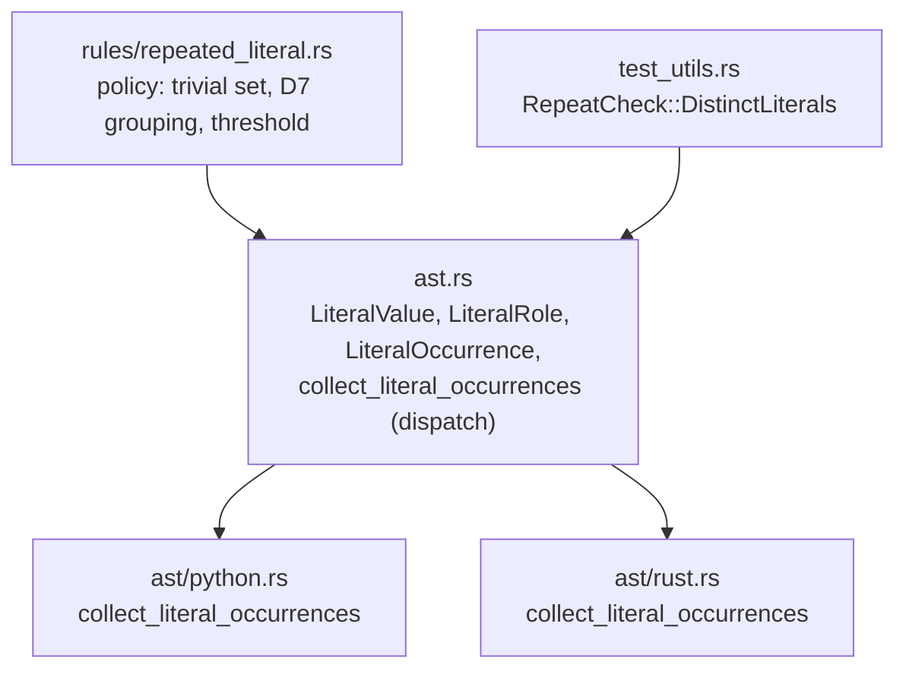

# Phase 3: Design & Plan — `repeated-literal`

Builds on [01_understand.md](01_understand.md) (D1–D8) and [02_references.md](02_references.md) (R1–R8, R-D2, R-D4, R-D6, R-D7, R-Dogfood).

> Status: **VALIDATED** (2026-10-03). P1–P3 resolved (§7). Historical record: 04 §2 and 06 supersede it where they differ.

---

## 1. Definition of Done

### 1.1 Critical User Journeys

1. **Python developer repeats a URL in two functions**: the 2nd occurrence is flagged with ``Literal `"https://api.example.com/orders"` appears 2 times in this file.``
2. **Rust developer has `const JJ: &str = "jj";` and writes `!= "jj"`**: the wild `"jj"` is flagged (D7, constant exists).
3. **Two unrelated constants share a value** (`MAX_RETRIES = 3`, `TUPLE_ARITY = 3`): nothing is flagged (Tip #069).
4. **Test code repeats fixture strings**: nothing is flagged (`RuleTarget::SourceOnly`, R-D2).
5. **User raises the threshold**: `[rules.repeated-literal] min-occurrences = 3` stops flagging 2-site duplicates.

### 1.2 Metrics

- `cargo fmt --check && cargo clippy --all-targets -- -D warnings && cargo test` green.
- `test_self_dogfooding_code_lint` green, with the only `repeated-literal` suppressions being the three `ast/` file-level disables (R-Dogfood).
- The harness extension (§3.5) does not weaken the check for any other rule: every existing `rule_test!` keeps the default mode.

---

## 2. Architecture



- **Structural facts in `ast`** (node kinds, exempt syntax, constant roles, value normalization), per `architecture_conformance.rs`: no `.kind()` / `.field()` outside `code_lint::ast`.
- **Policy in the rule**: trivial-value filter (D5), test-range filter (Rust), D7 grouping and threshold.

---

## 3. Detailed Design

### 3.1 Types (`src/code_lint/ast.rs`)

```rust
/// A literal's normalized value: equal values are the same literal whatever their spelling.
#[derive(Debug, Clone, PartialEq, Eq, Hash)]
pub enum LiteralValue {
    /// String content as written between the delimiters (escapes not decoded).
    Str(String),
    /// Byte-string content as written between the delimiters.
    Bytes(String),
    /// Integer value, with digit separators, base prefix and type suffix resolved.
    Int(i128),
    /// Float value as `f64::to_bits` (after `-0.0` → `0.0`).
    Float(u64),
}

impl LiteralValue {
    /// True for values not worth naming (D5): strings shorter than 2 characters or without
    /// an alphanumeric character; integers -1, 0, 1, 2; floats -1.0, 0.0, 1.0.
    pub fn is_trivial(&self) -> bool;
}

/// Whether a literal defines a named constant or is used inline.
pub enum LiteralRole { ConstantDefinition, Inline }

pub struct LiteralOccurrence<'a> {
    /// The literal, or its unary `-` node for a negative number.
    pub node: AstNode<'a>,
    pub value: LiteralValue,
    pub role: LiteralRole,
}

/// Literals in `file` that could be replaced by a named constant, in source order.
pub fn collect_literal_occurrences(file: &ParsedFile) -> Vec<LiteralOccurrence<'_>>;
```

`is_trivial` lives on the value type so the rule and the harness (§3.5) share one definition.

### 3.2 Collectors (what is skipped vs collected)

| Concern | Python | Rust |
| :--- | :--- | :--- |
| Strings | `string` (each part of a `concatenated_string`); `b`-prefix → `Bytes` | `string_literal`, `raw_string_literal` → `Str`; `byte_string_literal`, `raw_byte_string_literal` → `Bytes`. `char_literal`, byte chars and C strings are not collected. |
| Numbers | `integer`, `float`; imaginary (`1j`) not collected | `integer_literal`, `float_literal` |
| Negation | `unary_operator` `-` on a number: collect the unary node, skip the child | `unary_expression` / `negative_literal` `-` on a number: same |
| Scalar constant (`ConstantDefinition`) | Module- or class-level `assignment` whose target is `UPPER_SNAKE_CASE` or annotated `Final`, with a literal (or negated number) as the whole right side | `const_item` / `static_item` whose whole `value` is a literal (or negated number); `enum_variant` discriminant |
| Composite constant (R-D7) | Same targets with any other right side: inner literals **not collected** | `const_item` / `static_item` with any other value: inner literals **not collected** |
| Not values (never collected) | Docstrings (`string` whose parent is `expression_statement`): documentation, not data | Tuple field positions: `t.0` parses as a `field_expression` whose `field` child is an `integer_literal` node, a grammar label for a field name. The collector matches literal node kinds, so it skips this node; it is not an exemption policy. |
| Literal required by the language (D6) | `type` ancestors; `Literal[...]`; 1st argument of `TypeVar`, `NewType`, `ParamSpec`, `TypeVarTuple`, `NamedTuple`, `TypedDict`, `cast` | `attribute_item` / `inner_attribute_item` ancestors; `extern_modifier` ABI strings; literals inside the exempt macros (§3.3), resolved with `resolve_preceding_macro_path` |
| Judgement exemption (D6) | Interpolated f-strings: the string itself (a template mixing code and text, like `format!`); literals inside `{...}` are still collected | — |
| Counted on purpose | `case` patterns: repeated case values are domain values; the fix is an `Enum` / class constant matched by dotted name (§3.4 suggestion) | `match` arms and `matches!` patterns (constants are valid patterns) |

Number normalization: strip `_`; Rust integer suffixes (`u8`…`u128`, `i8`…`i128`, `usize`, `isize`) and, for decimal literals only, `f32` / `f64`; parse `0x` / `0o` / `0b`. A literal that fails to parse (overflow) is not collected.

### 3.3 Exempt Rust macros (D6)

`format`, `print`, `println`, `eprint`, `eprintln`, `write`, `writeln`, `panic`, `todo`, `unimplemented`, `unreachable`, `assert`, `assert_eq`, `assert_ne`, `debug_assert`, `debug_assert_eq`, `debug_assert_ne`, `bail`, `ensure`, `anyhow`, `error`, `warn`, `info`, `debug`, `trace`, `indoc`, `concat`, `env`, `option_env`, `include_str`, `include_bytes`. Matched on the macro's last path segment.

- `matches!` is **not** exempt (P1).
- Not listed because already covered: `rule_test!` and `insta` snapshot macros only appear in test code (`SourceOnly`); `violation_template!` strings sit in a composite `const`; `architecture_component!` takes no string.
- Known gap: the whole macro is exempt, not only its format-string position, so `assert_eq!(x, "expected")` repeated in production code is missed. Narrowing needs per-macro argument positions inside raw token trees.

### 3.4 Rule (`src/code_lint/rules/repeated_literal.rs`)

```rust
const MIN_OCCURRENCES: CountOption = CountOption {
    key: "min-occurrences",
    doc: "Minimum occurrences of a literal in a file, its constant definition included, for it to be flagged.",
    default: LanguageDefaults::new(2, &[]),
};

pub const RULE: CodeRule<CountOption> = CodeRule { /* D1, D3, R-D4 */ target: RuleTarget::SourceOnly, check: check_file };
```

`check_file(rule, path, file, min_occurrences)`:
1. `ast::collect_literal_occurrences(file)`, drop `is_trivial()` values; for Rust, drop occurrences inside `ast::rust::collect_inline_test_ranges(file)` (so a test literal cannot pair with a production one).
2. Group by `LiteralValue` in first-seen order, splitting `ConstantDefinition` from `Inline`.
3. D7: with a constant, flag every inline use when `1 + inline.len() >= min_occurrences`; without, flag `inline[1..]` when `inline.len() >= min_occurrences`.
4. Params: `expression` = the flagged node's text, `count` = definitions + inline uses.

Classification: `Topic::LITERALS`, `Precision::Heuristic`, `Consensus::Opinionated`, `ImpactedQuality::Maintainability`.

Template (placeholders already allowed in `tests/registry.rs`):
- **summary**: ``Literal `{expression}` appears {count} times in this file.``
- **rationale**: "A value copied inline has no name, and changing it means finding every copy: missing one silently desynchronizes the file."
- **suggestion**:
  - base / Rust: ``Extract `{expression}` into one named constant (or reuse the existing one) and reference it at every site.``
  - Python: ``Extract `{expression}` into one named constant (or reuse the existing one) and reference it at every site; in a `case` pattern, use a dotted name such as `Mode.READ`, since a bare name captures any value.``

### 3.5 Harness extension (D8): `RepeatCheck::DistinctLiterals`

Problem: the repeated-occurrence check runs `{code}\n{code}`; identical literals merge into one group, so a wild pair yields 3 diagnostics, not the mirrored 2.

Design:
- `rule_test!` gains an optional mode: `rule_test!(RULE, repeat: DistinctLiterals, { ... })`. Without it, `RepeatCheck::SameCode` (today's behaviour) applies.
- In `DistinctLiterals` mode, before running the doubled file, the second copy's non-trivial literals (found with `ast::collect_literal_occurrences` on `code`) are rewritten **in place with the same byte length**: the first ASCII letter of a string toggles case, the first significant digit of a number moves to the next digit in `3..=9` (cycling), so it stays non-trivial.
- The harness asserts the rewritten values are disjoint from the first copy's values and panics with "rename a literal in this case" otherwise.
- The assertion is unchanged: exactly `span` and `span + offset`. Each copy now forms its own groups, so a rule that stops after its first group or first match still fails.
- `assert_documented_examples` takes the same mode.
- No guardrail needed: the mode does not loosen the assertion; it only changes the input's literal values.

---

## 4. Test Plan

### 4.1 `rule_test!` cases (both languages unless noted; one behaviour per case)

**fail** (1 diagnostic):
- `repeated_string_flags_second_use`, `repeated_number_flags_second_use`, `repeated_negative_number` (`-42`).
- `constant_then_inline_use_flags_inline` (D7).
- `quote_styles_are_the_same_literal` (Python `'x'` / `"x"`), `raw_and_plain_string_are_the_same_literal` (Rust `r"x"` / `"x"`).
- `digit_separators_are_the_same_number` (`1_000` / `1000`), `type_suffix_is_the_same_number` (Rust `30u64` / `30`).
- `literal_inside_interpolation_counts` (Python `f"{row['status']}"` + `row['status']`).
- `match_arm_literal_counts` (Rust), `matches_pattern_literal_counts` (Rust), `case_pattern_literal_counts` (Python).
- `repeated_byte_string`.

**pass**:
- `single_occurrence`, `trivial_numbers` (`0 1 -1 2 0.0 1.0 -1.0`), `delimiter_and_single_char_strings` (`", "`, `"--"`, `"a"`).
- `constants_sharing_a_value` (Tip #069), `composite_constant_does_not_pair_with_single_use` (R-D7).
- `str_and_bytes_are_distinct`, `number_and_negation_are_distinct` (`42` / `-42`).
- Python: `repeated_docstrings`, `repeated_type_annotations_and_literal_types`, `repeated_interpolated_fstrings`.
- Rust: `repeated_attribute_arguments`, `repeated_format_and_assert_macro_arguments`, `tuple_field_positions_are_not_literals` (`t.3`), `repeated_extern_abi`, `known_gap_values_inside_exempt_macros` (`assert_eq!(x, "expected")` twice).

Each exemption case is checked once by disabling the exemption and watching it fail (rule_test! Rustdoc).

### 4.2 `ast` unit tests (in `ast/python.rs` / `ast/rust.rs` `mod tests`)

Node-shape facts the rule cases cannot isolate: role of scalar vs composite constants, unary node as the anchor, tuple index skipped, macro exemption via path resolution, number normalization (`0x1F`, `0b11`, `1_000_u32`, overflow skipped).

### 4.3 Harness tests (`src/test_utils.rs`)

The rewrite keeps byte length and spans; collision detection panics; `SameCode` mode unchanged.

---

## 5. Task Plan

| # | Task | Verify |
| :--- | :--- | :--- |
| T0 | ROADMAP: typed node kinds investigation (**done**); replace the `no-repeated-literals` candidate entry once shipped. | Doc review |
| T1 | `ast.rs` types + `LiteralValue::is_trivial` + Python collector + unit tests. | `cargo test ast::python` |
| T2 | Rust collector + unit tests. | `cargo test ast::rust` |
| T3 | Harness `RepeatCheck` + tests. | `cargo test test_utils` + full suite unchanged |
| T4 | Rule file, registration in `rules.rs`, `rule_test!`, docs/examples; update `cli__list_rules.snap`. | `cargo test`, `cargo insta review` |
| T5 | Dogfooding: constants in `packed_assertion.rs`, `environment_variable_in_function.rs`, `suppression.rs`, `semantic/comments.rs`; `omni:disable-file [repeated-literal]` in the three `ast/` files. | `test_self_dogfooding_code_lint` |

After every task: `cargo fmt --check && cargo clippy --all-targets -- -D warnings && cargo test`.

> [!WARNING]
> `ast/python.rs` is also being edited by the `signature_collection_types` track. T1 adds a self-contained collector section and should land after (or be rebased onto) that work.

---

## 6. Rejected Alternatives

| Alternative | Why rejected |
| :--- | :--- |
| Per-case opt-out of the repeated-occurrence check + registry guard (old ROADMAP note) | Under D7, every inline-only case needs the opt-out, so no case checks multi-group completeness. |
| Flag one diagnostic per group | Breaks `flagged_span` semantics and hides which sites to change. |
| Composite constant literals as `ConstantDefinition` | `RULE` metadata strings would pair with a single inline use of the same word (02 §2.2.5). |
| Decoding escapes / raw-string equivalence (`"\\d"` = `r"\d"`) | Language-specific decoders for a rare case; raw content comparison is predictable. |
| Length cutoff (`< 5`, `< 10`) | Misses `"json"`, `"GET"`, `"jj"` (R2, R3). |
| Exempting Python `case` patterns | Repeated case values are domain values; `Enum` + dotted name is the idiomatic fix. The bare-name capture trap is handled in the suggestion instead. |
| Author-written placeholders in cases (H3) | Independent of the collector, but unusual case syntax, and documented examples would need substitution before display. H2 failures are loud even though it reuses the collector. |
| Listing test-only and template macros as exempt | Redundant with `SourceOnly` and composite-constant skipping. |

---

## 7. Open Points for Validation

- **P1 — `matches!`**: **accepted** (2026-10-03): not exempt, counted like `match` arms.
- **P2 — Harness**: **accepted** H2 (`repeat: DistinctLiterals`, in-place rewrite of the second copy).
- **P3 — Exemptions**: **accepted** with changes: language-required literals (A) kept; docstrings and tuple positions reframed as non-values (B); `case` patterns counted with a Python-specific suggestion (C); test-only and template macros removed from the list (D). R-D4 and R-D7 as written.
