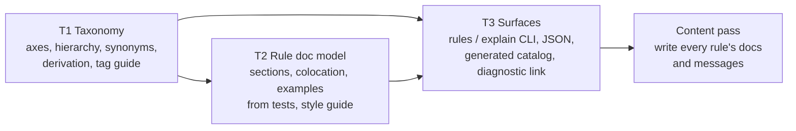

# Phase 1: Understand — Rule Documentation & Tagging System

This document records **Phase 1 (Understand)** of the exploration cycle for Omni's rule documentation and tagging system.

**Status**: Validated. This cycle focuses on **T1 (taxonomy)** (D13). Next: **Phase 2 (Gather Resources and Reference)**.

---

## 1. Context & Problem Statement

Prior analysis in `tag_system_analysis.md` (now folded into this directory) and [ROADMAP.md §5](../../../../ROADMAP.md) recorded early 17-rule findings. Only the §10 "Manual notes" (preserved verbatim in §1.1 below) are authoritative input (D11). The facts as of today (21 code rules, 4 suppression meta-rules and 1 command rule, 26 in all):

1. **Tags are only selectors.** `Tag` in [core.rs](../../../../src/core.rs) has one consumer: `select` / `ignore` / `per_file_ignores`. `Tag::description` and `Tag::as_str` have no production callers.
2. **Tags are flat and ad hoc.** `has_tag` checks flat membership, so a rule has to list every ancestor itself (`[Style, Naming]`). `Cli` has no members. `Workflow`, `Vcs` and `JJ` all select the same single rule. Axes are mixed together in one enum: subject tags (`Testing`), dispositions (`Heuristic`, `Opinionated`), and `SideEffects`, which fits no axis cleanly.
3. **Language tags are derived.** `Python` and `Rust` come from `supported_languages()`. This is the only part of the current system that cannot drift.
4. **Rule documentation is scattered and hand-kept.** Prose is split across the `//!` module doc, the `///` struct doc, the `ViolationTemplate` (summary / rationale / suggestion), and the hand-written [README.md](../../../../README.md) catalog. Nothing checks the catalog against `CODE_RULES`, and none of this text can be reached from the binary.
5. **Examples already exist, but only as tests.** Every rule has `rule_test!` pass/fail cases per language. These are the best-maintained examples in the project, but no documentation uses them.

### 1.1 Authoritative Manual Notes (from `tag_system_analysis.md` §10)

> What I want is a powerful tagging systems, potentially with hierachical tags, but even more a clear documentation of our rules, e.g. by adding domain (e.g. where JJ would be a child of VCS), and a rule could belong to more than one domain, "disposition" (even though I'm not sure it's most explicit/self explanatory name), etc, and we can research different axis to that might improve the documentation while not adding noise. We don't wan't to lose granularity with our tags, and the hierachical system is here for that purpose, we can go very granular while not losing more general tags. Our current set of tags is not set in stone, it's a draft, and we can add or remove or change them (including things like domain/subject, opinionated, heuristics, etc)
> We also want to colocate documentation with the rules themselves, so we can display them instead of in the readme.
>
> Also we could join this with a proper tag guide to replace the kinda ad hoc Candidate: Admission Criteria.
>
> We can also probably consider synonyms per tags, in case a single concept could have multiple names.
>
> A further idea that I would like to investigate but out of scope, is the auto tagging, e.g., I have an abstraction for working with logging, and by importing/using it, it automatically tags it as `logging`, or we declare a "heuristics", and the rule is automatically tagged as `heuristics`. Though if there are things that we can already simply automatically derive, we should do it.

---

## 2. Goals & Explicit Non-Goals

### Goals

- **G1 — Rule documentation lives with the rule.** Each rule declares its documentation in its own source file, and the binary can reach it at runtime.
  - *Reason*: Docs kept apart from the code drift. The README catalog has already drifted, with no check to catch it.
- **G2 — A tag taxonomy that supports granular tags and broad selection.** Tags can be very specific (e.g. `jj`) without losing the broader tags above them (e.g. `vcs`), and a rule can belong to more than one domain.
  - *Reason*: A flat tag set forces a trade-off: either lose granularity, or make every rule list all its ancestors (and risk forgetting some).
- **G3 — Tags serve as both selectors and documentation.** Tags are rendered wherever rules are listed or explained, not only matched in config.
  - *Reason*: This settles the "central tension" in the prior analysis. The goal is for tags to document rules, and a label that is never displayed documents nothing.
- **G4 — Derive whatever can be derived.** Language, rule kind (code / command), tests-only target, configurable, and later fixable are computed, never declared.
  - *Reason*: A derived fact cannot drift. A declared one only stays correct if a test checks it.
- **G5 — One style guide for rule docs and violation messages.** A single guide covers doc sections and `summary` / `rationale` / `suggestion`. Text shared between them has one source.
  - *Reason*: The doc's "why is this bad" and the message's `rationale` say the same thing. Writing it twice means it will diverge.
- **G6 — A tag guide instead of ad hoc admission criteria.** A written guide defines the axes, when a tag is allowed, when a parent link is legitimate, and how synonyms work.
  - *Reason*: As the rule count grows, contributors need rules they can apply, not reasoning they have to reconstruct.
- **G7 — Discovery for humans and agents.** A human in the terminal and an AI agent fixing a violation can both find out which rules exist and what a given rule means.
  - *Reason*: These are the two readers named in D3.
- **G8 — A decision grounded in SOTA, with evidence.** The exploration cycle ends with an architecture decision, backed by CUJs and prototypes.
  - *Reason*: The current tags grew ad hoc. This cycle exists to stop that.

### Explicit Non-Goals

- **NG1 — Implementation in this cycle.**
  - *Reason*: D1. This cycle produces the decision (docs 01–07 and ADR 007). Later `impl/` cycles scope, build and review it, in the order set by D12.
- **NG2 — Auto-tagging driven by abstractions** (e.g. using the logging helper tags a rule `logging`).
  - *Reason*: D7. It is a real idea but a separate mechanism. It goes on the roadmap.
- **NG3 — Renaming rules.**
  - *Reason*: This is the ROADMAP "Random" item, and it has its own review. Tag names *are* in scope.
- **NG4 — Writing or rewriting rule docs and violation messages.**
  - *Reason*: This cycle designs the style guide and the shared-text mechanism. Applying them to every rule is the final content pass in D12.
- **NG5 — Severity levels, rule lifecycle (preview / stable / deprecated), and presets.**
  - *Reason*: These are related but separate concerns (see §5 Adjacent topics). Pulling them in would double the scope. They are recorded so the design leaves room for them.
- **NG6 — A hosted documentation website.**
  - *Reason*: The readers are the terminal, agents, and an in-repo catalog (D3).

---

## 3. Numbered Decisions (D1–D12)

- **D1 — Cycle type**: An exploration cycle (requirements, SOTA survey, CUJs, prototypes / POC tracks, architecture decision) comes first. The implementation cycle follows in `impl/`, as in `common/reports`.
- **D2 — Work directory**: `docs/dev/rule_docs_and_tags/`.
- **D3 — Readers**: Humans in the terminal (`rules` / `explain`-style discovery) and AI agents (machine-readable output, with a pointer to docs from each diagnostic). The hand-written README catalog is replaced by the declared documentation.
- **D4 — Doc content**: Ruff-style sections (What it does / Why is this bad / Example / Use instead / Options / References). The Example and Use-instead snippets come from the existing `rule_test!` fail/pass cases, so they cannot drift.
- **D5 — One style guide**: Rule docs and violation messages are designed together, and shared text (e.g. rationale) has a single source.
- **D6 — Hierarchy shape is open**: Tree vs DAG, and how hierarchical tags should be used at all, is decided in Phases 2 and 3 against real tag examples.
- **D7 — Derivation scope**: Trivially derivable properties are derived. Abstraction-driven auto-tagging goes on the roadmap.
- **D8 — Current tags are a draft**: Tags can be added, removed or renamed freely, including the subject / domain and disposition concepts themselves.
- **D9 — Tags are selectors *and* documentation** (G3).
- **D10 — Synonyms are in scope**: A concept can have more than one accepted name.
- **D11 — Authoritative input**: The §10 "Manual notes" (§1.1 above) state the intent. The rest of the earlier `tag_system_analysis.md` (axis model, admission criteria, disposition wording, alternatives) was background to re-examine, not a baseline to preserve.
- **D12 — Implementation order** ✅ *Confirmed*: T1 (taxonomy) → T2 (doc model and mechanism) → T3 (surfaces) → a final **content pass** that writes or rewrites every rule's docs and messages against the finished style guide and tags. Rule prose is written last, when everything it depends on is final.
- **D13 — This cycle's focus is T1**: This cycle explores and designs only the taxonomy. T2 and T3 are considered only as **interfaces**: what T1 must be able to supply to docs and surfaces (descriptions, hierarchy, synonyms, derived tags). They are designed in a later loop of these phases. Q4–Q8 are deferred to that loop.

---

## 4. Assumptions

- **A1 — No backward compatibility for config.** ✅ *Confirmed.* Nobody outside this repository uses Omni, so renaming tags needs no migration or compatibility aliases. Any synonyms (D10) exist for clarity, not compatibility.
- **A2 — Docs must be in the binary.** ✅ *Confirmed.* `explain` and agent output need the docs at runtime. Whether they are declared explicitly or extracted from `///` comments by a crate is still open (Q4).
- **A3 — Command rules are in scope.** ✅ *Confirmed.* The docs and tag system cover `CommandRule`s (e.g. the jj rule), not only `CodeRule`s.
- **A4 — Scale target.** ✅ *Confirmed.* The design should hold up at hundreds of rules, not only today's 26.
- ~~**A5 — Selecting a parent selects its descendants.**~~ *Withdrawn.* How hierarchical tags should behave will be researched instead (Q2, Q3).

---

## 5. Scope Split

The work separates into three tracks, and the dependencies between them point one way:

- **T1 — Taxonomy**: which axes exist, tree vs DAG, synonyms, what gets derived, selection semantics, the tag guide.
- **T2 — Rule doc model**: the sections, where and how docs are declared, how `rule_test!` cases become examples, sharing text with `ViolationTemplate`, the style guide.
- **T3 — Surfaces**: CLI discovery, machine-readable output, the generated catalog and its drift check, doc pointers from diagnostics.

The exploration cycle covers all three at the design level, because T3 is what makes tags documentation and it constrains T1 and T2. The implementation cycles then follow D12. Each slice can ship on its own.

### Adjacent topics (out of scope, listed so the design leaves room)

- **Rule lifecycle**: preview / stable / deprecated (Ruff preview, Clippy `nursery`).
- **Presets / default sets**: e.g. a `recommended` set. Clippy's lint groups combine disposition with default level.
- **"See also" links** between related rules, and an **overlap** section pointing to equivalent external rules (e.g. Ruff `PLR2004`), as the ROADMAP's candidate rules already do informally.
- **Config documentation derived from the config structs** (`ThresholdConfig`, `DenyListConfig`, …) for the Options section.
- **Abstraction-driven auto-tagging** (NG2).

---

## 6. Open Questions for Phase 2 (SOTA) & Phase 3 (Design)

- **Q1 — Axes**: Which axes earn a place (domain / subject, disposition, …)? What should "disposition" be called so the name explains itself (e.g. *nature*, *confidence*, *strictness*)? Where does `SideEffects` go?
- **Q2 — Hierarchy shape and proper use**: How are hierarchical tags meant to be used (in linters, taxonomies, faceted classification)? Tree or DAG? What makes a parent link legitimate? How are cycles and depth bounded?
- **Q3 — Selection semantics**: Does selecting a parent also select its descendants (formerly A5)? How do parent / child, synonyms, `select` vs `ignore` precedence, and `per_file_ignores` interact? Do synonyms appear in output, or only the canonical name?
- **Q4 — Colocation mechanism**: How do docs get into the binary? The options are explicit declaration (const struct or declarative macro), extracting `///` comments with a crate (e.g. `strum::EnumMessage`, which `Tag` already uses, or `documented`), `include_str!` of a sibling Markdown file, or something else. The same question applies to tag descriptions.
- **Q5 — Examples from tests**: Which `rule_test!` cases become examples? How are they marked, and how are they rendered per language?
- **Q6 — Shared text**: Is the doc's "Why is this bad" the same as `ViolationTemplate::rationale`, or a longer version of it? What exactly does each piece own?
- **Q7 — Surfaces**: What are the command names and output formats? Does the catalog live in the README or under `docs/rules/`? Is drift prevented by a test or by generating at build time?
- **Q8 — Tags in diagnostics**: Do diagnostics (JSON) carry tags and a doc pointer?
- **Q9 — Tag documentation**: What does each tag itself document (description, members, parent)? What format does the tag guide take?
