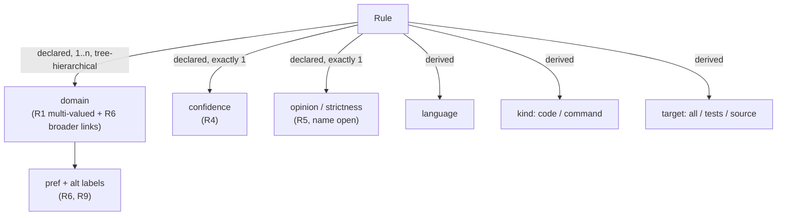

# Phase 2: Gather Resources and Reference — Tag Taxonomy (T1)

This document records **Phase 2** of the exploration cycle. It combines three independent research tracks and focuses on T1 (D13).

**Status**: Validated. The opinion-facet definition and the remaining facet labels (§6.4) are carried into Phase 3.

**Sources**: The full reports, with every citation, are in the researcher transcripts:
- [Linter taxonomy survey](conversation://400b8d13-982a-476e-8628-0c64722485fe)
- [Hierarchy & vocabulary theory](conversation://61f8491b-4eb7-4718-8ecb-8ee6dcb6d137)
- [Rust implementation patterns](conversation://f930e137-ad1c-404a-a4af-b561c851375e)

> [!WARNING]
> The researchers could only read search summaries, not the pages themselves. Structural facts below are consistent across all three tracks. Issue numbers, exact code signatures and a few claims (marked *unverified*) must be checked against the source before the ADR cites them.

---

## 1. Selected References

We will compare against these references for the rest of the project. **Adopt** means we take the idea. **Contrast** means it teaches mostly by what went wrong.

| # | Reference | Role | Key idea | How it differs from what we want |
|---|---|---|---|---|
| R1 | **Biome** `declare_lint_rule!` (groups + `domains`) | Adopt | Each axis is its own typed field, and the type enforces how many values it takes: `group` is exactly 1, `domains: &[RuleDomain]` is 0..n. Domains are metadata that *enable* rules, e.g. turned on automatically from `package.json`. | Domains are flat. There is no hierarchy and no synonyms. |
| R2 | **Ruff** `RuleSelector` + `rule_redirects.rs` + `generate-all --check` | Adopt (mechanics) | Selection resolves by specificity, and ignore wins ties. An alias table keeps `redirected_from`, so Ruff can warn and still print the canonical name. A CI check fails when generated files are stale. | The hierarchy is the rule-code string, so it is a tree only. It has no subject axis at all, and its origin-tool prefixes are its most criticised usability point. |
| R3 | **rustc lint groups** (`register_group`, `check_lint_name`) | Adopt | A lint can belong to many groups. Some groups are **derived** from lint metadata (`future_incompatible`, edition groups). Groups can have aliases. Unknown names get a Levenshtein "did you mean". | Groups are declared on the group side, as lists of lints. Selection is order-based, which does not fit unordered TOML. |
| R4 | **Semgrep** `confidence` · **RuboCop** `Safe: false` | Adopt (naming) | "Can this rule be wrong about a fact?" is a first-class, single-valued axis called **confidence**. | Semgrep's other axes (likelihood, impact) are specific to security. |
| R5 | **typescript-eslint** `recommended` / `strict` / `stylistic` · **Clippy** `restriction` | Adopt (concept) | "Is this rule a matter of taste?" is a separate axis. v6 split stylistic rules out of `recommended` because users kept disabling the opinionated ones. | Implemented as nested presets, not tags. |
| R6 | **W3C SKOS** · **ISO 25964 / Z39.19** | Adopt (theory) | Store only direct `broader` links and compute ancestors (`broaderTransitive` is inferred, never asserted). Each concept has one `prefLabel` and several `altLabel`s, and the label sets are disjoint. A parent link must pass the **all-and-some test** ("*all* jj rules are vcs rules"). Hierarchy never crosses facets. A facet name is a *node label*, not an assignable concept. | Written for library vocabularies, not selectors. Precedence rules are not covered. |
| R7 | **Debian debtags** · **Kubernetes** `kind/` `area/` · **GitLab scoped labels** | Adopt | Named facets, each with a documented vocabulary. GitLab's `scope::value` makes a facet **single-valued** (adding one value removes the other). Kubernetes keeps every label, with its description and admission criteria, in one file. | Facets are shown as a prefix in the label, because their names are not globally unique. |
| R8 | **Wikipedia category guideline** ("diffusion") | Adopt (one rule) | Tag only the most specific category, and let ancestors be implied. | Its graph is the main example of failure: cycles, "related-to" parent links, drift. |
| R9 | **Stack Overflow tag synonyms / tag wiki** | Adopt | A synonym is replaced by the master tag on input. Each tag's excerpt says *when to use it*, not what the word means. Meta-tags that describe quality rather than content were banned. | Flat tags. Governance is by community vote. |
| C1 | **Gmail nested labels** | Contrast | Nesting is display-only: `label:parent` does not match messages that only carry a child label. Users must attach every ancestor by hand, which is exactly Omni's `[Style, Naming]` today. | — |
| C2 | **golangci-lint v2** removed presets | Contrast | Presets whose membership changed made configs drift silently. They were replaced by explicit `default: standard\|all\|none` plus lists. *(stated reason unverified)* | — |
| C3 | **Clippy groups** · **Pylint** category letters | Contrast | One axis mixing domain, confidence, opinion, lifecycle and default level ends up overloaded. Pylint puts the category in the message ID, so recategorising a message means renaming it. | — |
| C4 | **SonarQube 10.2 → 10.8** | Contrast | Replacing a familiar single axis with a richer model caused migration pain, and part of it was walked back. A1 means Omni cannot suffer this, but it shows richer is not automatically better. | — |

---

## 2. Critical Points

### CP1 — No surveyed linter has a declared hierarchy between tags
Hierarchy always comes from name prefixes (Ruff, clang-tidy, RuboCop), from unions of groups (Clippy `all`, rustc edition groups), or does not exist (Biome, oxlint, Semgrep). The `jj ⊂ vcs` idea is new ground for linters, though it is standard in controlled vocabularies (R6).
**Consequence**: the design has to borrow its semantics from R6 and keep them tested and shallow. No linter offers a design we can copy.

### CP2 — Axes should be facets, one characteristic of division each
The current `Tag` mixes subject, confidence, opinion and language in a single enum. This is the textbook mistake, and it is why `SideEffects` fits no axis. Every mature tool that splits "disposition" ends up with **two** axes:
- **confidence**: can the rule be wrong about a fact? (R4)
- **opinion / strictness**: is the rule a matter of taste? (R5)

A rule can be exact *and* opinionated (`enforce-frozen-slots-dataclass`), or heuristic *and* not opinionated (`banned-abbreviations`).

### CP3 — Descendant inclusion is only sound when parent links mean "is-a"
If selecting `vcs` includes `jj`, then every link must pass the all-and-some test on rule sets. Partitive and "related-to" links make `select P` pull in rules that are not about P. Those links belong in a "see also" relation, which is kept disjoint from the hierarchy (SKOS S27).

### CP4 — The researchers disagree on precedence
- **Ruff-style specificity** (implementation and survey tracks): rule > deeper tag > shallower tag, and ignore wins ties.
- **Theory track objection**: depth cannot be compared across branches or facets. Take a rule tagged `naming` (depth 2) and `testing` (depth 1), with `select naming` and `ignore testing`. Depth-specificity turns it *on*, although the user wrote "ignore testing". The only specificity that is always well defined is **rule name > any tag**.
- **Order-based** (rustc, ESLint, clang-tidy): ruled out, because TOML sets are unordered. Cargo had to add `priority` for exactly this reason.

**My assessment**: the theory objection holds. Candidate semantics:
1. a rule name beats any tag;
2. among tags, `ignore` wins;
3. `per_file_ignores` only subtracts.

Point 1 **changes today's behaviour**: today `ignore` beats even an explicit rule name.

### CP5 — Tree vs DAG
- **Tree now** (theory track): every tag has at most one parent. A rule already belongs to several domains by carrying several domain tags, so G2 does not need a DAG. A tree also gives one canonical display path (`vcs/jj`).
- **Keep the semantics DAG-compatible**: selection is a closure over a parent map, so allowing a second parent later is a data change, not a redesign.
- Precedents: rustc's many-groups-per-lint shows multi-membership works. Wikipedia shows what unchecked polyhierarchy does.

### CP6 — Tag synonyms are new; rule aliases are universal
Every mature tool has *rule* redirects, and almost none has *tag* synonyms. The R6 and R9 model fits:
- canonicalise at parse time;
- display only the canonical name;
- list the alternative labels in the tag's docs;
- make labels globally unique, including against rule names;
- allow only true equivalents.

`hiddenLabel` (typo absorption) is rejected, because typos should be errors with a suggestion (R3).

### CP7 — The selector namespace has latent defects (found during research)
- `Selector` parses a tag first, so a tag or synonym equal to a rule name would silently hide that rule.
- `Selector::Name(String)` is never checked against the registry, so a typo selects nothing (see the TODO at [core.rs:541](../../../../src/core.rs#L541)).
- `Tag::Suppression` drives runner behaviour ([runner.rs:38](../../../../src/code_lint/runner.rs#L38)). It is a behavioural property posing as a tag.

The first two are in T1 scope because they are selection semantics. The third is in scope because it decides what a tag is.

### CP8 — The silent-growth risk comes with hierarchy
C2 shows the risk of a broad tag quietly picking up new rules. For Omni that is the *intended* behaviour of `select = ["testing"]`, and A1 removes the compatibility concern. The remedy is visibility: an interface requirement on T3 to explain *why* a rule is on or off. Growth itself is not a problem to remove.

### CP9 — Implementation shape
There are four candidate shapes:
- **A**: one enum with a `const fn parents`.
- **B**: one enum per axis, with typed fields.
- **C**: a const table.
- **D**: a declarative macro.

The implementation track recommends **B's axis split with A's mechanics**:
- a strum enum for the hierarchical, multi-valued `domain` axis, with `parents()` and synonyms as extra `serialize`s;
- **typed single-value fields** for exclusive axes, so the compiler enforces the count;
- **derived** axes (language, kind, target) that have no field at all, so they cannot be declared;
- move to D only when the tag count justifies it.

Shapes are compared properly in Phase 3 (prototypes against CUJs).

---

## 3. Proposed Combination and Improvements

This is how the references would combine. It is input to Phase 3, not a decision.



Improvements over the references:
1. **A hierarchical domain facet with R6 semantics.** Biome's multi-valued domains, plus SKOS broader links, plus the all-and-some test. No linter has this (CP1).
2. **Two single-valued quality facets with explicit defaults**, e.g. `confidence: exact | heuristic`. A presence-only flag cannot do this. Docs can show "Confidence: exact" on every rule (G3), and users can `select` the complement without a negation syntax (GitLab's scoped-label model).
   - Tension: showing default values everywhere could be noise. Settle this in Phase 3 against CUJs.
3. **Derived facets that cannot be declared.** rustc derives some groups but still lets others be declared. In Omni, derived axes have no field at all (G4).
4. **Facet names are node labels**, not selectable tags (R6). `domain` is never a selector. `testing` is.
5. **Tag synonyms** (CP6), a small extension of the universal rule-redirect pattern.
6. **The tag guide is normative and tested.** Each written rule (acyclic, same-facet parent, depth ≤ 3, no ancestor listed alongside a descendant, globally unique labels, non-empty scope note, no empty tag) has a matching invariant test (qSKOS-style checks, R2's `--check`).

Future ideas, recorded next to NG2:
- **Domain activation from project context**, as Biome does with `package.json`. Example: a `pyproject.toml` depending on `pytest` activates `testing` rules.
- **Cross-facet intersection selection**, e.g. `testing AND heuristic`, pytest `-m` style. `select` is a union today. This is a known limitation, not in scope.

---

## 4. Draft Placement of Today's Tags

This is a starting point for Phase 3, to show what the facet model implies. Nothing here is decided.

| Today | Proposed placement | Reason |
|---|---|---|
| `Python`, `Rust` | `language` (derived) | Already derived. |
| `Naming`, `Async`, `Testing`, `Typing`, `Complexity`, `Logging`, `Exceptions`, `Style`, `Suppression` | `domain` | Subjects. Parent links (e.g. `naming → style`) must pass the all-and-some test in Phase 3. |
| `Vcs`, `JJ` | `domain`, `jj → vcs` | Passes the all-and-some test (instance link). |
| `SideEffects` | `domain` | It describes what the rule is *about*. |
| `Heuristic` | `confidence` value | CP2. |
| `Opinionated` | value on the opinion facet | CP2. |
| `Cli` | drop, or derived `kind: command` | No members. It restates the rule kind. |
| `Workflow` | drop, or give it a real scope note | Selects the same single rule as `Vcs`. |
| `Safety` | split or give it a scope note | Polysemous: memory/type safety vs destructive commands. |
| `Suppression` (behaviour) | also a typed rule property | CP7. |
| `TestsOnly` ≡ `Testing` | `target` derived; `testing` domain stays declared | Target is *where* a rule runs, domain is *what* it is about. A test can assert that tests-only implies `testing`. |

---

## 5. Decisions Needed Before Phase 3

- **Q11 — Reference set**: Is §1 the right set to compare against for the rest of the cycle?
-> looks good
- **Q12 — Precedence (CP4)**: Should an explicit rule name override a tag `ignore`? Today it does not.
-> Yes, definitely, but I don't know exactly how to resolve the rest, did we rseearch practices on that?
- **Q13 — Split disposition (CP2)**: Split it into `confidence` + an opinion facet? And what should the second facet be called: *opinion*, *strictness*, *stance*, *basis*?
-> Research good terms, i think some linter have that, like clippy, etc
- **Q14 — Tree now (CP5)**: One parent per tag, with DAG-compatible semantics?
-> So we are going with tree for now, that looks good, we should be able to change to a dag later.
- **Q15 — Explicit defaults**: Should single-valued facets always carry a value (`confidence: exact`), or only mark the exception (`heuristic`)?
-> The rule should declare this explicitley, no default, but when we display maybe we'll show only the exception, to be decided/investigated.
- **Q16 — Drop `Cli` / `Workflow`** in favour of the derived `kind` facet?
-> Yes, but maybe we can try to find a more explicit/self explanatory name
Q1–Q3 and Q9 from Phase 1 remain open for Phase 3. The positions in CP2–CP6 are candidate answers to them.

### Outcome of the review

- **D14 — Reference set** (Q11): §1 is accepted as the reference set.
- **D15 — A rule name beats any tag** (Q12, partial): An explicit rule-name selector overrides any tag selector, in either direction. How tag selectors resolve among themselves is still open and goes to follow-up research **F1**.
- **D16 — Tree now, DAG later** (Q14): Each tag has at most one parent. Selection is a closure over a parent map, so allowing more parents later is a data change.
- **D17 — Single-valued facets are always declared** (Q15): Every rule declares a value for each single-valued facet explicitly, and there is no default. Whether displays show every value or only the exceptions is left to T3 (an interface requirement: the data must support both).
- **Q13 → F2**: Research the names for the facets and their values.
- **Q16 → F2**: `Cli` and `Workflow` are dropped in favour of a derived facet for code vs command rules. Its name should explain itself (F2).

### Follow-up research

- **F1 — Resolving selectors that overlap**: How do systems with overlapping, multi-membership or hierarchical groups resolve `select`/`ignore` conflicts in unordered config?
- **F2 — Facet and value naming**: Established, self-explanatory names for:
  - the opinion/strictness facet;
  - the confidence facet and its values;
  - the code/command facet;
  - `domain` itself.

Findings are recorded in §6.

---

## 6. Follow-up Findings

Full reports:
- [F1 selector precedence](conversation://75b42e42-b7ef-4888-b176-fe39fba0fac6)
- [F2 naming](conversation://ef4bb236-116b-41dc-8a1b-5da64764abc3)

The same verification caveat as above applies: summaries only, with unverified claims marked in the reports.

### 6.1 F1 — Resolving selectors that overlap

**The key finding**: Ruff's "more specific wins" is well defined only because every Ruff selector is a prefix of the rule code. Any two selectors that match the same rule therefore sit on one root-to-leaf path. Omni's rules carry several tags across several facets, which breaks that assumption. That is the CP4 objection.

Precedents found:

| Model | Precedent | Lesson |
|---|---|---|
| Ignore always wins | Bazel `-tag`, Ansible `--skip-tags` (even across inherited tags), IAM explicit deny, detekt, Omni today | Predictable, but "vcs except jj" cannot be expressed. |
| Child beats ancestor | Ruff (single tree), RuboCop cop > department, rustc innermost scope | What users expect from hierarchies. gitignore's "cannot re-include under an excluded parent" is the documented counterexample, and it generates endless questions. |
| Order / last wins | markdownlint (JSON key order), ESLint, rustc CLI, gitignore | Unusable with unordered TOML. Cargo had to add `priority` plus a Clippy lint to catch mistakes, the cautionary tale. |
| Computed specificity | CSS | Hard to predict. CSS later added `@layer` and `:where()` to give authors explicit control back. |
| User-written expression | pytest `-m "naming and not testing"` | Most expressive, heaviest. It covers the future cross-facet intersection idea. |

Candidate models:
- **A**: a rule name beats tags; among tags, ignore wins.
- **B**: nearest selector wins on each of the rule's own branches, and ignore wins when branches disagree. The rule name counts as a leaf under every tag, so D15 follows from the same rule.
- **C**: a global specificity tuple, CSS-style.
- **D**: pure deny-overrides (today).
- **E**: conflicts across branches are config errors.

| Case | A | **B** | C | D |
|---|---|---|---|---|
| 1. `select naming`, `ignore testing`, rule tagged both | OFF | **OFF** | ON ✗ | OFF |
| 2. `select jj`, `ignore vcs` | OFF (dead config) | **jj ON, other vcs OFF** | ON | OFF |
| 3. `select vcs`, `ignore jj` | jj OFF | **jj OFF** | jj OFF | jj OFF |
| 4. `ignore testing`, `select no-sleep-in-tests` | ON | **ON** | ON | OFF ✗ (D15) |
| 5. `select heuristic`, `ignore logging` | heuristic − logging | **heuristic − logging** | flips if `logging` gains a parent ✗ | same as A |

**Recommendation: model B**, with A as the fallback if B feels too clever. They differ only in case 2.
- Depth is compared only along one branch, where it means something. Across branches and facets, "ignore wins" is the tie rule.
- It is order-independent, and it survives a move to a DAG (D16): evaluate every path.
- It is stable under refactoring: adding a parent changes nothing unless a selector names it.
- Consequence for the tag guide: a rule carrying two tags on the same branch is evaluated per path.

**Per-file and layering:**
- `per_file_ignores` stays **subtract-only** and runs as a later stage. D15 applies *within* a stage, not across stages. The ADR must say so.
- Re-enabling per path would need an ordered `[[overrides]]` array, as in Biome and ESLint flat config. Not now.
- No `extend-select` / `extend-ignore`. They only matter once there is a base to extend (presets, config inheritance, CLI flags).

**Config diagnostics that come with B** (these also fix CP7):
- *Error*: an unknown selector, with "did you mean".
- *Error*: the same canonical selector in both `select` and `ignore`.
- *Warning*: a selector that is fully shadowed.
- *Warning*: a per-file entry that matches no rule.

**T3 interface**: an "explain" output needs, per rule and per branch:
- the tag path;
- the nearest selector and where it is in the config;
- the branch verdict and how the branches combined;
- the selectors that were overridden;
- the per-file stage.

The taxonomy must supply the parent map and canonical labels.

### 6.2 F2 — Facet and value naming

| Facet (meaning) | Top candidate | Values | Alternative | Reason |
|---|---|---|---|---|
| Can the rule be wrong about a fact? | **`detection`** | `exact` \| `heuristic` | `confidence`, same values (Semgrep, SpotBugs) | It names the *mechanism*, so "Detection: heuristic" reads naturally. "Confidence" is a degree, and "Confidence: exact" reads oddly. Two values, not a scale: CodeQL-style precision levels need a measurement corpus, and `high`/`medium`/`low` are not unique selectors. |
| Taste vs a failure mode you can name | **`opinion`** | `opinionated` \| `unopinionated` | `basis`: `convention` \| `hazard` | `ignore = ["opinionated"]` reads perfectly. `unopinionated` has precedent (eslint-plugin-unicorn preset). No linter has a per-rule opinion facet; Omni would be first. |
| Code rule vs command rule (derived) | **`input`** | `code` \| `command` | `kind` | It is literally what differs: a parsed file vs an intercepted command. `kind` means something else in CodeQL, SwiftLint and ESLint. The values match Omni's own naming (`omni-code-lint`, `CommandRule`). |
| Subject (multi-valued, hierarchical) | **`topic`** | `testing`, `vcs/jj`, … | `domain` (Biome) | `topic` explains itself. Biome's "domain" means *technology* and drives auto-activation; Omni's `naming` / `complexity` / `side-effects` stretch that. Keep `domain` only if activation from project context is adopted soon. |

**Rejected names**:
- `strictness` / `stance`: in typescript-eslint, "strict" means *more bug-catching*, not taste.
- `style | correctness`: `style` is already a topic.
- `safe`: clashes with future fix safety and with `Safety`.
- `rationale` / `suggestion` / `summary`: `ViolationTemplate` fields.
- `category`, `kind`, `type`: overloaded across linters.
- `source`: clashes with `source-only`.
- `all`: reserved for a future meta-selector.

**Facet names are never selectors.** Values are bare and globally unique (improvement #4). A `facet:value` qualification would be added only if a collision ever becomes unavoidable. Keep `/` for topic paths and reserve `:`.

**Example of the result:**
```toml
select = ["testing", "vcs"]
ignore = ["opinionated", "heuristic"]
```
```
no-sleep-in-tests
Topics: testing · Detection: exact · Opinion: unopinionated · Input: code · Target: tests-only · Languages: python, rust
```

**A definitional problem, not a naming one.** Applying the narrow definition of "opinionated" to real rules exposes inconsistencies:
- `enforce-frozen-slots-dataclass` is tagged `Opinionated`, yet its rationale names a failure mode (accidental mutation).
- `banned-abbreviations`: is "hurts readability" a failure mode you can name?

The tag guide needs worked examples and a test contributors can apply. This goes to Phase 3.

### 6.3 Decisions needed

- **Q17 — Precedence model**: B (nearest per branch, ignore wins across branches) or A (ignore always wins among tags)?
- **Q18 — Naming the "can it be wrong" facet**: `detection` or `confidence`? Values `exact` | `heuristic`?
- **Q19 — Naming the opinion facet**: `opinion` with `opinionated` | `unopinionated`, or `basis` with `convention` | `hazard`?
- **Q20 — Naming the code/command facet**: `input` with `code` | `command`?
- **Q21 — Naming the subject facet**: `topic` or `domain`?
- **Q22 — Facet names never selectors**: bare, globally unique values only?

### 6.4 Outcome of the review

- **D18 — Precedence model B** (Q17): On each of a rule's branches, the nearest selector wins. When branches disagree, `ignore` wins. The rule name counts as the most specific selector on every branch. `per_file_ignores` is a later stage that only removes rules.
- **D19 — Facet names are display labels, never selectors** (Q22): A facet-name selector would be meaningless. Every rule has a value in each single-valued facet, so `select = ["detection"]` would match every rule. Facet names therefore appear only in docs, listings, JSON keys and Rust types. They can be **multi-word labels** (e.g. "Detection method") because they never have to be typed in config. Values are bare and globally unique, so no `facet:value` syntax is needed.
- **D20 — `topic`** (Q21) names the subject facet.
  - Clarification on "Biome-style": Biome turns on a domain's rules automatically when it finds the matching dependency in `package.json` (verified on the Biome domains page: "Enabled when the following dependencies are declared").
  - For Omni that would mean something like "if `pyproject.toml` depends on `pytest`, turn on `testing` rules". `domain` would only earn its name if that feature were planned. It stays a roadmap idea, so we use `topic`.
- **Still open, carried into Phase 3** (Q18–Q20). Your reviews: `detection` is better than `confidence` but vague without its values; `input` is OK but vague, and `kind` is worse; `opinion` beats `basis` but is also vague. D19 frees facet names to be explicit phrases. Working labels, to be settled together with the definitions in Phase 3:

  | Facet | Working label candidates | Values (selectors) |
  |---|---|---|
  | Can the rule be wrong about a fact? | "Detection method", "Match precision", "False positives" | `exact` \| `heuristic` |
  | Code rule vs command rule | "Analyzes", "Checks" | `code` \| `command` |
  | Taste vs failure mode | depends on the definition (below) | depends on the definition |

  The code/command facet **is derived**: it is determined by whether the rule is registered as a `CodeRule` (`CODE_RULES`) or a `CommandRule` (`COMMAND_RULES`). The name we choose does not affect that.
- **The opinion facet needs a definition before a name.** `enforce-frozen-slots-dataclass` shows that the narrow definition does not separate cleanly: nearly every rule can name *some* failure mode. Candidate definitions to test against all 26 rules in Phase 3:
  1. **No nameable failure mode** (the prior narrow reading). Frozen dataclass → not opinionated. Risk: almost nothing qualifies.
  2. **Reasonable teams disagree** (the broad reading). Risk: about 60% of rules qualify, so it is useless as an off-switch.
  3. **Beyond an external baseline**: a rule is opinionated when no established reference (the language's official style guide, a default-enabled rule in Ruff or Clippy, …) backs it. Pro: this is a test anyone can check, and the reference can go in the rule's References section (T2). Frozen dataclass → opinionated (no default-enabled equivalent).
  4. **Restricts a legitimate construct as policy** (Clippy `restriction`): the flagged code is correct in general, and the rule bans it as project policy.
  5. **Drop the facet** and let presets do the adoption-ramp job later (typescript-eslint `recommended` / `strict` / `stylistic`, NG5).

### 6.5 Claims checked against the source pages

- ✅ **Ruff precedence**, quoted from the `lint.ignore` / `lint.select` settings docs: "When breaking ties between enabled and disabled rules (via `select` and `ignore`, respectively), more specific prefixes override less specific prefixes. `ignore` takes precedence over `select` if the same prefix appears in both."
- ✅ **New finding: Ruff is adding semantic categories in preview.** The settings docs say "In preview, categories like `correctness` and `suspicious` can be used in addition to rule codes and linter group prefixes". `RuleSelector::Category(Category)` ("Select all rules in a semantic category") exists in `rule_selector.rs`.
  - So Ruff is moving to a second axis that crosses its prefix tree, which is the multi-membership situation where depth specificity breaks down (CP4).
  - How Ruff ranks a category against a prefix is **not yet verified**. The fetched source was truncated.
- ✅ **Biome** domains are enabled from declared dependencies and configured with `all` / `none` / `recommended`.
- ✅ **eslint-plugin-unicorn** ships an `unopinionated` configuration ("☑️ Set in the `unopinionated` configuration").
