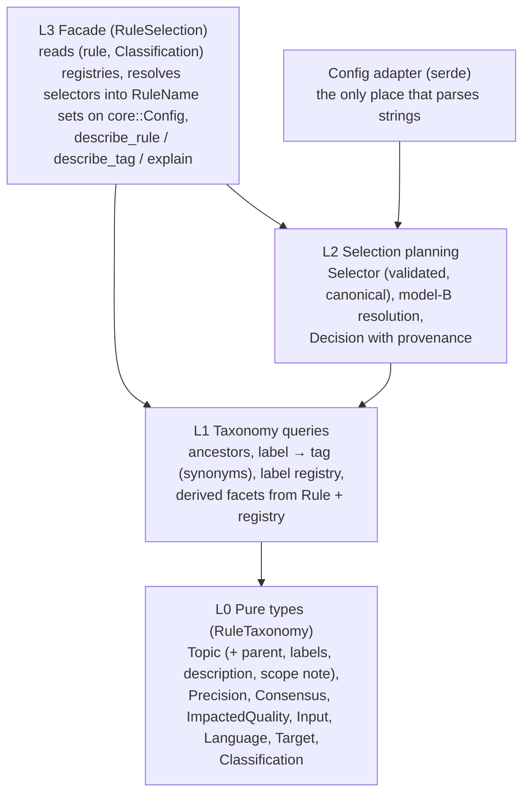

# Phase 3: Design/Plan — Tag Taxonomy (T1)

This document records **Phase 3** of the exploration cycle. It defines "done" independently of any solution, lists the design items still open, and plans the experiments and the validating prototype (POC) that settle them.

**Status**: Complete (D21, D22; later refined by D28, D29, D33–D38).

- **D21 — A typed field per facet, with enum values** (settles DI6):
  - A rule declares each facet in its own field, so the field's type enforces how many values it takes: exactly one for `precision`, `consensus`, and `impacted_quality` (plain enum fields, D28/D38), at least one for `topics`.
  - Each facet's values are an enum.
  - Derived facets have no field.
  - Shape A (one enum for everything, with facet membership as data) is dropped: it enforces nothing that B does not, and it enforces less.
  - At Checkpoint 3 (D29), the POC was expanded to 5 competing prototypes (`P0`–`P4`) against a shared harness to compare P0 against SOTA alternatives.
- **D22 — E2 may rename, split or replace any tag**, as long as nothing is lost:
  - Current tag names (`style`, `safety`, `naming`, …) are experimental and not binding.
  - The new tree must be **at least as granular** as today. Every distinction a current tag can select must still be selectable, and it may become finer.

**Inputs**:
- [01_understand.md](01_understand.md) (D1–D13)
- [02_sota_and_references.md](02_sota_and_references.md) (D14–D20, references R1–R9 / C1–C4)

---

## 1. Rule Inventory (the corpus we design against)

There are 26 rules. The *current* tags are shown only as the starting point.

| Rule | Current tags | Languages | Target | Kind |
|---|---|---|---|---|
| `banned-abbreviations` | Style, Naming, Heuristic | py, rs | all | code |
| `single-letter-variable-name` | Style, Naming | py, rs | all | code |
| `no-hungarian-notation` | Style, Naming | py, rs | all | code |
| `prefer-timedelta-over-seconds` | Style, Naming, Typing | py, rs | all | code |
| `prefer-dedent-for-multiline-strings` | Style | py, rs | all | code |
| `prefer-tuple-unpacking` | Style, Opinionated, Heuristic | py, rs | all | code |
| `flat-scope-enforced` | Complexity, Style | py | source-only | code |
| `enforce-frozen-slots-dataclass` | Typing, Style, Opinionated | py | all | code |
| `no-typing-cast` | Typing | py | source-only | code |
| `no-dynamic-attribute-access` | Typing, Safety, Opinionated | py | all | code |
| `no-identical-positional-types` | Typing, Safety, Opinionated | py | source-only | code |
| `no-env-in-functions` | SideEffects, Opinionated | py, rs | source-only | code |
| `no-logging-error-in-except` | Logging, Exceptions | py | all | code |
| `no-uncommented-suppress` | Exceptions | py | all | code |
| `no-unstructured-task-creation` | Async | py | all | code |
| `no-sleep-in-tests` | Testing | py, rs | tests-only | code |
| `no-zero-sleep-in-tests` | Testing | py, rs | tests-only | code |
| `max-test-assertions` | Testing, Heuristic, Opinionated | py, rs | tests-only | code |
| `no-assertion-packing` | Testing, Opinionated | py, rs | tests-only | code |
| `no-mocks-in-tests` | Testing, Opinionated | py | tests-only | code |
| `no-mock-assertions` | Testing, Opinionated | py | tests-only | code |
| `missing-suppression-reason` | Suppression | py, rs | — | suppression audit |
| `unused-suppression` | Suppression | py, rs | — | suppression audit |
| `unknown-suppression-rule` | Suppression | py, rs | — | suppression audit |
| `blanket-suppression` | Suppression | py, rs | — | suppression audit |
| `no-edits-on-described-commits` | Workflow, Vcs, JJ | — | — | command |

> [!NOTE]
> **New finding: a third kind of rule.** The four suppression rules are not ordinary code rules. The runner never calls their `check_file`, they audit `omni:` directives, and they are excluded from what can be suppressed ([runner.rs:38,94,117,146](../../../../src/code_lint/runner.rs#L38)). The `Suppression` tag is how the runner recognises them.
> **Consequence:** the derived code/command facet may need a third value, or this must become a typed rule role (DI4).

---

## 2. Definition of Done: CUJs, Acceptance Criteria, Metrics

These are independent of any implementation. Every POC is measured against them.

### Config users

| CUJ | Scenario | Acceptance criteria |
|---|---|---|
| **U1 — Adoption ramp** | A team adopts Omni in stages: first the precise rules that prevent real failures, then the rest. | `ignore = ["heuristic", <opinion value>]` produces exactly the expected set. The set can be predicted from the rule listing alone. |
| **U2 — Broad and granular selection** | `select = ["vcs"]` includes jj rules. `select = ["jj"]` + `ignore = ["vcs"]` keeps only the jj rules (D18). | Resolution matches the D18 case table (02 §6.1) for all five cases. |
| **U3 — Exception to a tag** | `ignore = ["testing"]` + `select = ["no-sleep-in-tests"]`. | `no-sleep-in-tests` is on and every other testing rule is off (D15). |
| **U4 — Mistakes are loud** | Typo `tesing`. Unknown rule name. The same selector in both `select` and `ignore`. | Config load fails with a message naming the entry. Unknown names get a "did you mean". Nothing is silently ignored. |
| **U5 — Synonym** | `select = ["jujutsu"]`. | Same result as `select = ["jj"]`. Only `jj` appears in any output. |
| **U6 — Per-path removal** | `per_file_ignores = { "tests/**" = ["heuristic"] }`. | Heuristic rules are off under `tests/**` and unchanged elsewhere. Per-file never adds rules. |

### Contributors

| CUJ | Scenario | Acceptance criteria |
|---|---|---|
| **C1 — Add a rule** | A contributor classifies a new rule. | Everything is declared in the rule's own file. Forgetting a single-valued facet is a **compile error** (D17). Derived facets (language, input, target) **cannot be declared**. Listing a tag together with its ancestor, or putting a facet value where a topic belongs, fails a test with a message saying what to change. |
| **C2 — Add a tag** | A contributor adds `git` under `vcs`. | One spot in one file (`Topic::GIT` struct literal, D32). The label, parent, description, scope note and synonyms are declared together. Cycles (`E0391`) and a parent in another facet (`E0308`) are compile errors (D34); duplicate labels (including collisions with rule names) and empty tags fail a test. |
| **C3 — Apply the tag guide** | A contributor decides whether a rule is heuristic / opinionated. | The guide gives a test they can answer yes/no, with worked examples from real rules. Two contributors applying it to the same rule reach the same answer (checked in E1). |

### Interfaces to T2 / T3 (the taxonomy must *supply*; rendering is later)

| CUJ | Acceptance criteria |
|---|---|
| **I1 — Describe a rule** | Given a rule, the API returns: topic paths (most specific tags plus their ancestors), each facet value with its display label, languages, input and target. All as strict types. |
| **I2 — Describe a tag** | Given a tag, the API returns: its canonical label, synonyms, facet, parent, children, description, scope note and member rules. |
| **I3 — Explain a decision** | Given config, a rule and optionally a path, the API returns the D18 resolution: per-branch verdicts, the deciding selector, overridden selectors and the per-file stage (02 §6.1 T3 interface). |

### Metrics

| Metric | Target |
|---|---|
| Mis-tag classes caught at compile time vs test time vs not at all | Maximise compile time. "Not at all" = 0. |
| Places to edit to add a tag | 1 (one `Topic` `const` struct literal, D32) |
| Places to edit to add a rule's classification | 1 (the rule file) |
| Lines to declare one rule's classification | ≤ 6 (D32) |
| Lines of taxonomy + selection code (production, excluding tests) | Reported per POC. The smaller wins, if the CUJs pass equally. |
| Config errors that silently match nothing | 0 |

---

## 3. Open Design Items

| # | Item | How it is settled | Depends on |
|---|---|---|---|
| **DI1** | **Definition of the opinion facet**, or dropping it (02 §6.4, candidates 1–5) | **E1**: apply each candidate to all 26 rules, blind and twice, and measure agreement and split usefulness | — |
| **DI2** | **Facet display labels** (detection, input, opinion) | Pick after E1, using D19's freedom to use multi-word labels | DI1 |
| **DI3** | **Initial topic tree** for the 26 rules (roots, parent links, synonyms) | **E2**: draft the tree and run the all-and-some test on every parent link | — |
| **DI4** | **Suppression rules**: a third input value or a typed role | Decided in the POC. The runner branching must use a typed property, not a tag. | — |
| **DI5** | **One namespace**: rule names, tag labels and synonyms globally unique | Invariant test in the POC | — |
| **DI6** | ~~Implementation shape~~ | **Settled by D21** (typed field per facet, enum values). The POC validates it against §2. | — |
| **DI7** | **Tag guide** (G6) | Drafted from E1, E2 and the POC outcome | DI1–DI5 |

---

## 4. Target Architecture: Dependency DAG

Dependencies only point down.



- **Keep loosely typed code contained.** String parsing (TOML via serde, and strum's `FromStr`) happens only in the config adapter. It produces validated `Selector`s holding canonical tags or a registered `RuleName`. Nothing above L0 handles raw strings.
- **Make the API a pit of success (D21, D38):**
  - `Classification` has one mandatory field per declared facet, so a missing value does not compile (D17). The shape is:
    ```rust
    Classification { topics: &[Topic], precision: Precision, consensus: Consensus, impacted_quality: ImpactedQuality }
    ```
  - Derived facets have no field.
  - Topics are a non-empty slice of `Topic` (≥1 checked by test).
- **Keep behaviour off tags (DI4, D37, R1–R3):** `Rule` exposes no tag getter; each domain registry (`CodeLintRules`, `CodeSuppressionEngine`, `CommandLintRules`) registers `(rule, Classification)` in a single source, and `RuleSelection` eagerly resolves selectors into a tag-free `RuleName` filter on `core::Config`. Neither rules nor runners may depend on `RuleSelection` (enforced by ADR 006). Suppression audits use a separate contract/registry rather than a tag check.
- T2/T3 renderers later sit *beside* the facade and consume I1–I3. They are out of scope here.

---

## 5. Experiments and POC

### E1 — Opinion definition experiment (settles DI1)
- Two independent read-only reviewers classify all 26 rules under each of the four candidate definitions (02 §6.4; candidate 5 is dropping the facet). Each reads the rule source and its `ViolationTemplate` rationale, and neither sees the other's answers or the current tags.
- **Measured per definition:**
  - agreement between the reviewers (C3);
  - how many rules land in each value (a useful off-switch should neither be nearly empty nor nearly universal);
  - the borderline cases, with reasons.
- **Output:** a table and a recommended definition (or "drop the facet"), plus worked examples for the tag guide.

### E2 — Topic tree experiment (settles DI3)
- One reviewer designs the topic tree for the 26 rules **from scratch** (D22). Current tag names are input, not constraints: any tag may be renamed, split or replaced.
- **Granularity constraint:** every distinction a current subject tag can select must still be selectable. The tree may be finer, never coarser.
- Deliverables:
  - most-specific topics per rule;
  - parent links, each with an explicit all-and-some justification (R6);
  - synonyms that are true equivalents only;
  - scope notes;
  - a mapping table from old tag to new topic(s) that proves no granularity was lost.
- It also applies the tag-admission rules (≥2 members, or 1 plus a named roadmap rule) and flags tags that fail them.
- Must resolve:
  - is naming a kind of style?
  - the `safety` polysemy;
  - `exceptions` vs `suppression` (`no-uncommented-suppress` is about `contextlib.suppress`, not `omni:` suppression);
  - where `side-effects` goes.

### POC — Validate D21 and compare SOTA alternatives (settles DI4, DI5; confirms DI6, D29)
A standalone workspace, `scratch/tag_poc/` (git-ignored, outside `src/`; production code is untouched), with a shared harness and 5 competing prototype crates (`P0`–`P4`, D29). Each implements L0–L3 with:
- all 26 rules' classifications, using the E2 tree and the E1 definition;
- D18 resolution with provenance;
- synonyms;
- a typed suppression-audit role (DI4);
- the invariant tests (DI5 and the tag-guide rules);
- one test per CUJ (U1–U6, C1–C2 negative cases, I1–I3).

**Measured on:**
- CUJ pass/fail;
- which mis-tag classes are caught at compile time vs test time vs not at all;
- production LOC;
- lines per rule declaration;
- clarity of the error messages for C1/C2 negative cases.

Any CUJ the POC fails reopens D21.

---

## 6. Phase 4 Plan (ordered tasks)

Each task runs **Audit → RED → GREEN → Verify**. For experiments, "RED/GREEN" means: the acceptance questions are written first, then answered.

| # | Task | Output | Verify |
|---|---|---|---|
| 1 | **E1** opinion definition experiment (2 reviewers in parallel) | `04_execution_log.md` §E1 table and recommendation | Agreement and distribution reported for all 4 candidate definitions (plus option 5: drop the facet) |
| 2 | **E2** topic tree experiment (in parallel with 1) | §E2 tree, justifications, old→new mapping, flagged tags | Every link has an all-and-some justification; every rule has ≥1 topic; no old distinction lost |
| 3 | ⏸ **User checkpoint**: choose DI1/DI2 and validate the E2 tree | Decisions D23–D29 | — |
| 4a | **Shared harness** `scratch/tag_poc/harness`: rule identities and non-classification facts, the expected outcome of every CUJ scenario (from D23/D24), the `Prototype` trait, and a generic test runner. Written first: it is the RED for every prototype. | harness crate | Compiles; a stub prototype fails every scenario |
| 4b | **Five prototypes in parallel** (D29), one crate each, same harness, same 26 rules: P0 decided design (+ trial quality facet, D27), P1 flat + presets, P2 group-side membership, P3 label expressions, P4 polyhierarchy | 5 crates + per-prototype `REPORT.md` | Standard verification per crate |
| 4c | **Comparison** | `04_execution_log.md` §6: CUJ matrix, metrics table, lessons per prototype, recommendation (keep P0, amend it, or switch) | Every metric reported for every prototype |
| 5 | **Draft the tag guide** (G6, R7 skeleton from the theory report) | `docs/dev/tag_guide.md` (draft) | Every guide rule maps to an invariant test in the POC |
| 6 | ⏸ **User checkpoint**: POC results and tag guide | — | — |

**Standard verification** (POC crate):
- `cargo fmt --check`
- `cargo clippy --all-targets -- -D warnings` (using the repo's `clippy.toml` lints)
- `cargo test`
- A report of production LOC

The main crate is not touched in this cycle. It must still build and pass its tests, as a sanity check.

After Phase 4: Phase 5 (clean up `scratch/`, fold `tag_system_analysis.md` into this directory), Phase 6 (independent review), and the ADR in `decisions/` recording the architecture decision that the implementation cycle (`impl/`) will build.
