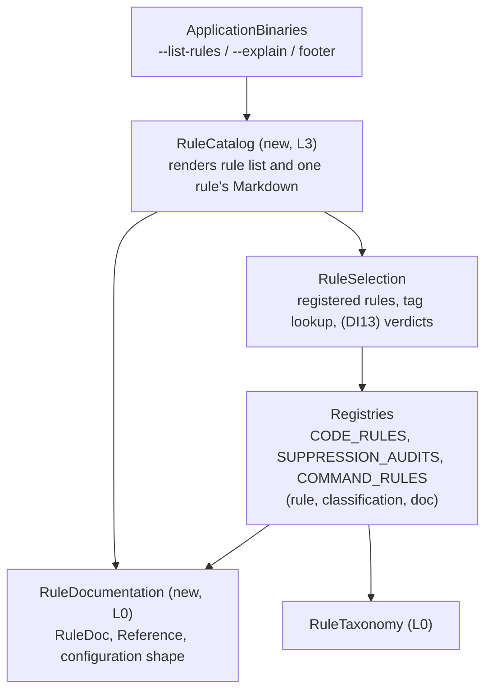

# Phase 3: Design/Plan — Rule Docs (T2) & Surfaces (T3)

This document records **Phase 3** of the T2/T3 loop. It defines "done" independently of any solution, lists the design items still open, and plans the prototype (POC) that settles them.

**Status**: Validated. DI8, DI9, DI14, DI15, DI16 settled in review; DI10–DI13 settled by the competing POCs (§5).

**Inputs**:
- [01_understand.md](01_understand.md) (H1–H7, D39–D44)
- [02_sota_and_references.md](02_sota_and_references.md) (D45–D53)

---

## 1. Corpus

The 26 rules: 21 code rules, 4 suppression audits, 1 command rule. Two files group several rules (D53). Rules read configuration through `Rule` helpers in [core.rs](../../../../src/core.rs) that pick one of four shapes (`ThresholdConfig`, `DenyListConfig`, `AllowListConfig`, `EnforcementConfig`), each also accepted per language under `[rules.<name>.<lang>]`. Which shape a rule reads is visible only in its `check_file` body.

The POC works on four representative rules:

| Rule | Why it is representative |
|---|---|
| `no-sleep-in-tests` | Grouped file, deny-list configuration, per-language `ViolationTemplate` overrides |
| `max-test-assertions` | Threshold configuration |
| `missing-suppression-reason` | Suppression audit (grouped file, no `rule_test!`) |
| `no-edits-on-described-commits` | Command rule, other binary |

---

## 2. Definition of Done: CUJs, Acceptance Criteria, Metrics

### Terminal users

| CUJ | Scenario | Acceptance criteria |
|---|---|---|
| **R1 — List rules** | A user wants to see what Omni checks. | One command prints every rule: name, languages and a one-line summary, grouped or sortable predictably. |
| **R2 — Filter by tag** | `… --tag testing`, `… --tag jujutsu`. | Same semantics as `select`: a topic includes its subtopics, synonyms resolve, an unknown label fails with "did you mean". |
| **R3 — Read one rule** | `… explain no-sleep-in-tests`. | Prints, as Markdown: What it does, Why is this bad?, the raw message template (placeholders and per-language overrides), Configuration keys, References, tags with branch provenance (D36), languages, target. |
| **R4 — Mistakes are loud** | `explain no-sleep-in-test`, `--format jsno`. | Unknown rule: error with "did you mean". Unknown format: clap error listing valid values (D51). |
| **R5 — From a diagnostic to its doc** | A plain run reports violations. | The output ends with one footer naming the command that explains a rule (D48). |

### Agents

| CUJ | Scenario | Acceptance criteria |
|---|---|---|
| **A1 — Fix a violation** | An agent sees `[no-mocks-in-tests]` in a diagnostic. | One command returns the full doc as Markdown, with no source reading and no ANSI escapes. |

### Contributors

| CUJ | Scenario | Acceptance criteria |
|---|---|---|
| **K1 — Document a new rule** | A contributor adds a rule. | One const in the rule's file. A missing section is a compile error; registering a rule without a doc is a compile error. |
| **K2 — Quality checks** | A doc has an empty section, a multi-line summary, a `#` heading inside a field, or a configuration key the rule's shape does not have. | A registry test fails naming the rule and the problem. |
| **K3 — No second place** | A rule is added, renamed or removed. | Nothing else needs editing to keep docs correct (the README has no catalog). |

### Metrics

| Metric | Target |
|---|---|
| Places to edit to document a rule | 1 (the rule file) |
| New dependencies | 0 |
| New macros | 0 |
| Lines of rendering / command code (production, excluding tests) | Reported by the POC; smaller wins if CUJs pass equally |
| Undocumented rules that compile | 0 |

---

## 3. Open Design Items

| # | Item | Options | Recommendation | Settled by |
|---|---|---|---|---|
| **DI8** | **CLI shape** | (a) Flags `--list-rules` and `--explain <rule>` on both binaries. (b) Subcommands `rules` / `explain`. | **(a)**. `omni-code-lint` takes positional paths, so `omni-code-lint rules` is ambiguous with a directory named `rules`; subcommands would need a default `check` subcommand, a CLI redesign (NG10). `omni-command-lint` requires `--cmd`, which becomes required unless a discovery flag is given. Precedent: `rustc --explain`, `cargo clippy --explain`, `pylint --list-msgs`. | ✅ **(a)**. Subcommands: ROADMAP investigation. |
| **DI9** | **Which rules each binary serves** | (a) Both binaries list and explain all 26 rules. (b) Each binary only its own kind. | **(a)**. Configuration and selection already span all rules; a user should not need to know which binary owns a rule. One shared implementation. | ✅ **(a)** |
| **DI10** | **Summary line for R1** | (a) Explicit `summary` field (one line). (b) `what_it_does` is itself one sentence, used as the summary. | **(b)** if the POC's four docs read well with a one-sentence "What it does" (detail goes in "Why is this bad?"); else (a). Avoids a third near-identical text beside the struct `///`. | POC |
| **DI11** | **Configuration keys** | (a) Hand-listed keys (`&["max"]`), checked by a test against the fields of the four shapes. (b) A `ConfigShape` enum on the doc (`Threshold`, `DenyList`, …), keys derived from the shape's fields. | **(b)** if the key list can be derived without new dependencies (serde of `Default` in a test is enough for the check, but rendering needs the names at runtime); else (a). Neither ties the declared shape to what `check_file` reads (ROADMAP: typed configuration). | POC |
| **DI12** | **Registry type and module** | (a) Add `doc` to `ClassifiedRule` in `rule_taxonomy`; `RuleDoc` in a new L0 module. (b) Put `RuleDoc` inside `rule_taxonomy`. | **(a)**, renaming `ClassifiedRule` to a name that no longer says only "classified" (e.g. `RuleEntry`). Docs are not taxonomy. | POC (compile, architecture test) |
| **DI13** | **Current status in `explain` (H7, I3)** | (a) `explain` also prints whether the rule is on or off under the loaded config, and the deciding selector. (b) Docs only; status is a ROADMAP item. | **(a) without paths** if the POC shows it costs ≲ 50 lines on top of existing `Plan` / `Verdict` (P0 `facade.rs` is the reference); path-aware status (`per_file_ignores`) stays ROADMAP. Else (b). | POC |
| **DI14** | **Footer content** | (a) Generic: "For details on a rule, run: `omni-code-lint --explain <rule>`". (b) Also lists the rules that fired. | **(a)**. Diagnostics already name their rule. | ✅ **(a)** |
| **DI15** | **Struct `///` vs `DOC`** | Keep a one-line developer `///` (required by `missing_docs`) that points at `Self::DOC`, and never restate the user-facing text. | As stated. | ✅ Style guide (DI16) |
| **DI16** | **Style guide (G5) location** | (a) New `docs/dev/rule_doc_guide.md`. (b) A section in `tag_guide.md`. (c) Extend the existing [rule_design_guide.md](../../rule_design_guide.md), whose §2 already governs `summary` / `rationale` / `suggestion` wording. | ✅ **(c)**. One guide already owns message wording; the doc sections belong next to it (G5). | Review |

---

## 4. Target Architecture

- `RuleDocumentation` depends only on `FoundationPrimitives`, like `RuleTaxonomy`.
- Runners must not depend on `RuleDocumentation` or `RuleCatalog` (same isolation rule as the taxonomy, D37).
- `print_diagnostics` stays unchanged; the binary prints the footer after it in plain mode.
- `OutputFormat` (D51) lives beside `print_diagnostics` in `diagnostic.rs`.

---

## 5. POC Plan: two competing prototypes

Each POC runs in its own isolated workspace (a branch of the real crate, thrown away afterwards). Both implement the same shared scope and differ only on DI10–DI13:

| | **PA — Minimal** | **PB — Derived** |
|---|---|---|
| DI10 summary | `what_it_does` is one sentence and is the summary | Explicit one-line `summary` field + multi-sentence `what_it_does` |
| DI11 configuration | Hand-listed keys, checked by a test against the four shapes | `ConfigShape` enum on the doc, keys derived from the shape |
| DI12 registry | `doc` added to the registry entry; `RuleDoc` in a new L0 module; entry renamed | Same (shared; not a competing axis) |
| DI13 `explain` status | Docs only | On/off under the loaded config + deciding selector (no paths) |

- **Shared scope**: `RuleDoc` on the four rules of §1 (others get a placeholder so the crate compiles), `--list-rules [--tag]`, `--explain`, the footer, `OutputFormat` (D51), the K2 registry test, the architecture graph and isolation rule.
- **Measures**: CUJ pass/fail (§2), production lines per part (docs model, rendering, CLI, status), ergonomics of the four docs, and anything that surprised.
- **Choice**: per DI, not per POC. The winner may combine axes (e.g. PA's summary with PB's configuration shape).
- **Out of scope for the POCs**: real docs for the other 22 rules (content pass, D12), README changes, the style guide text.
