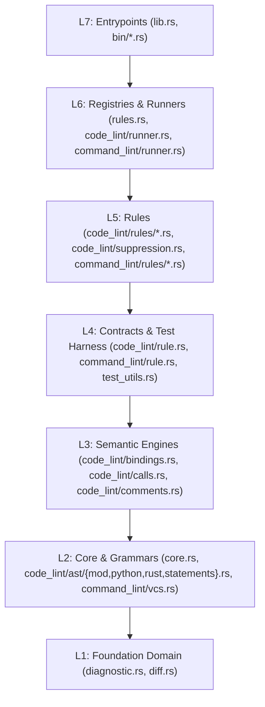

# Phase 3 — Design & Implementation Plan

This document specifies the exact module hierarchy, type signatures, file splits, rule refactorings,
and `rust_arkitect` enforcement rules to execute in Phase 4.

---

## 1. Target Crate Architecture & Layer Matrix (L0–L7)

Every module in `src/` belongs to a single abstraction level `L1..L7` and may only depend on modules
in strictly lower levels (`target_layer < source_layer`).



| Layer | Module Path | Contents | Allowed Internal Dependencies |
|:---|:---|:---|:---|
| **L1** | `crate::diagnostic` | `RuleName`, `Diagnostic`, `ViolationMessage`, `ViolationTemplate`, `violation_template!`, `SourceLocation`, `SourceSpan`, `LineColumn`, `ReportFormatter` | **None** |
| **L1** | `crate::diff` | `VcsType`, `detect_vcs_diff` | **None** |
| **L2** | `crate::core` | `Rule`, `Tag`, `Selector`, `Config`, `ConfigError`, `FilterListDefaults`, `LanguageDefaults`, `EnforcementMode`, `DynamicRuleConfig` | `L1` (`crate::diagnostic`) |
| **L2** | `crate::code_lint::ast` (`mod.rs`, `python.rs`, `rust.rs`, `statements.rs`) | `ParsedFile`, `SyntaxNode<'a>`, `dispatch_lang!`, grammar predicates & extractors, statement header ranges | `L1` (`crate::diagnostic`) + `ast_grep_core` (private to `ast`) |
| **L2** | `crate::command_lint::vcs` | `JjClient`, `JjCliClient`, `CommitDescriptionStatus` | `L1` (`crate::diff`) |
| **L3** | `crate::code_lint::bindings` | `collect_bindings`, `collect_renameable_bindings`, `SuffixedBindingMatch`, `find_suffixed_bindings` | `L2`, `L1` |
| **L3** | `crate::code_lint::calls` | `CallMatch`, `find_banned_calls` | `L2`, `L1` |
| **L3** | `crate::code_lint::comments` | `CommentIndex`, `strip_comment_delimiters` | `L2`, `L1` |
| **L4** | `crate::code_lint::rule` | `CodeRule`, `RuleTarget` | `L3`, `L2`, `L1` |
| **L4** | `crate::command_lint::rule` | `CommandRule`, `InterceptedCommand`, `ProgramCliSchema`, `ParsedArgs` | `L2`, `L1` + `ast_grep_core` (private to `InterceptedCommand::parse_all`) |
| **L4** | `crate::test_utils` | `rule_test!`, `run_code_rule`, `assert_rule_pass`, `assert_rule_fail`, `assert_command_rule_snapshot` | `L4` (`code_lint::rule`, `command_lint::rule`), `L3`, `L2`, `L1` |
| **L5** | `crate::code_lint::rules::*`, `crate::code_lint::suppression` | All 19 code rule structs + 4 suppression rules & `SuppressionTracker` | `L4`, `L3`, `L2`, `L1` (no cross-rule imports) |
| **L5** | `crate::command_lint::rules::*` | `NoJJEditOnDescribedCommits` | `L4`, `L2`, `L1` |
| **L6** | `crate::rules` | `CODE_RULES`, `COMMAND_RULES`, registry integrity tests | `L5`, `L4`, `L3`, `L2`, `L1` |
| **L6** | `crate::code_lint::runner` | `lint_file`, `run_code_lint`, `LintOptions` | `L6` (`crate::rules`), `L5`, `L4`, `L3`, `L2`, `L1` |
| **L6** | `crate::command_lint::runner` | `run_command_lint`, `CommandLintOptions` | `L6` (`crate::rules`), `L5`, `L4`, `L2`, `L1` |
| **L7** | `crate`, `bin/*` | `lib.rs` re-exports, CLI binaries | `L6..L1` |

---

## 2. L2 Grammar Encapsulation (`src/code_lint/ast/mod.rs`)

### 2.1 `ParsedFile` and `SyntaxNode<'a>`

`ast_grep_core::AstGrep` and `ast_grep_core::Node` are encapsulated inside `crate::code_lint::ast` using
`pub(in crate::code_lint::ast)` field visibility:

```rust
pub(in crate::code_lint::ast) type SourceDoc =
    ast_grep_core::tree_sitter::StrDoc<ast_grep_language::SupportLang>;
pub(in crate::code_lint::ast) type RawNode<'a> = ast_grep_core::Node<'a, SourceDoc>;

/// A parsed source file encapsulating the underlying syntax tree.
pub struct ParsedFile {
    pub(in crate::code_lint::ast) grep: ast_grep_core::AstGrep<SourceDoc>,
}

impl ParsedFile {
    #[must_use]
    pub fn new(source: &str, lang: SupportLang) -> Self {
        Self {
            grep: ast_grep_core::AstGrep::new(source, lang),
        }
    }

    #[must_use]
    pub fn lang(&self) -> SupportLang {
        *self.grep.lang()
    }

    #[must_use]
    pub fn root(&self) -> SyntaxNode<'_> {
        SyntaxNode {
            raw: self.grep.root(),
        }
    }
}

/// An opaque handle to a syntax node exposing only source text and location coordinates outside L2.
#[derive(Clone)]
pub struct SyntaxNode<'a> {
    pub(in crate::code_lint::ast) raw: RawNode<'a>,
}

impl<'a> SyntaxNode<'a> {
    #[must_use]
    pub fn text(&self) -> std::borrow::Cow<'a, str> {
        self.raw.text()
    }

    #[must_use]
    pub fn lang(&self) -> SupportLang {
        *self.raw.lang()
    }

    #[must_use]
    pub fn byte_range(&self) -> std::ops::Range<usize> {
        self.raw.range()
    }

    #[must_use]
    pub fn span(&self) -> SourceSpan {
        SourceSpan::from_range(self.raw.range())
    }

    #[must_use]
    pub fn start_line(&self) -> usize {
        self.raw.start_pos().line() + 1
    }

    #[must_use]
    pub fn end_line(&self) -> usize {
        self.raw.end_pos().line() + 1
    }

    #[must_use]
    pub fn line_column(&self) -> LineColumn {
        let start_pos = self.raw.start_pos();
        LineColumn {
            line: start_pos.line() + 1,
            column: start_pos.column(&self.raw) + 1,
        }
    }

    #[must_use]
    pub fn location(&self, path: impl Into<std::path::PathBuf>) -> SourceLocation {
        SourceLocation::file_span(path, self.span(), self.line_column())
    }
}
```

### 2.2 Standardized Language Dispatch (`dispatch_lang!`)

Defined in `src/code_lint/ast/mod.rs`:

```rust
macro_rules! dispatch_lang {
    ($lang:expr, $func:ident ( $($arg:expr),* $(,)? ), $fallback:expr) => {
        match $lang {
            ast_grep_language::SupportLang::Python => {
                $crate::code_lint::ast::python::$func($($arg),*)
            }
            ast_grep_language::SupportLang::Rust => {
                $crate::code_lint::ast::rust::$func($($arg),*)
            }
            _ => $fallback,
        }
    };
}
pub(crate) use dispatch_lang;
```

### 2.3 Grammar Helpers Added to `ast::python` and `ast::rust`

To eliminate all `.kind()`, `.field()`, `.children()`, `.dfs()`, and `.find_all()` calls from L3 (`bindings`,
`calls`, `comments`) and L5 (`rules/*.rs`):

1. **For `bindings.rs` (L3)**:
   - Both `ast::python` and `ast::rust` expose symmetric `SyntaxNode`-taking functions:
     - `collect_bindings<'a>(file: &'a ParsedFile) -> Vec<SyntaxNode<'a>>`
     - `is_import_binding(node: &SyntaxNode<'_>) -> bool`
     - `is_unaliased_import_binding(node: &SyntaxNode<'_>) -> bool`
     - `is_structural_definition(node: &SyntaxNode<'_>) -> bool`
     - `is_trait_impl_member(node: &SyntaxNode<'_>) -> bool`
2. **For `calls.rs` (L3)**:
   - `ast` (`mod.rs` + `python.rs` / `rust.rs`) provides:
     - `collect_call_candidates<'a>(file: &'a ParsedFile) -> Vec<RawCallCandidate<'a>>` (yielding `node: SyntaxNode<'a>`, `function: SyntaxNode<'a>`, `method_target: Option<SyntaxNode<'a>>`, and `arguments: Vec<SyntaxNode<'a>>` where arguments filter non-semantic punctuation using `child.is_named()`).
     - `find_call_pattern_matches<'a>(file: &'a ParsedFile, pattern: &str, entry: &str) -> Vec<(SyntaxNode<'a>, String, Vec<SyntaxNode<'a>>)>`.
3. **For `comments.rs` (L3)**:
   - `ast::collect_comment_nodes<'a>(file: &'a ParsedFile) -> Vec<SyntaxNode<'a>>`
   - `ast::statements::find_enclosing_statement` and `ast::statements::header_line_range` (already in `ast::statements`).
4. **For L5 Rules**:
   - `flat_scope_enforced.rs`:
     - `ast::python::find_nested_functions<'a>(file: &'a ParsedFile) -> Vec<(SyntaxNode<'a>, String)>`
   - `prefer_dedent_for_multiline_strings.rs`:
     - `ast::python::find_unwrapped_multiline_strings<'a>(file: &'a ParsedFile, is_allowed_wrapper: impl Fn(&str, &str) -> bool) -> Vec<SyntaxNode<'a>>`
     - `ast::rust::find_unwrapped_multiline_strings<'a>(file: &'a ParsedFile, is_allowed_wrapper: impl Fn(&str, &str) -> bool) -> Vec<SyntaxNode<'a>>`
   - `no_assertion_packing.rs`:
     - `ast::python::collect_assert_statements<'a>(file: &'a ParsedFile) -> Vec<SyntaxNode<'a>>`
     - `ast::python::has_top_level_logical_and(assert_node: &SyntaxNode<'_>) -> bool`
     - `ast::python::has_boolean_literal_comparison(assert_node: &SyntaxNode<'_>) -> bool`
     - `ast::rust::collect_macro_invocations<'a>(file: &'a ParsedFile) -> Vec<SyntaxNode<'a>>`
   - `max_test_assertions.rs`:
     - `ast::python::collect_test_function_assertion_counts<'a>(file: &'a ParsedFile) -> Vec<(SyntaxNode<'a>, String, usize)>`
     - `ast::rust::collect_test_function_assertion_counts<'a>(file: &'a ParsedFile) -> Vec<(SyntaxNode<'a>, String, usize)>`
   - `no_env_in_functions.rs`:
     - `ast::python::enclosing_non_exempt_function_name(node: &SyntaxNode<'_>, is_exempt: impl Fn(&SyntaxNode<'_>, &str) -> bool) -> Option<String>` (and symmetric `ast::rust::enclosing_non_exempt_function_name`)
     - `ast::python::is_top_level_function(func_node: &SyntaxNode<'_>) -> bool` (and `ast::rust::is_top_level_function`)
     - `ast::python::collect_environ_subscripts<'a>(file: &'a ParsedFile) -> Vec<(SyntaxNode<'a>, &'static str)>`
   - `no_identical_positional_types.rs`:
     - `ast::python::PythonFunctionSignature<'a> { pub node: SyntaxNode<'a>, pub name_node: SyntaxNode<'a>, pub name: String, pub parameters: Vec<PythonParameterInfo<'a>> }`
     - `ast::python::extract_function_signatures<'a>(file: &'a ParsedFile) -> Vec<PythonFunctionSignature<'a>>`

---

## 3. Cycle & Inversion Resolutions

1. **Cycle D (`core.rs` ↔ `diagnostic.rs`)**:
   - Move `RuleName` definition into `src/diagnostic.rs` (L1) and re-export `pub use crate::diagnostic::RuleName;` in `src/core.rs`.
   - Remove `SourceLocation::from_node` and `LineColumn::from_node` from `src/diagnostic.rs` (replaced by `SyntaxNode::location` and `SyntaxNode::line_column` in L2 `code_lint::ast`).
   - Result: `src/diagnostic.rs` has **zero** `crate::*` imports.
2. **Cycle C (`core.rs` ↔ `rules.rs`)**:
   - Move `Tag` enum and its `impl Tag` methods from `src/rules.rs` to `src/core.rs` (L2) and re-export `pub use crate::core::Tag;` in `src/rules.rs`.
   - Change `Selector::Name(RuleName)` to `Selector::Name(String)` in `src/core.rs`:
     - `Selector::deserialize` attempts `selector_input.parse::<Tag>()` first; otherwise validates non-empty kebab-case and returns `Ok(Self::Name(selector_input))`.
     - `Selector::matches_rule` checks `name == rule.name().0`.
   - Result: `src/core.rs` has **zero** imports from `crate::rules`.
3. **Inversion B & E (`code_lint.rs` & `command_lint.rs` splits, `bindings.rs` → `CodeRule`)**:
   - Split `src/code_lint.rs` into:
     - `src/code_lint/mod.rs` (module declarations & re-exports)
     - `src/code_lint/rule.rs` (L4: `RuleTarget`, `CodeRule` trait with `diagnostic_at_node`, `find_configured_banned_calls`, `check_banned_calls`, `check_banned_suffixes`)
     - `src/code_lint/runner.rs` (L6: `detect_language`, `lint_file`, `run_code_lint`, `LintOptions`)
   - Split `src/command_lint.rs` into:
     - `src/command_lint/mod.rs` (module declarations & re-exports)
     - `src/command_lint/rule.rs` (L4: `ProgramCliSchema`, `InterceptedCommand`, `ParsedArgs`, `CommandRule`)
     - `src/command_lint/runner.rs` (L6: `CommandLintOptions`, `run_command_lint`)
4. **Inversion F (`suppression.rs` → `rules.rs` & `lint_file`)**:
   - Change `SuppressionTracker::audit(&self, path: &Path, config: &Config, suppressible_rules: &HashSet<&str>) -> Vec<Diagnostic>` so the L6 caller (`lint_file` in `code_lint/runner.rs`) passes `suppressible_rules`.
   - Move the 11 end-to-end `lint_file` tests from `src/code_lint/suppression.rs` into `src/code_lint/runner.rs`.

---

## 4. Ordered Execution Steps & Verification Gates (Phase 4)

```
1. [L1/L2 Foundation: diagnostic.rs & core.rs]
   - Move RuleName to diagnostic.rs; move Tag to core.rs; decouple Selector from CODE_RULES/COMMAND_RULES.
   → verify: `cargo test --lib core diagnostic`

2. [L2 Grammar Encapsulation: code_lint/ast/{mod,python,rust,statements}.rs]
   - Create `code_lint/ast/mod.rs` with `ParsedFile`, `SyntaxNode`, `dispatch_lang!`.
   - Move `ast_python.rs` -> `ast/python.rs`, `ast_rust.rs` -> `ast/rust.rs`, `statements.rs` -> `ast/statements.rs`.
   - Add all new semantic helpers for L3 and L5.
   → verify: `cargo test --lib code_lint::ast`

3. [L3 Semantic Engines & L4 Contracts: bindings, calls, comments, rule.rs, test_utils.rs]
   - Update `bindings.rs`, `calls.rs`, `comments.rs` to use `ParsedFile`, `SyntaxNode`, and `dispatch_lang!`.
   - Split `code_lint.rs` into `code_lint/{mod,rule,runner}.rs` and `command_lint.rs` into `command_lint/{mod,rule,runner}.rs`.
   - Update `test_utils.rs` to use `ParsedFile`.
   → verify: `cargo check`

4. [L5 Rules Migration: code_lint/rules/*.rs & suppression.rs]
   - Update all 19 rule files + `suppression.rs` to take `&ParsedFile` in `check_file`, use L2/L3 helpers, and remove all `ast_grep_core` imports and grammar literals.
   - Move the 11 `lint_file` integration tests from `suppression.rs` to `code_lint/runner.rs`.
   → verify: `cargo test` & `cargo clippy --all-targets`

5. [Architecture Enforcement: tests/architecture.rs with rust_arkitect]
   - Add `rust_arkitect = "0.3.7"` to `[dev-dependencies]` in `Cargo.toml`.
   - Write `tests/architecture.rs` enforcing zero cycles, L1–L7 layer monotonicity, no cross-rule imports, and `ast_grep_core` isolation to L2/L4 parser modules.
   - Update `ROADMAP.md` and `docs/dev/rule_design_guide.md`.
   → verify: `cargo test --test architecture`, full `cargo test`, `cargo clippy --all-targets`
```
