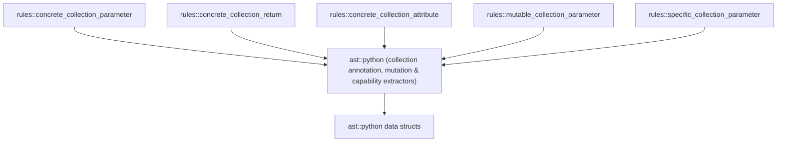

# Phase 3: Design & Plan — Signature & Attribute Collection Type Rules

This document records **Phase 3 (Design / Plan)** for porting Polybot's collection type annotation rules to Omni. It builds on validated [01_understand.md](01_understand.md) (G1–G5, NG1–NG4, D1–D5, Q1–Q8) and validated [02_sota_and_references.md](02_sota_and_references.md), and incorporates user feedback on execution order, nested container variance, mutation rule scope, and false-positive mitigation for overly specific collection types.

> Status: **UPDATED — Ready for Final Phase 3 Validation**

---

## 1. Definition of Done

### 1.1 Critical User Journeys (CUJs)

| ID | Journey | Acceptance Criteria |
| :--- | :--- | :--- |
| **CUJ1 (Concrete Parameter)** | A Python developer writes `def process(items: list[int] \| None, nested: Sequence[dict[str, int]]) -> None:`. | 1 diagnostic per offending parameter annotation (`items` and `nested`), naming the parameter and function, explaining invariance/caller lock-in, and suggesting `Sequence` / `Mapping` (or `MutableSequence` / `MutableMapping` when mutated in place). Zero diagnostics after changing to read-only ABCs. |
| **CUJ2 (Concrete Return Type)** | A developer writes `def get_tags(self) -> list[str]: return self._tags` without an explanation comment. | Flagged by `concrete-collection-return`, suggesting `Sequence[str]` (or adding an explanatory comment when returning a freshly owned mutable list under `require-explanation` mode). If a caller in the same file mutates `get_tags()` (`get_tags().sort()`), or if an explanatory comment is present, zero diagnostics. |
| **CUJ3 (Concrete Public/Dataclass Attribute)** | A developer writes `@dataclass(frozen=True) class Config: hosts: list[str]`. | Flagged by `concrete-collection-attribute` on `hosts: list[str]`, suggesting `Sequence[str]` so callers can construct `Config` with tuples or upstream `Sequence[str]` parameters without copying. Private attributes (`_hosts: list[str]`) and attributes mutated by methods of the class (`self.hosts.append(...)`) produce zero diagnostics. |
| **CUJ4 (Unused Mutable Parameter)** | A developer writes `def summarize(counts: MutableMapping[str, int]) -> int: return sum(counts.values())`. | Flagged by `mutable-collection-parameter` on `MutableMapping[str, int]`, noting `counts` is never mutated in `summarize` and suggesting `Mapping`. If `counts["total"] = 0` or `helper(counts)` is added, zero diagnostics. |
| **CUJ5 (Overly Specific Read-Only Parameter)** | A developer writes `def total(prices: Sequence[float]) -> float: return sum(prices)` without an explanation comment. | Flagged by `specific-collection-parameter`, noting `prices` is only iterated once and suggesting `Iterable` (or `Collection` when `len(prices)` / `x in prices` / `if prices:` / multi-pass iteration is used). Adding an explanatory comment (under `require-explanation` mode) or using `prices[0]` / `reversed(prices)` / `helper(prices)` produces zero diagnostics. |
| **CUJ6 (Exempt Contracts & Stubs)** | A developer writes a `Protocol` method, `@override` method, `@overload` signature, `@abstractmethod`, or stub (`...` / `pass` / `raise NotImplementedError`). | Zero false positives across all rules. |
| **CUJ7 (Configuration & Suppression)** | A team configures `enforcement-mode = "ban"` or `"require-explanation"` in `.omnilint.toml` or uses `# omni:ignore [<rule>] -- reason`. | Handled uniformly by Omni's `RuleOptions` and `SuppressionTracker`. |

### 1.2 Success Metrics

| Metric | Target |
| :--- | :--- |
| False positives on repository dogfooding (`src/`, `tests/`) | **0** |
| Variance soundness on nested containers (`Sequence[list[T]]`, `Mapping[K, list[V]]` vs. `Callable[[list[T]], R]` and `MutableMapping[K, list[V]]`) | **100%** (flags covariant nested positions; never suggests contravariant narrowing on `Callable` args or invariant inner narrowing on `Mutable*`) |
| Execution model | Single-file, single CST pass per collector (`G3`), zero cross-file state |
| Test matrix coverage | Every row in the Ideal Test-Case Matrix (§2) covered by a named `rule_test!` case |

---

## 2. Ideal Test-Case Matrix (All 3 Tiers / 5 Rules)

### 2.1 Matrix A — Annotation Syntactic Shapes & Nested Container Variance

Verified against `tree-sitter-python` 0.25.0 (see §4.1 for exact CST node shapes and §3.2 for the complete variance proof):

| ID | Python Annotation Snippet | Syntactic Shape in `tree-sitter-python` | Ideal Outcome (Tier 1 Concrete Rules) | Variance & Soundness Rationale |
| :--- | :--- | :--- | :--- | :--- |
| **A1** | `x: list`, `x: dict`, `x: set`, `x: typing.List` | `type(identifier)` or `type(attribute)` | **FLAG** | Bare concrete mutable collection type. |
| **A2** | `x: list[int]`, `x: dict[str, int]`, `x: set[str]` | `type(generic_type(identifier, type_parameter))` | **FLAG** | Unqualified PEP 585 generic concrete collection. |
| **A3** | `x: typing.List[int]`, `x: typing.Dict[str, int]`, `x: typing.Set[str]` | `type(subscript(attribute, ...))` | **FLAG** | Qualified PEP 484 generic concrete collection (uses expression fallback `subscript` in `tree-sitter-python`). |
| **A4** | `x: list[int] \| None`, `x: int \| list[str] \| set[int]` | `type(union_type(type, type))` | **FLAG** | PEP 604 union wrapping concrete collection(s) — consolidated into 1 diagnostic on the annotation. |
| **A5** | `x: typing.List[int] \| None` | `type(binary_operator(subscript, "\|", none))` | **FLAG** | Qualified PEP 604 union (uses expression fallback `binary_operator` in `tree-sitter-python`). |
| **A6** | `x: Optional[list[int]]`, `x: Union[list[int], str, None]` | `type(generic_type("Optional"/"Union", type_parameter))` | **FLAG** | Fixes Polybot's `get_annotation_base_types` bug (`Optional`/`Union` slice was never inspected). |
| **A7** | `x: typing.Optional[typing.Dict[str, int]]`, `x: typing.Union[list[int], None]` | `type(subscript(attribute, subscript))` | **FLAG** | Qualified `typing.Optional` / `typing.Union` wrapping concrete collection. |
| **A8** | `x: Annotated[list[int], "meta"]`, `x: typing.Annotated[set[str], Doc("...")]` | `generic_type` or `subscript` with base `Annotated` | **FLAG** | Unwraps first type argument (`list[int]`, `set[str]`) and ignores metadata arguments `1..`. |
| **A9** | `x: Annotated[Sequence[int], list]` | `generic_type("Annotated", [Sequence[int], list])` | **PASS** | `list` is in metadata position (arg 1), not the underlying type (arg 0). |
| **A10** | `x: ClassVar[list[str]]`, `x: Final[dict[str, int]]`, `x: Required[list[int]]`, `x: NotRequired[set[str]]`, `x: ReadOnly[list[int]]` | `generic_type` or `subscript` with qualifier base | **FLAG** | Unwraps first type argument `T`. |
| **A11** | `x: Sequence[list[int]]`, `x: Collection[set[str]]`, `x: Iterable[dict[str, int]]`, `x: AbstractSet[tuple[int, ...]]`, `x: Awaitable[list[int]]`, `x: tuple[str, list[int]]`, `x: tuple[list[int], ...]` | Covariant single/tuple generic container wrapping concrete collection | **FLAG** (`list`, `set`, `dict`) | **Covariant outer container**: `Sequence`, `Collection`, `Iterable`, `Iterator`, `Reversible`, `Container`, `AsyncIterable`, `AsyncIterator`, `Awaitable`, `AbstractSet`, `Set`, `frozenset`, and `tuple` are covariant in all element type parameters. `list[list[int]]` is a valid subtype of `Sequence[Sequence[int]]`. |
| **A12** | `x: Mapping[str, list[int]]` | `generic_type("Mapping", [str, list[int]])` | **FLAG** (`list`) | **Covariant value parameter**: `Mapping[K, V_co]` is covariant in its 2nd type argument `V_co` (arg index 1). Because `dict[str, list[int]] <: Mapping[str, list[int]] <: Mapping[str, Sequence[int]]`, callers holding `dict[str, list[int]]` can pass it directly to `Mapping[str, Sequence[int]]` in both Mypy and Pyright! |
| **A13** | `cb: Callable[[int], list[str]]` | `generic_type("Callable", [list([int]), list[str]])` | **FLAG** (`list`) | **Covariant return parameter of `Callable`**: `Callable[[...], Ret_co]` is covariant in its 2nd type argument `Ret_co` (arg index 1). |
| **A14** | `cb: Callable[[list[int]], None]` | `generic_type("Callable", [list([subscript]), none])` | **PASS** | **Contravariant parameter position**: `Callable` is contravariant in its parameter list (arg index 0). `Callable[[Sequence[int]], None]` is a *narrower subtype* of `Callable[[list[int]], None]`, which would reject valid callbacks like `def cb(xs: list[int]): xs.sort()`. |
| **A15** | `x: MutableMapping[str, list[int]]`, `x: MutableSequence[list[int]]` | `generic_type("Mutable*", [..., list[int]])` | **PASS** (on inner `list[int]` in Tier 1) | **Invariant outer generic**: `MutableMapping` and `MutableSequence` are invariant in their type arguments. Replacing inner `list[int]` with `Sequence[int]` inside `MutableMapping[str, Sequence[int]]` makes `dict[str, list[int]]` a Mypy/Pyright type error at call sites! |
| **A16** | `x: CustomBox[list[int]]` | `generic_type("CustomBox", [list[int]])` | **PASS** | **Unknown generic**: `TypeVar` in Python is invariant by default; without cross-file variance resolution, recursing into unknown user generics is unsound. |
| **A17** | `x: Sequence[int]`, `x: Mapping[str, int]`, `x: AbstractSet[str]`, `x: collections.abc.Set[str]` | `generic_type` or `subscript` | **PASS** (Tier 1) | Already uses read-only abstract collection ABCs. |
| **A18** | `x: tuple[int, ...]`, `x: frozenset[str]`, `x: bytes`, `x: str` | `generic_type` or `identifier` | **PASS** | Immutable concrete builtin types (`tuple` and `frozenset` are covariant and runtime-immutable). |

---

### 2.2 Matrix B — Tier 1a: `concrete-collection-parameter` Scope & Exemptions

| ID | Case | Code (abridged) | Ideal Outcome |
| :--- | :--- | :--- | :--- |
| **B1** | Positional, keyword-only, or default parameter | `def f(a: list[int], *, b: dict[str, int] = ...) -> None:` | **FLAG** (`a`, `b`) |
| **B2** | Method receiver `self` / `cls` | `def f(self, items: list[int]) -> None:` | **FLAG** (`items` only) |
| **B3** | Variadic `*args` and `**kwargs` | `def f(*args: list[int], **kwargs: set[str]) -> None:` | **PASS** (`is_variadic()` skipped, matching Polybot and D5) |
| **B4** | `@override` / `@typing.override` / `@typing_extensions.override` method | `@override def f(self, items: list[int]) -> None:` | **PASS** (signature fixed by base class) |
| **B5** | `@overload` declaration | `@overload def f(items: list[int]) -> int: ...` | **PASS** (checked on implementation) |
| **B6** | `@abstractmethod` | `@abstractmethod def f(self, items: list[int]) -> None:` | **PASS** |
| **B7** | Enclosing class is `Protocol` or `ABC` | `class P(Protocol): def f(self, items: list[int]) -> None: ...` | **PASS** |
| **B8** | `@pytest.fixture` / `@fixture` | `@pytest.fixture def items(raw: list[int]) -> None:` | **PASS** (DI fixture signature matched by parameter name/type) |
| **B9** | Fixed-signature Python data-model dunders (`__eq__`, `__contains__`, etc.) | `def __eq__(self, other: list[int]) -> bool:` | **PASS** (`__init__` and `__new__` are **not** exempt and are still checked!) |

---

### 2.3 Matrix C — Tier 1b: `concrete-collection-return`

| ID | Case | Code (abridged) | Ideal Outcome | Why |
| :--- | :--- | :--- | :--- | :--- |
| **C1** | Unexplained concrete return type (`list`, `dict`, `set`, `typing.List`, etc.) | `def get_users() -> list[str]: return ["a"]` | **FLAG** | Returning invariant `list[str]` prevents zero-copy forwarding of `Sequence[str]` and exposes mutability across the API boundary. |
| **C2** | Union / Optional / Covariant nested concrete return type | `def get_users() -> list[str] \| None:` / `Awaitable[dict[str, int]]` / `Sequence[list[int]]` | **FLAG** | Unwraps transparent union/optional and covariant containers (`T-Covariant`). |
| **C3** | Abstract return type (`Sequence`, `Mapping`, `AbstractSet`, `Iterable`, `Iterator`) | `def get_users() -> Sequence[str]:` | **PASS** | Covariant read-only return contract. |
| **C4** | Runtime-immutable concrete return type (`tuple`, `frozenset`) | `def get_users() -> tuple[str, ...]:` | **PASS** | Covariant and runtime-immutable. |
| **C5** | **Explained concrete return type** (under `require-explanation` mode) | `# Caller sorts and appends to the returned buffer in place.\ndef make_buffer() -> list[str]: return []` | **PASS** | Substantive header/inline comment documents why the caller needs a mutable concrete return value. |
| **C6** | **Intra-file caller mutates returned value** | `def make_buf() -> list[int]: ...` + `buf = make_buf(); buf.append(1)` (or `make_buf().sort()`, `self.make_buf()[0] = 1`) in same file | **PASS** | Local caller proves the return value is mutated in place. |
| **C7** | `@override` / `@overload` / `@abstractmethod` / `Protocol` / `ABC` / dunders | `@override def items(self) -> list[str]:` | **PASS** | Fixed by external contract. |

---

### 2.4 Matrix D — Tier 1c: `concrete-collection-attribute`

| ID | Case | Code (abridged) | Ideal Outcome | Why |
| :--- | :--- | :--- | :--- | :--- |
| **D1** | Public `@dataclass` or class attribute (`items: list[str]`, `config: dict[str, int]`, `tags: set[str]`) | `@dataclass(frozen=True)\nclass Order:\n    items: list[str]` | **FLAG** | Forces callers of `Order(items=...)` to pass a concrete `list` instead of `Sequence[str]` / `tuple`, and exposes a mutable field. |
| **D2** | Public `ClassVar`, `Final`, `Optional`, or covariant nested attribute | `class C:\n    DEFAULT_TAGS: ClassVar[set[str]]\n    matrix: Sequence[list[int]]` | **FLAG** | Public class attribute with concrete mutable collection type. |
| **D3** | Public instance attribute annotated in `__init__` | `class C:\n    def __init__(self) -> None:\n        self.items: list[str] = []` (never mutated in `C`) | **FLAG** | Public instance attribute never mutated by `C`'s methods. |
| **D4** | **Private / internal attribute (`_attr`)** | `class C:\n    _cache: dict[str, int]\n    def __init__(self) -> None:\n        self._items: list[str] = []` | **PASS** | Leading underscore marks internal implementation state, not public constructor/interface contract. |
| **D5** | **Intra-class mutated attribute (`self.attr.append(...)`, `self.attr[k] = v`, `del self.attr[k]`, `self.attr += ...`, `Cls.attr.add(...)`)** | `class Bag:\n    items: list[str]\n    def add(self, x: str) -> None:\n        self.items.append(x)` | **PASS** | Class methods mutate `self.items` in place, so typing `items: Sequence[str]` would fail Mypy inside `Bag.add`. |
| **D6** | **Explained public concrete attribute** (under `require-explanation` mode) | `class State:\n    # Callers append pending tasks directly to this queue.\n    queue: list[str]` | **PASS** | Substantive comment explains why public mutability is intentional. |
| **D7** | Module-level or function-local variable annotation | `items: list[int] = []` (at module top-level or inside `def f(): x: list[int] = []`) | **PASS** | Not a class/instance attribute (local implementation variable). |
| **D8** | `Protocol` or `ABC` class attributes | `class P(Protocol):\n    items: list[str]` | **PASS** | Structural protocol / abstract contract. |

---

### 2.5 Matrix E — Tier 2: `mutable-collection-parameter` (`MutableSequence`, `MutableMapping`, `MutableSet`)

| ID | Case | Code inside `def f(x: MutableSequence[int]):` (or `MutableMapping` / `MutableSet`) | Ideal Outcome | Why |
| :--- | :--- | :--- | :--- | :--- |
| **E1** | Read-only iteration & indexing | `return sum(v for v in x) + x[0]` | **FLAG** | Only uses `Sequence` operations (`__iter__`, `__getitem__`). |
| **E2** | Read-only methods | `return x.count(1) + x.index(2)` (or `m.get(k)`, `m.keys()`, `m.items()`, `m.values()`, `s.isdisjoint(other)`) | **FLAG** | All methods exist on `Sequence` / `Mapping` / `AbstractSet`. |
| **E3** | Non-mutating builtins | `return len(x) + max(x) + min(x) + sum(x) + len(sorted(x)) + len(list(x)) + len(tuple(x)) + int(bool(x)) + int(any(x)) + int(all(x))` | **FLAG** | Safe read-only builtins do not mutate or retain a mutable reference to `x` (fixes Polybot's incomplete 14-item allowlist). |
| **E4** | `enumerate`, `zip`, `reversed`, `iter` | `for i, v in enumerate(reversed(x)): ...` | **FLAG** | Safe read-only iteration wrappers. |
| **E5** | Mutating method call | `x.append(1)` / `x.extend(y)` / `x.insert(0, 1)` / `x.pop()` / `x.remove(1)` / `x.clear()` / `x.reverse()` / `x.sort()` / `m.update(y)` / `m.setdefault(k, v)` / `m.popitem()` / `s.add(1)` / `s.discard(1)` | **PASS** | Mutated in place. |
| **E6** | Subscript or slice write | `x[0] = 1` or `x[1:3] = [2, 3]` or `a, x[0] = 1, 2` | **PASS** | Mutated via `__setitem__`. |
| **E7** | Subscript augmented write | `x[0] += 1` | **PASS** | Mutated via `__setitem__`. |
| **E8** | Subscript deletion | `del x[0]` or `del a, x[0]` | **PASS** | Mutated via `__delitem__`. |
| **E9** | Augmented assignment on parameter | `x += [1]` or `x \|= other` or `x &= other` or `x -= other` or `x ^= other` | **PASS** | Mutated in place via `__iadd__` / `__ior__` / etc. |
| **E10** | Nested element mutation (`x[0].append(1)`) | `x[0].append(1)` | **FLAG** | Mutates the inner element `x[0]`, **not** the outer container `x` (`Sequence[list[int]]` allows `x[0].append(1)`). |
| **E11** | Passed to unknown function or method | `helper(x)` or `self.process(x)` or `other.extend(x)` | **PASS** | Escapes to unknown callee that may mutate `x` or require `Mutable*`. |
| **E12** | Stored in variable, attribute, or container | `self.x = x` or `alias = x` or `box = [x]` | **PASS** | Escapes via aliasing. |
| **E13** | Returned or yielded | `return x` or `yield x` | **PASS** | Escapes to caller. |
| **E14** | Mutated inside nested closure / function | `def inner(): x.append(1)` | **PASS** | Whole-body walk sees `x.append(1)` inside nested scope (unless `x` is shadowed by an inner parameter `def inner(x):`). |
| **E15** | Shadowed parameter in nested function | `def inner(x: MutableSequence[int]): x.append(1)` (outer `x` untouched) | **FLAG** (outer `x`) | Scope-aware walk does not attribute inner parameter `x`'s mutation to outer `x`. |
| **E16** | Stub body (`...`, `pass`, `raise NotImplementedError`) | `def f(x: MutableSequence[int]) -> None: ...` (with or without docstring) | **PASS** | Interface/stub declaration has no body implementation to inspect. |
| **E17** | Enclosing class is `Protocol` or `ABC`, or `@override` / `@overload` / `@abstractmethod` | `@override def f(self, x: MutableSequence[int]) -> None:` | **PASS** | Fixed by external signature contract. |

---

### 2.6 Matrix F — Tier 3: `specific-collection-parameter` (`Sequence` / `Collection` → `Collection` / `Iterable`)

| ID | Case | Code inside `def f(x: Sequence[int]):` (or `Collection[int]`) | Ideal Outcome | How Omni Fixes Polybot's Bugs |
| :--- | :--- | :--- | :--- | :--- |
| **F1** | Single `for` loop or single comprehension | `for item in x: total += item` (or `return [v * 2 for v in x]`) | **FLAG** → suggest `Iterable` | `x` is only iterated in a single pass. |
| **F2** | Single call to iterable-consuming builtin (`sum`, `min`, `max`, `any`, `all`, `sorted`, `list`, `tuple`, `set`, `frozenset`, `dict`, `enumerate`, `zip`, `iter`) | `return sum(x)` | **FLAG** → suggest `Iterable` | Builtin consumes an `Iterable` in a single pass. |
| **F3** | `len(x)` or `v in x` / `v not in x` (without indexing) | `if 1 in x: return len(x)` | **FLAG** `Sequence` → suggest `Collection` (**PASS** if already `Collection`) | Requires `Sized` / `Container` (`Collection`), not `Sequence`. |
| **F4** | **Truthiness check** (`if x:`, `if not x:`, `bool(x)`, `x and y`, `while x:`, `a if x else b`) + single iteration | `if not x: return 0\nreturn sum(x)` | **FLAG** `Sequence` → suggest `Collection`; **PASS** if already `Collection` (must **never** suggest `Iterable`!) | **Fixes Polybot Bug #1**: `bool(generator)` is always `True` even when empty! Truthiness on a collection requires `__len__` (`Collection`). |
| **F5** | **Multi-pass iteration** (two loops/consumers, or iteration nested inside a loop/comprehension/closure) | `return min(x) + max(x)` or `for r in rows:\n    for v in x: ...` | **FLAG** `Sequence` → suggest `Collection`; **PASS** if already `Collection` (must **never** suggest `Iterable`!) | **Fixes Polybot Bug #2**: an `Iterable` can be a single-use iterator/generator that exhausts on the first pass and silently yields empty on the second pass! `Collection` guarantees repeatable iteration. |
| **F6** | **`reversed(x)`** | `return list(reversed(x))` | **PASS** on `Sequence` (and `Reversible`) | **Fixes Polybot Bug #3**: `Iterable` and `Collection` are not `Reversible` (`TypeError: '...' object is not reversible` at runtime). |
| **F7** | **`.index(v)` or `.count(v)`** | `return x.count(0) + x.index(1)` | **PASS** on `Sequence` | **Fixes Polybot Bug #4**: `.index()` and `.count()` are `Sequence` methods, absent on `Collection` and `Iterable`. |
| **F8** | **Indexing or slicing (`x[0]`, `x[1:]`)** | `return x[0]` | **PASS** on `Sequence` | Requires `Sequence.__getitem__`. |
| **F9** | **Sequence `match` pattern** | `match x:\n    case [first, *rest]: return first` | **PASS** on `Sequence` | **Fixes Polybot Bug #5**: structural sequence pattern matching requires `Sequence`. |
| **F10** | **Helper forwarding / escape** (`helper(x)`, `self.m(x)`, `", ".join(x)`, `return x`, `self.x = x`) | `return helper(x)` | **PASS** (exempt!) | **Fixes Polybot Bug #6**: without cross-function type inference, `helper` may require `Sequence` or `Collection`. |
| **F11** | **Explained `Sequence` / `Collection` parameter** (under `require-explanation` mode) | `# Sequence required to preserve deterministic ordering of layers.\ndef build(layers: Sequence[str]) -> None:\n    for l in layers: ...` | **PASS** | Built-in workaround for defensive API contracts and order-sensitive parameters without `# omni:ignore`. |
| **F12** | Unused parameter, stub body, `@override`, `@overload`, `@abstractmethod`, `Protocol`, `ABC`, `@pytest.fixture`, dunders | `def f(x: Sequence[int]) -> None: ...` | **PASS** | Interface/unused/external contract exemption. |

---

## 3. Core Engineering Decisions (Validated & Resolved)

### 3.1 Three-Tier Rule Scope & Execution Order (`P1`)

All 3 tiers (5 rules total) are in scope and will be implemented in this exact sequence:

1. **Tier 1 — Concrete Collection Rules**:
   - `concrete-collection-parameter` (Default: `EnforcementMode::Ban`, `Precision::Exact`)
   - `concrete-collection-return` (Default: `EnforcementMode::RequireExplanation`, `Precision::Heuristic`)
   - `concrete-collection-attribute` (Default: `EnforcementMode::RequireExplanation`, `Precision::Heuristic`)
2. **Tier 2 — Mutable Collection Rule**:
   - `mutable-collection-parameter` (Default: `EnforcementMode::Ban`, `Precision::Heuristic`)
3. **Tier 3 — Overly Specific Collection Rule**:
   - `specific-collection-parameter` (Default: `EnforcementMode::RequireExplanation`, `Precision::Heuristic`)

### 3.2 Nested Container Variance Analysis (`P2` — Why `T-Covariant` for Tier 1 and `T-Wrapper` for Tiers 2–3)

Whether we can check inside nested containers is determined strictly by type variance and dataflow soundness:

1. **Tier 1 (`concrete-collection-parameter`, `concrete-collection-return`, `concrete-collection-attribute`) uses `T-Covariant`**:
   - At any covariant target root (parameter, return, or read-only attribute), replacing a concrete `list[T]` with `Sequence[T]`, `dict[K, V]` with `Mapping[K, V]`, or `set[T]` with `AbstractSet[T]` inside a nested type parameter `P` is **logically sound if and only if every enclosing type constructor along the path from the root to `P` is covariant in that parameter position**:
     - **Transparent wrappers (all type args except `Annotated` metadata `1..`)**: `T1 | T2`, `Union[...]`, `Optional[T]`, `Annotated[T, ...]`, `ClassVar[T]`, `Final[T]`, `Required[T]`, `NotRequired[T]`, `ReadOnly[T]`.
     - **Single-parameter covariant containers (arg 0)**: `Sequence[T]`, `Collection[T]`, `Iterable[T]`, `Iterator[T]`, `Reversible[T]`, `Container[T]`, `AsyncIterable[T]`, `AsyncIterator[T]`, `Awaitable[T]`, `AbstractSet[T]`, `Set[T]` (`collections.abc.Set` / `typing.Set` when abstract), `frozenset[T]`.
     - **Tuples (all non-ellipsis type args)**: `tuple[T, ...]` and `tuple[T1, T2, ...]`.
     - **Mappings (arg 1 `V_co` only)**: `Mapping[K, V_co]` is invariant in `K` (arg 0) and covariant in `V_co` (arg 1). In Python's type system (`mypy` and `pyright`), `dict[str, list[int]] <: Mapping[str, list[int]] <: Mapping[str, Sequence[int]]`, so widening `Mapping[str, list[int]]` → `Mapping[str, Sequence[int]]` is 100% sound and zero-copy for callers holding `dict[str, list[int]]`.
     - **Callables (arg 1 `Ret_co` only)**: `Callable[[Arg1, ...], Ret_co]` is contravariant in its parameter list (arg 0) and covariant in its return type `Ret_co` (arg 1).
     - **Generators / Coroutines**: `Generator[YieldT, SendT, ReturnT]` and `Coroutine[YieldT, SendT, ReturnT]` are covariant in `YieldT` (arg 0) and `ReturnT` (arg 2), and contravariant in `SendT` (arg 1); `AsyncGenerator[YieldT, SendT]` is covariant in `YieldT` (arg 0).
     - **Concrete outer containers (`list[T]`, `set[T]`, `dict[K, V]`)**: When the outer container itself is being widened to a covariant ABC (`list[list[int]]` → `Sequence[Sequence[int]]`), its element/value position also becomes covariant.
   - **Where `T-Covariant` MUST STOP (logically unsound to recurse)**:
     - `Callable[[list[int]], R]` parameter list (arg 0): **contravariant** (`Callable[[Sequence[int]], R]` is a narrower subtype that rejects valid callbacks).
     - `MutableSequence[T]`, `MutableMapping[K, V]`, `MutableSet[T]`: **invariant** (`dict[str, list[int]]` is *not* a subtype of `MutableMapping[str, Sequence[int]]`).
     - Any unknown/user-defined generic `CustomGeneric[T]`: `TypeVar` is invariant by default in Python.
2. **Tiers 2 & 3 (`mutable-collection-parameter` and `specific-collection-parameter`) use `T-Wrapper`**:
   - Both rules rely on intra-procedural syntactic tracking of operations on the bound parameter symbol `x` (`x.append(...)`, `x[0]`, `len(x)`).
   - If a parameter has a nested type like `x: Sequence[MutableSequence[int]]`, mutations happen on extracted inner elements (`for row in x: row.append(1)`), not on `x` itself. Without element-level alias/type inference across loops and unpackings, inspecting nested containers for body usage would be unsound. Therefore, Tiers 2 and 3 unwrap only transparent wrappers (`|`, `Optional`, `Union`, `Annotated[T, ...]`).

### 3.3 Why Tier 2 (`mutable-collection-parameter`) and Tier 3 (`specific-collection-parameter`) Are Parameter-Only

A critical architectural question is why Tier 1 spans **parameters, returns, and attributes**, whereas Tier 2 (`mutable-collection-parameter`) and Tier 3 (`specific-collection-parameter`) target **parameters**:

1. **Consumer vs. Producer Asymmetry (Why Return Types Cannot Use Function-Body Usage Analysis)**:
   - For a **parameter** `def f(x: MutableSequence[int]):`, the function body of `f` is the **consumer** of `x`. Inspecting `f`'s body tells us everything `f` does to `x`.
   - For a **return type** `def f() -> MutableSequence[int]:` or `def f() -> Sequence[int]:`, the function body of `f` is the **producer**, while the **consumers** are all external callers across the codebase!
   - Inspecting `f`'s body cannot determine how callers use the returned value: `f` may mutate a local list `result.append(1)` while building it and then `return result`, which does *not* make the return contract mutable. Conversely, for Tier 3, returning `-> Sequence[int]` instead of `-> Iterable[int]` is *strictly better* for callers (Postel's Law: accept general, return specific read-only ABCs so callers get `len()` and indexing without copying).
2. **What if someone writes `MutableSequence`, `MutableMapping`, or `MutableSet` on a Return Type or Attribute?**:
   - On a **return type** (`def f() -> MutableSequence[int]:`) or a **public unmutated class attribute** (`class C: items: MutableSequence[int]`), `MutableSequence` has the **exact same invariance and mutability exposure** as `list[int]`: it prevents returning or passing a `tuple` or `Sequence[int]` without copying!
   - Furthermore, if `concrete-collection-return` and `concrete-collection-attribute` only flagged `list`/`dict`/`set`, a developer could "fix" `-> list[int]` or `items: list[int]` on a read-only dataclass by changing it to `-> MutableSequence[int]` or `items: MutableSequence[int]`, silencing the linter while leaving the type invariant!
   - Wait — should `concrete-collection-return` / `concrete-collection-attribute` remain focused strictly on concrete types (`list`, `dict`, `set`), while we document why `mutable-collection-parameter` is parameter-only?
   - Yes: on parameters, `MutableSequence` is the valid replacement when `f` mutates `x` in place (`concrete-collection-parameter` tells the user to use `Sequence` or `MutableSequence`, and `mutable-collection-parameter` catches `MutableSequence` when `f` doesn't actually mutate `x`). On returns and attributes, concrete `list`/`dict`/`set` are the primary real-world anti-pattern (~99% of cases), and `concrete-collection-return` / `concrete-collection-attribute` always recommend `Sequence` / `Mapping` / `Set` (never `Mutable*`) or an explanation comment.
3. **Why Tier 3 (`specific-collection-parameter`) Must Never Apply to Attributes**:
   - Lowering a class/dataclass attribute `self.items: Sequence[int]` to `Iterable[int]` allows callers to construct the object with a **single-use generator/iterator** (`Order(items=(x for x in range(5)))`). The first method call that iterates `self.items` permanently exhausts the attribute, causing all subsequent reads of `self.items` to silently see an empty collection!

### 3.4 Default `EnforcementMode` & False-Positive Workarounds (`P3`)

| Rule | Default `EnforcementMode` | `Precision` | Why & Workarounds |
| :--- | :--- | :--- | :--- |
| `concrete-collection-parameter` | `Ban` | `Exact` | A parameter should always use an abstract collection (`Sequence`/`Mapping`/`Set` if read-only, `MutableSequence`/`MutableMapping`/`MutableSet` if mutated). |
| `concrete-collection-return` | `RequireExplanation` | `Heuristic` | Allows returning a freshly owned mutable `list`/`dict`/`set` when documented with a normal comment on the `def` (or when mutated by a caller in the same file). |
| `concrete-collection-attribute` | `RequireExplanation` | `Heuristic` | Exempts private `_attr` and attributes mutated by the class's own methods; allows publicly mutable attributes when documented with a comment. |
| `mutable-collection-parameter` | `Ban` | `Heuristic` | Conservatively exempts any parameter that is mutated in place or escapes to an unknown function, attribute, variable, or return. |
| `specific-collection-parameter` | `RequireExplanation` | `Heuristic` | Fixes all 6 Polybot bugs (truthiness, multi-pass iteration, `reversed`, `.index`/`.count`, `match`, helper forwarding) and allows documenting intentional `Sequence`/`Collection` contracts (e.g., deterministic ordering or eager materialization) with a comment. |

### 3.5 Diagnostic Granularity (`P4`)

- Every rule emits **at most 1 diagnostic per parameter / return annotation / attribute**, anchored on the **type annotation node** (`param.type_node` for parameters, `return_type` for returns, `assignment.type` for attributes).
- If a single annotation contains multiple offending types (`items: list[int] | set[str]` or `dict[str, list[int]]`), they are consolidated into 1 diagnostic on that annotation in source order (`"list, set"` or `"dict, list"`).

---

## 4. Detailed Technical Architecture

### 4.1 Verified `tree-sitter-python` 0.25.0 Node Shapes

1. **Dual representation of generics and unions inside `type`**:
   - **Unqualified generic** (`list[int]`, `Optional[list[int]]`, `Union[list[int], None]`, `Annotated[list[int], "meta"]`, `ClassVar[list[str]]`, `Mapping[str, list[int]]`):
     `type` → `generic_type` → child 0 is `identifier`, child 1 is `type_parameter` whose named children are `type` nodes.
   - **Callable generic** (`Callable[[list[int]], dict[str, int]]`):
     `type` → `generic_type` → child 0 is `identifier` (`"Callable"`), child 1 is `type_parameter` where child 0 is `type` → `list` (the contravariant parameter list) and child 1 is `type` (the covariant return type).
   - **Qualified generic** (`typing.List[int]`, `typing.Optional[typing.Dict[str, int]]`, `collections.abc.MutableSequence[int]`):
     Because `generic_type` only matches a bare `identifier` before `type_parameter`, `tree-sitter-python` falls back to `expression`:
     `type` → `subscript` → `field("value")` is `attribute` or `identifier`, and `field_children("subscript")` are the argument nodes.
   - **Unqualified vs. qualified `|` union**:
     - `list[int] | None` → `type` → `union_type` (named children are `type` nodes).
     - `typing.List[int] | None` → `type` → `binary_operator` (`field("left")`, `field("operator") == "|"`, `field("right")`).
2. **Return type annotation**:
   - `function_definition.field("return_type")` returns the `type` node after `->`.
3. **Class and instance attribute annotations**:
   - Class body attribute: inside `class_definition.field("body")` (`block`), direct child `expression_statement` → `assignment` with `field("left")` (`identifier` `"items"`) and `field("type")` (`type` node).
   - Instance attribute in `__init__`: inside `function_definition` (`__init__`), `expression_statement` → `assignment` with `field("left")` (`attribute` where `object` is `"self"` and `attribute` is `"items"`) and `field("type")` (`type` node).
4. **Stub / abstract bodies**:
   - After skipping an optional leading docstring (`expression_statement` wrapping a `string` literal), a function body `block` is a stub if its only remaining statement is:
     - `expression_statement` wrapping `ellipsis` (`...`),
     - `pass_statement` (`pass`), or
     - `raise_statement` raising `NotImplementedError` or `NotImplementedError(...)`.

### 4.2 Dependency DAG

All tree-sitter node navigation lives inside [src/code_lint/ast/python.rs](../../../src/code_lint/ast/python.rs); rule files in `src/code_lint/rules/` operate purely on typed structs and `AstNode` spans.

### 4.3 Shared AST Extractors in `src/code_lint/ast/python.rs`

1. **Variance-Aware Annotation Traversal (`collect_type_constructors`)**:
   - Supports two traversal modes via an enum `TraversalDepth { TransparentWrappersOnly, CovariantPositions }`:
     - Both modes unwrap `type`, `union_type`, `binary_operator("|")`, `parenthesized_expression`, `Optional[T]`, `Union[T1, T2, ...]`, `Annotated[T, ...]` (arg 0 only), and class/typed-dict qualifiers `ClassVar[T]`, `Final[T]`, `Required[T]`, `NotRequired[T]`, `ReadOnly[T]` (arg 0 only).
     - `CovariantPositions` additionally recurses into:
       - All type args of `Sequence`, `Collection`, `Iterable`, `Iterator`, `Reversible`, `Container`, `AsyncIterable`, `AsyncIterator`, `Awaitable`, `AbstractSet`, `Set`, `frozenset`, `tuple`, `Tuple`, `list`, `List`, `set`.
       - Arg 1 (value type `V`, 0-indexed `1`) of `Mapping`, `dict`, `Dict`.
       - Arg 1 (return type `Ret`, 0-indexed `1`) of `Callable`.
       - Args 0 and 2 (`YieldT` and `ReturnT`) of `Generator` and `Coroutine`, and arg 0 (`YieldT`) of `AsyncGenerator`.
     - Works uniformly across both `generic_type` and expression-fallback `subscript` nodes.
2. **Single-Pass Parameter Mutation & Escape Detector (`is_parameter_mutated_or_escaping`)**:
   - Respects lexical shadowing in nested `function_definition` and `lambda` parameters.
   - Detects in-place mutation (`MUTATING_COLLECTION_METHODS`, subscript writes/aug-assigns/deletes, augmented assignments `x += ...`).
   - Detects escaping/aliasing (passing `x` to any callee outside `SAFE_READONLY_BUILTINS`, assigning `x` to an attribute/variable/container, or returning/yielding `x`).
3. **Single-Pass Parameter Capability Analyzer (`analyze_parameter_collection_capabilities`)**:
   - For `specific-collection-parameter`, walks `function_definition.body` tracking loop/comprehension/closure nesting depth:
     - Marks `escapes_or_mutated = true` if `x` is mutated, reassigned, returned, yielded, stored, or passed to an unknown function/method.
     - Marks `needs_sequence = true` if `x` is indexed/sliced (`x[...]`), matched in a `list_pattern`/`sequence_pattern`, accessed via `.index`/`.count`/unknown attributes, or passed to `reversed(x)`.
     - Marks `needs_collection = true` if `x` is passed to `len(x)`, used in `in`/`not in`, checked for truthiness (`if x:`, `not x`, `bool(x)`, `x and y`, `x or y`, `while x:`, ternary condition), or iterated when `iteration_count > 1` or `loop_nesting_depth > 0`.
     - Counts `iteration_count` across `for ... in x`, comprehensions over `x`, star-unpacking `*x`, and single-pass iterable builtins (`iter`, `list`, `tuple`, `set`, `frozenset`, `dict`, `sorted`, `sum`, `min`, `max`, `any`, `all`, `enumerate`, `zip`, `map`, `filter`).
4. **Intra-Class Attribute Mutation Detector (`collect_concrete_class_attributes`)**:
   - Collects public (`!attr_name.starts_with('_')`) annotated attributes in `class_definition` bodies and `__init__` methods (`self.attr: T`), exempting any attribute where a method in the class mutates `self.<attr>` or `<ClassName>.<attr>`.
5. **Intra-File Return Mutation Detector (`collect_concrete_return_annotations`)**:
   - Collects functions with concrete collection return annotations, exempting any function whose return value is mutated in place at a call site within the same file (`fn(...).<mutating_method>(...)`, `fn(...)[k] = v`, or `v = fn(...); v.<mutating_method>(...)`).

---

## 5. Rule Declarations, Names, and Messages

Verified against [naming_and_message_style_guide.md](../naming_and_message_style_guide.md) and [tests/registry.rs](../../../tests/registry.rs):
- All rule names are `kebab-case`, ≤ 4 words, naming the flagged pattern without polarity prefixes.
- All summaries are 1 declarative sentence ending with `.`, with no fix verbs or judgement words.
- All rationales explain the harm without `must` / `should` or leading fix verbs.
- All suggestions start with `Replace` (in `SUGGESTION_VERBS`).
- Placeholders use `{name}`, `{function}`, `{class}`, `{expression}`, and `{token}` from the existing `PLACEHOLDERS` list in [tests/registry.rs](../../../tests/registry.rs#L325-L341) (zero new placeholder vocabulary entries needed).

| Tier | Rule Name | File | Default Mode | Summary / Rationale / Suggestion |
| :--- | :--- | :--- | :--- | :--- |
| **1a** | `concrete-collection-parameter` | `concrete_collection_parameter.rs` | `Ban` (`Precision::Exact`) | - **Summary**: ``Parameter `{name}` of `{function}` is annotated with concrete collection type `{expression}` (`{token}`).`` - **Rationale**: ``Concrete mutable collection types such as `list`, `dict`, and `set` are invariant in their type arguments and reject read-only inputs such as `tuple`, `frozenset`, or subtype sequences.`` - **Suggestion**: ``Replace `{token}` in `{name}` with a read-only abstract collection from `collections.abc` (`Sequence`, `Mapping`, or `Set`), or with `MutableSequence`, `MutableMapping`, or `MutableSet` when `{function}` mutates `{name}` in place.`` |
| **1b** | `concrete-collection-return` | `concrete_collection_return.rs` | `RequireExplanation` (`Precision::Heuristic`) | - **Summary**: ``Return annotation of `{function}` uses concrete collection type `{expression}` (`{token}`).`` - **Rationale**: ``Returning an invariant concrete collection type such as `list`, `dict`, or `set` exposes mutability across the boundary and forces callers holding a `Sequence` or `Mapping` to copy before returning.`` - **Suggestion**: ``Replace `{token}` in the return annotation of `{function}` with `Sequence`, `Mapping`, or `Set` from `collections.abc` (or `tuple` / `frozenset`), or add a comment on `{function}` explaining why callers need a mutable collection.`` |
| **1c** | `concrete-collection-attribute` | `concrete_collection_attribute.rs` | `RequireExplanation` (`Precision::Heuristic`) | - **Summary**: ``Attribute `{name}` of `{class}` is annotated with concrete collection type `{expression}` (`{token}`).`` - **Rationale**: ``A public or dataclass attribute typed as `list`, `dict`, or `set` rejects `Sequence`, `Mapping`, or `tuple` arguments in synthesized constructors and exposes internal state to in-place caller mutation.`` - **Suggestion**: ``Replace `{token}` on `{name}` with `Sequence`, `Mapping`, or `Set` from `collections.abc` (or `tuple` / `frozenset`), prefix internal mutable state with `_`, or add a comment explaining why `{name}` is publicly mutable.`` |
| **2** | `mutable-collection-parameter` | `mutable_collection_parameter.rs` | `Ban` (`Precision::Heuristic`) | - **Summary**: ``Parameter `{name}` of `{function}` is annotated with mutable collection type `{expression}` (`{token}`) but never mutated in `{function}`.`` - **Rationale**: ``Annotating a read-only parameter as `MutableSequence`, `MutableMapping`, or `MutableSet` makes its type invariant and prevents callers from passing immutable collections such as `tuple` or `MappingProxyType`.`` - **Suggestion**: ``Replace `{token}` in `{name}` with its read-only counterpart from `collections.abc` (`Sequence`, `Mapping`, or `Set`).`` |
| **3** | `specific-collection-parameter` | `specific_collection_parameter.rs` | `RequireExplanation` (`Precision::Heuristic`) | - **Summary**: ``Parameter `{name}` of `{function}` is annotated with `{expression}` (`{token}`) but only uses `{class}` operations.`` - **Rationale**: ``Requiring a narrower collection interface than `{function}` uses restricts callers from passing compatible inputs such as sets, dictionary views, or lazy iterables without materializing a sequence.`` - **Suggestion**: ``Replace `{token}` in `{name}` with `{class}` from `collections.abc`, or add a comment on `{function}` explaining why the narrower interface is part of the contract.`` |

---

## 6. Step-by-Step Execution Plan (Phase 4 Tasks)

Each task follows **Audit → RED (failing test cases from §2) → GREEN (minimal implementation) → Verify (`cargo fmt --check`, `cargo clippy --all-targets -- -D warnings`, `cargo test`)**, in the exact tier order specified:

| Task | Tier | Scope | Verification |
| :--- | :--- | :--- | :--- |
| **T1** | **Tier 1 Foundation** | Shared variance-aware AST annotation extractor (`collect_type_constructors` with `CovariantPositions` and `TransparentWrappersOnly`) & exemption helpers (`Protocol`, `ABC`, `@override`, `@overload`, `@abstractmethod`, `@pytest.fixture`, stub body, dunders) in [src/code_lint/ast/python.rs](../../../src/code_lint/ast/python.rs) + unit tests covering Matrix A (`A1`–`A18`). | `cargo test --lib code_lint::ast::python` |
| **T2** | **Tier 1a (Concrete Parameter)** | Implement `concrete-collection-parameter` ([src/code_lint/rules/concrete_collection_parameter.rs](../../../src/code_lint/rules/concrete_collection_parameter.rs)) + register in `rules.rs` + `rule_test!` suite covering Matrix A & Matrix B (`B1`–`B9`). | `cargo test` (incl. `registry`, `cli`) |
| **T3** | **Tier 1b (Concrete Return)** | Implement `concrete-collection-return` ([src/code_lint/rules/concrete_collection_return.rs](../../../src/code_lint/rules/concrete_collection_return.rs)) with intra-file caller mutation exemption and `RequireExplanation` default + `rule_test!` suite covering Matrix C (`C1`–`C7`). | `cargo test` |
| **T4** | **Tier 1c (Concrete Attribute)** | Implement `concrete-collection-attribute` ([src/code_lint/rules/concrete_collection_attribute.rs](../../../src/code_lint/rules/concrete_collection_attribute.rs)) with private `_attr` and intra-class mutation exemptions and `RequireExplanation` default + `rule_test!` suite covering Matrix D (`D1`–`D8`). | `cargo test` |
| **T5** | **Tier 2 (Mutable Parameter)** | Implement intra-procedural parameter mutation & escape detector in [src/code_lint/ast/python.rs](../../../src/code_lint/ast/python.rs) + `mutable-collection-parameter` ([src/code_lint/rules/mutable_collection_parameter.rs](../../../src/code_lint/rules/mutable_collection_parameter.rs)) + `rule_test!` suite covering Matrix E (`E1`–`E17`). | `cargo test` |
| **T6** | **Tier 3 (Overly Specific Parameter)** | Implement capability lattice analyzer in [src/code_lint/ast/python.rs](../../../src/code_lint/ast/python.rs) + `specific-collection-parameter` ([src/code_lint/rules/specific_collection_parameter.rs](../../../src/code_lint/rules/specific_collection_parameter.rs)) with `RequireExplanation` default + `rule_test!` suite covering Matrix F (`F1`–`F12`). | `cargo test` |
| **T7** | **Docs & Catalog** | Update `README.md` rule catalog and `ROADMAP.md` marking the signature & attribute collection type rules complete. | `cargo fmt --check && cargo clippy --all-targets -- -D warnings && cargo test` |

---

## 7. Rejected Alternatives

| Alternative | Why Rejected |
| :--- | :--- |
| Blindly recursing into all `subscript` / `generic_type` type parameters | Unsound on contravariant `Callable[[list[int]], None]` parameter lists (where `Callable[[Sequence[int]], None]` is a narrower subtype), invariant `MutableMapping[str, list[int]]`, unknown user generics (`TypeVar` is invariant by default), and `Annotated` metadata (`A9`, `A14`, `A15`, `A16`). |
| Polybot's `SignatureMutationTracker` whole-repo pre-pass | Violates Omni's stateless per-file architecture (`G3`) and parallel `rayon` file runner. Replaced by intra-class / intra-file mutation exemptions plus `EnforcementMode::RequireExplanation` on return, attribute, and overly-specific parameter rules. |
| Running body mutation heuristics inside `concrete-collection-parameter` to pick between `Sequence` and `MutableSequence` | Violates `D5`: a parameter typed `x: list[int]` that is passed to `helper(x)` was falsely reported by Polybot as "mutated" and told to use `MutableSequence[int]` when `Sequence[int]` was what the user needed. |
| Applying `specific-collection-parameter` (`Sequence` → `Iterable`) to return types or class attributes | On return types, returning `Sequence` instead of `Iterable` is good API design (gives callers `len()` and indexing for free). On attributes, storing an `Iterable` allows single-use generators that permanently exhaust the attribute on the first read. |
