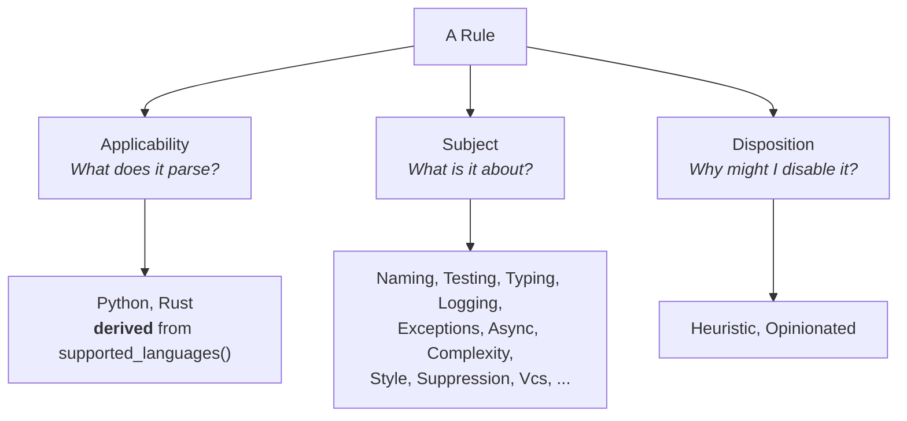

# Tag System Analysis

This document records analysis of Omni's rule tags performed while the linter had 17 rules. It exists so that the reasoning survives until there are enough rules to judge the taxonomy against.

**Nothing here is decided.** Sections marked *Finding* state verifiable facts about the code as it stands. Sections marked *Candidate* are proposals — starting points for a future design pass, to be validated or discarded against a much larger rule corpus. See `ROADMAP.md` section 5 for the design work this feeds.

---

## 1. Findings

* **Tags have exactly one consumer.** `Config::is_rule_enabled` and `Config::is_rule_enabled_for_path` in [src/core.rs](../../src/core.rs) resolve `select`, `ignore`, and `per_file_ignores`. Tags appear in no `Diagnostic`, no output format, and no CLI flag.
* **Tags are not documentation today.** `Tag::description` has zero production callers; its only caller is a test asserting a doc comment against a copy of itself. `Tag::as_str` has zero callers at all.
* **Language tags are derived, not declared.** `Rule::has_tag` resolves `Python` and `Rust` from `supported_languages()`, and a test forbids declaring them manually. This is the one part of the current design that cannot drift.
* **Rule discovery is hand-maintained.** [README.md](../../README.md) lists every rule by hand, with no tags, no languages, and nothing detecting drift from `CODE_RULES`.
* **`TestsOnly` and `Testing` coincide exactly.** All four `RuleTarget::TestsOnly` rules are precisely the four `Testing`-tagged rules.

---

## 2. The Central Tension

Most taxonomy questions resist settling because they depend on an unanswered prior question: **is a tag a selector, a documentation label, or both?**

If a tag is only a selector, a one-member tag is dead weight — `ignore = ["rule-name"]` is just as short and less ambiguous. If a tag is also documentation, a one-member label is still informative when rendered in a listing.

The codebase supports only the first reading today, but nothing commits it to that reading permanently. Until this is answered, verdicts on `Cli` (zero members), `Safety`, `Workflow`, and `JJ` cannot be reached, because each of them hinges on which reading holds.

A practical consequence: **rule discovery is upstream of taxonomy, not downstream of it.** Whether tags are documentation is decided by whether anything ever renders them.

---

## 3. Candidate: The Axis Model

The proposal is that users filter along three independent questions, and that tags should be grouped to reflect them.



* **Applicability** — derived, never declared. `select = ["python"]` when onboarding one language at a time.
* **Subject** — what the rule is about. `ignore = ["logging"]` means "this domain isn't my concern".
* **Disposition** — why a team might decline the rule. `ignore = ["heuristic"]` is the adoption ramp: take the precise rules first, the debatable ones later.

Unresolved within this candidate: does the Subject axis stay flat or subdivide as rules multiply? Should at least one Subject tag be mandatory per rule? Is Disposition a genuine third axis, or a property better modelled outside the tag system entirely?

---

## 4. Candidate: Admission Criteria

Four tests a prospective tag would have to pass:

1. **Selection** — would a real user write `select` or `ignore` with it? Fails if it only describes how the rule is implemented, or restates the rule name.
2. **Plurality** — does it cover two or more rules, or will it soon? Fails if one rule, since the rule name is an equally short selector.
3. **Disjointness** — is it distinguishable from every sibling on its axis? Fails if it is a synonym, or a strict subset with no independent members.
4. **Stability** — will its meaning hold as rules are added? Fails if it drifts per-rule.

This is the least controversial candidate, because it constrains only *future* tags and presumes no verdict on existing ones.

---

## 5. Candidate: Tag Hierarchy

Rather than requiring a rule to declare every ancestor tag, encode the relationship once and have `has_tag` walk it:

```rust
const fn parent(self) -> Option<Self> {
    match self {
        Self::Naming => Some(Self::Style),
        Self::JJ => Some(Self::Vcs),
        _ => None,
    }
}
```

**Arguments for.** There is nothing to forget — the relationship holds structurally rather than being caught at test time. Rules declare only their most specific tag, so `tags()` stays minimal. And a specific tag stops duplicating its parent: `ignore = ["jj"]` would mean "jj-specific rules" while `ignore = ["vcs"]` means "all VCS rules", which are different selectors even when one rule satisfies both.

**Arguments against, and open points.** Is `Naming` genuinely a strict subset of `Style`, or a peer concern? What stops every tag pair becoming an "is X a subset of Y?" debate? While only one or two hierarchies exist, a flat set plus a test assertion may be sufficient and simpler. If adopted, a test must walk every chain to bound it against cycles.


-> We need to do a thorough research on SOTA and tagging system to decide what to do and how.
---

## 6. Candidate: Disposition Definitions

Fixed wordings, so the tags stay meaningful instead of accreting onto everything:

* **`Heuristic`** — the rule matches on names, text shape, or counts rather than semantics, so it can fire on legitimate code. *Test*: "Can I write correct, idiomatic code that this flags?"
* **`Opinionated`** — the flagged code is unambiguously valid and the alternative is purely team taste, with no concrete, nameable failure mode prevented. *Test*: "Would another competent team reasonably disagree?"

The narrow reading of `Opinionated` was preferred because the loose reading ("would anyone disagree?") lands on roughly 60% of rules in a deliberately opinionated linter, and a tag carried by most of the set is not an off-switch. Under the narrow reading, rules preventing a nameable failure mode — flaky tests, orphaned tasks, lost tracebacks — are not opinionated, even though a team might still decline them.

This reasoning has not been tested against a large corpus and may not survive one.

---

## 7. Alternatives Considered

None of these are rejected, since nothing is decided. Each is recorded with the argument that currently weighs against it and what would change the verdict.

| Alternative | Current argument against | Reconsider if… |
| :--- | :--- | :--- |
| Split `Tag` into three enums, one per axis | `Selector` would need three `FromStr` attempts, and `has_tag`, `select`, `ignore`, and `per_file_ignores` all widen — to encode what grouped variants and a doc comment already convey | axis confusion causes real mis-tagging at scale |
| Model dispositions as trait methods (`uses_heuristics`) instead of tags | Two mechanisms for one concept; a defaulted `bool` is exactly as forgettable as an omitted tag, so it buys no safety | dispositions need data a tag cannot carry, such as a confidence level |
| Derive `Testing` from `RuleTarget::TestsOnly` | The implication holds today, but an assertion gives identical safety with no indirection, and each derivation shrinks what `rule.tags()` honestly reports | several more derivable tags appear, making assertions the larger burden |
| Model severity as a tag | Severity belongs to a diagnostic, not a rule; it would break the "a tag selects a set of rules" invariant that keeps the machinery small | severity becomes a per-rule property rather than per-diagnostic |

---

## 8. Open Questions

* Are tags selectors, documentation, or both?
* What becomes of `Cli` (zero members), `Safety`, `Workflow`, and `JJ`?
* Which axis does `SideEffects` belong to?
* Should every rule be required to declare at least one Subject tag?
* Is hierarchy warranted at all?
* Does a flat Subject axis scale to hundreds of rules?
-> Should we consider things like Domain (testing, logging, concurrency...) / Meta (opinionated, heuristics, ...) be a structural part of the documentation of a rule?
---

## 9. What Would Need Validating

The candidates above are judgements made against 17 rules. Evidence that would confirm or refute them:

* A rule corpus large enough that a tag's membership is not obvious at a glance.
* A real configuration need that no existing tag can express.
* An observed case of a rule author tagging incorrectly, and which distinction they missed.
* A user asking "which rules exist for X?" — the signal that tags have become documentation.
